## Excel读取操作(基于COM)

### Excel读取范围

1. 新建组件“Excel读写操作Demo”，并添加“活动范围”、“Excel应用程序范围”两个命令，在“Excel应用程序范围”填写Excel文档的路径，如图：

   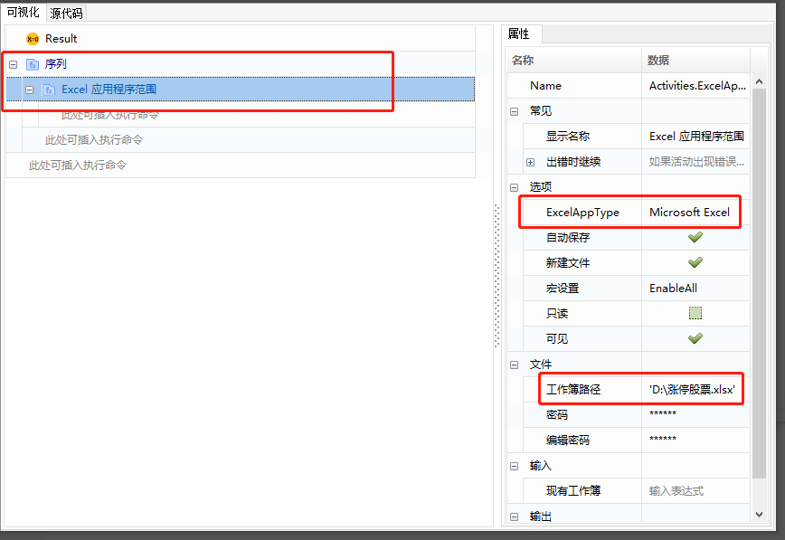

   Excel内容如下：

   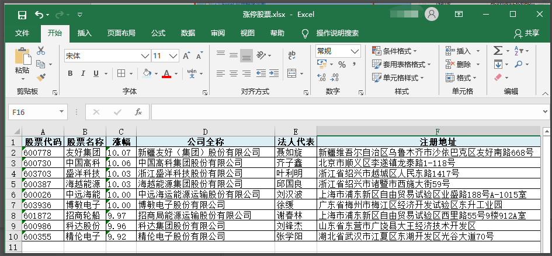

2. 拖入“读取范围”命令，并为输出数据表创建一个变量“Table”。

   常用属性介绍:

   范围: 需要读取的范围，格式（如’A1:E10’）;如果未设值，将会读取整个表格; 如果将范围指定为某个单元格(如：’A2’)，则读取从该单元格开始的整个表格。 

   添加标头：如果选中，将获取指定表格范围的标题。

   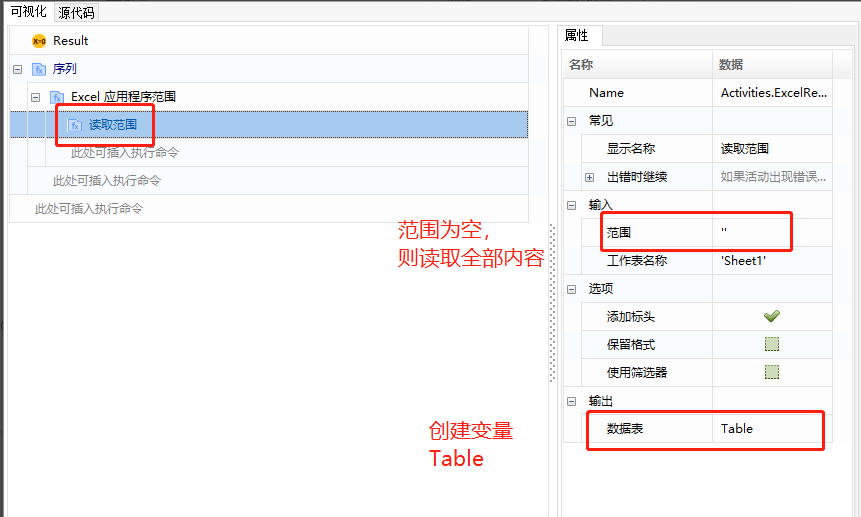

3. 打印数据查看：添加“输出数据表”命令，选择输入为上一步产生的“Table”，并为输出创建一个变量“str_tmp”，然后用“日志消息”命令打印出str_tmp。

   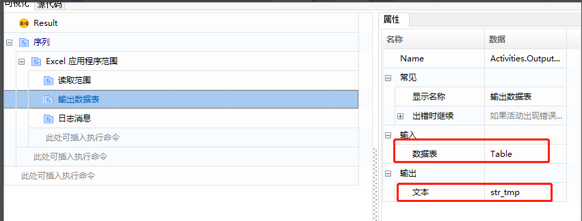

   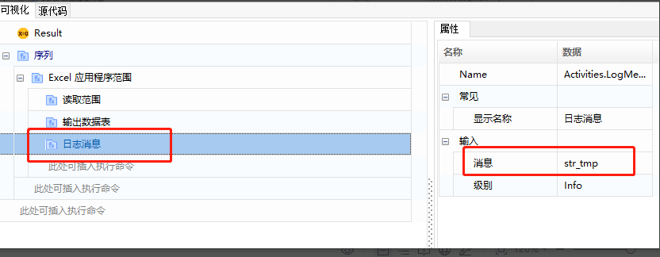

4. 执行结果：

   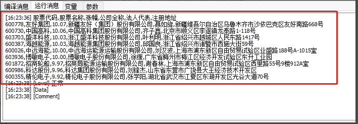

   

### Excel遍历内容

在完成读取范围的基础上，遍历Excel表格数据，实际上是对“Table”的数据进行遍历。

1. 添加命令“对于每一行”，并设置输入Table。

   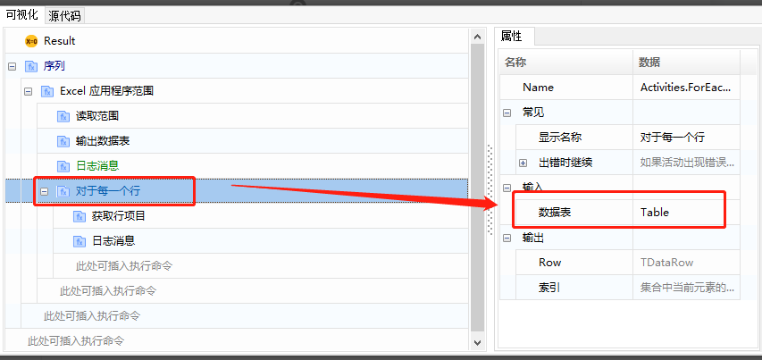

   为输出Row创建遍历“Row”。

   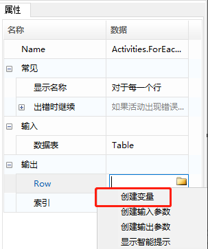

   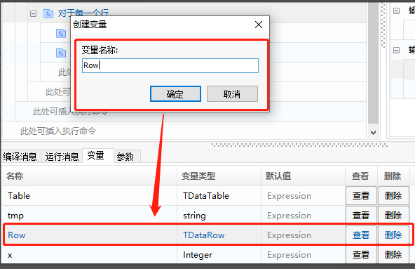

   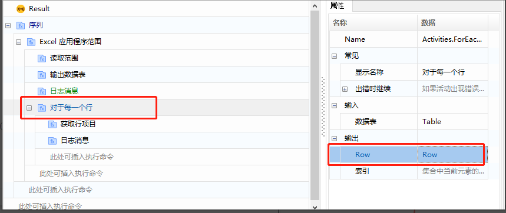

2. 添加“获取行项目”命令，并设置输入输出参数，如图：

   

3. 添加“日志消息”命令，输出取到的值（str_tmp）。

   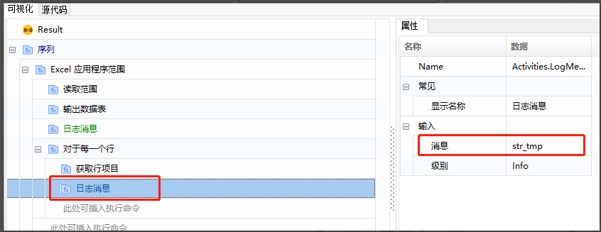

   运行结果：

   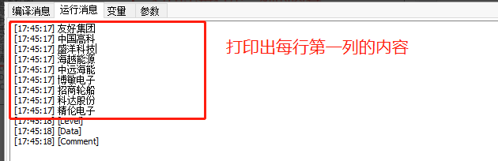

   

### Excel其他读取操作

1. 读取列：输入工作表名和起始单元格，返回整列数据，类型为List。

   

2. 读取单元格：输入工作表名和单元格，返回单元格的内容。

   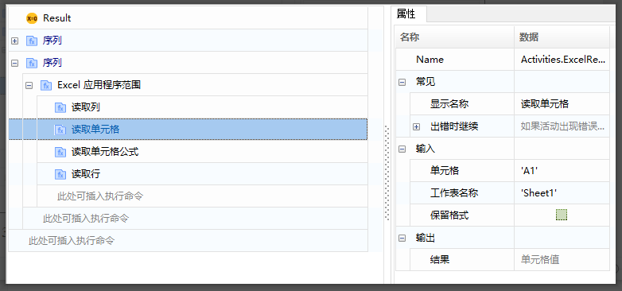

3. 读取单元格公式：输入工作表名和单元格，返回单元格公式。

   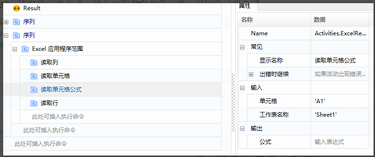

4. 读取行：输入工作表名和起始单元格，对应整行内容，类型为List。

   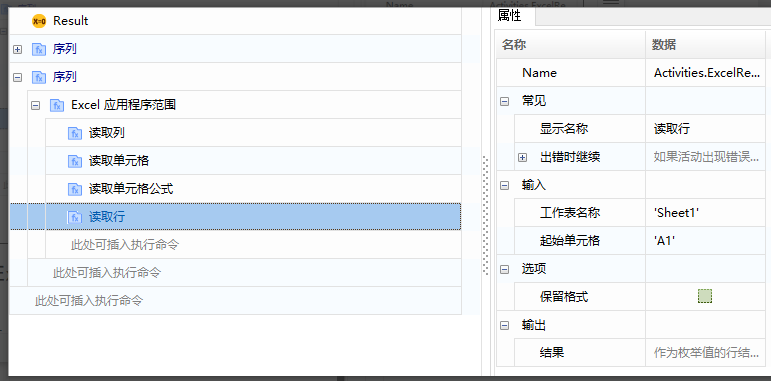