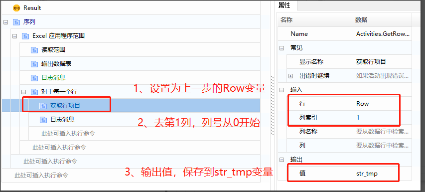
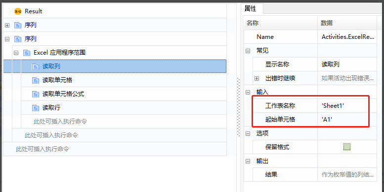

## Excel Read Operations (Based on COM)

### Excel Read Range 

1. Create a new component "Excel Read/Write Operation Demo" and add two commands, "Sequence" and "Excel Application Scope". In the "Excel Application Scope", fill in the path of the Excel document, as shown:

   

   The content of the Excel file is as follows:

   

2. Drag in the "Read Range" command and create a variable "Table" for the output data table.

   Common attribute descriptions:

   - Range: The range to be read, format (e.g., 'A1:E10'); if not set, the entire table will be read; if the range is specified as a single cell (e.g., 'A2'), the entire table starting from that cell will be read.
   - AddHeaders: If checked, the headers of the specified table range will be retrieved.

   

3. Print data to view: Add the "Output Data Table" command, select the input as the "Table" generated in the previous step, and create a variable "str_tmp" for the output. Then use the "Log Message" command to print out "str_tmp".

   

   

4. Execution result:

   

### Excel Traverse Content 

Based on reading the range, traverse the Excel table data, which is essentially traversing the data in "Table".

1. Add the command "For Each Row" and set the input to Table.

   

   Create a variable "Row" for the output.

   

   

   

2. Add the "Get Row Item" command and set the input and output parameters as shown:

   

3. Add the "Log Message" command to output the obtained value ("str_tmp").

   

   Execution result:

   

### Other Excel Read Operations 

1. Read Column: Input the worksheet name and the starting cell, return the entire column data, output type is 'List'.

   

2. Read Cell: Input the worksheet name and cell, return the content of the cell.

   

3. Read Cell Formula: Input the worksheet name and cell, return the cell formula.

   

4. Read Row: Input the worksheet name and starting cell, return the corresponding entire row content, output type is 'List'.

   
