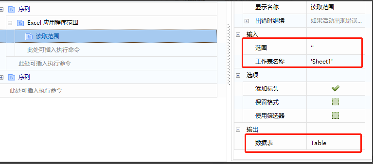
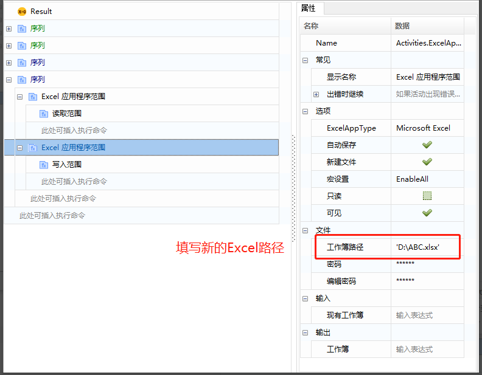
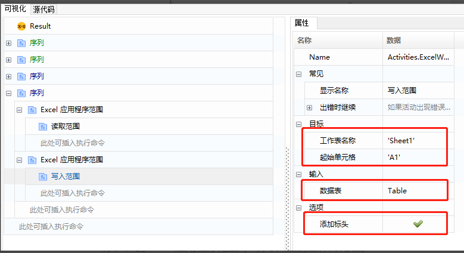
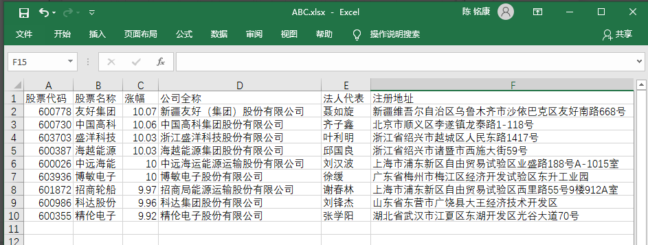
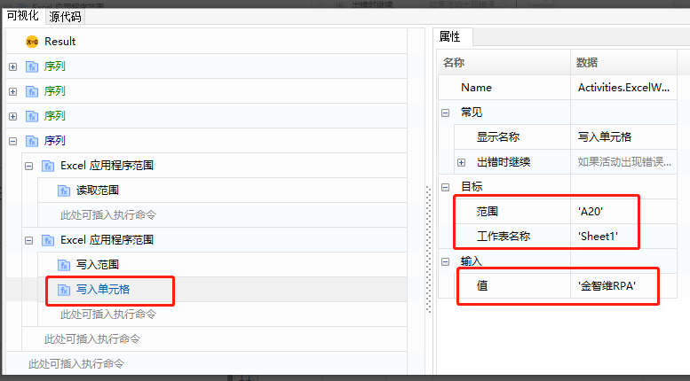

## Excel写入操作(基于COM)

### Excel写入范围

1. 参考读取范围的步骤，把Excel内容读入到Table。

   

2. 添加新的“Excel应用程序范围”，填写新建的工作簿路径。

   

3. 添加“写入范围”命令，并填写工作表名称，起始单元格、输入表（Table）、勾选增加标头。

   

4. 运行组件，查看输出文件内容。

   

### Excel写入单元格

 &emsp;&emsp;范围：单元格表达式，如A20。

 &emsp;&emsp;工作表名称：如Sheet1。

 &emsp;&emsp;输入值：填写要填入单元格的内容。

## Excel Write Operations (Based on COM)

### Excel Write Range 

1. Refer to the steps of reading the range to read the Excel content into Table.

   

2. Add a new "Excel Application Scope" and fill in the path of the new workbook.

   

3. Add the "Write Range" command, and fill in the worksheet name, starting cell, input table (Table), and check the option to add headers.

   

4. Run the component and check the content of the output file.

   

### Excel Write Cell 

- Range: Cell expression, such as A20.
- Worksheet Name: e.g., Sheet1.
- Input Value: Fill in the content to be entered into the cell.

