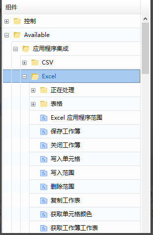

# Excel Automation

## Basic Introduction to Excel Automation 

Excel automation is mainly used to help various types of business users achieve automated Excel data processing. Excel automation activities include reading data from cells, columns, rows, or ranges, writing data to other spreadsheets or workbooks, sorting data, setting formats, or appending additional information. Even if the user's computer does not have Excel installed, some components can still be executed, but more data processing activities require the application to be installed on the machine. All activities of Excel automation operations must work within the Excel application scope, except for CSV operations.

There are two methods for RPA to operate Excel:

1. Based on the COM interface: App Integration > Excel.

   

2. Based on file read/write: System > File > Workbook.

   

 &emsp;&emsp;Differences in usage:

|         | Based on COM                                              | Based on File Read/Write             |
| --------------------- | --------------------------------------------------------- | ------------------------------------ |
| Requires Excel        | Yes, supports Microsoft Excel and WPS                     | No                                   |
| Needs to open Excel   | Yes                                                       | No                                   |
| Processing Efficiency | Needs to open Excel, slower when handling large data      | Faster                               |
| Functionality         | More complete and powerful. Supports general reading/writing, format setting, complex formulas, enhanced plugins, etc. | Supports general reading/writing, simple format setting, and simple formulas |
