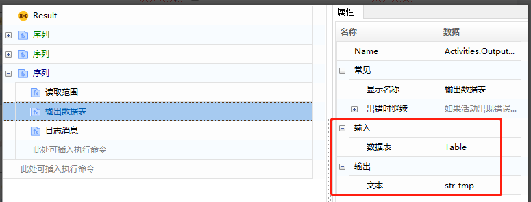
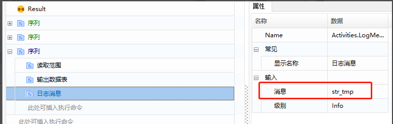
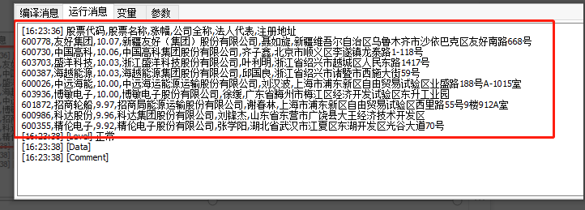
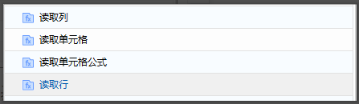

## Excel Read Operations (Based on Workbook File Read/Write)

### Read Range 

1. Add the "Read Range" command (System - File - Workbook - Read Range) and create a variable "Table" for the output data table.

   Common attribute descriptions:

   - WorkbookPath: Fill in the path of the Excel file.
   - SheetName: Fill in the name of the worksheet.
   - Range: The range to be read, format (e.g., 'A1:E10'); if not set, the entire table will be read; if the range is specified as a single cell (e.g., 'A2'), the entire table starting from that cell will be read.
   - AddHeaders: If checked, the headers of the specified table range will be retrieved.

   

2. Print data to view: Add the "Output Data Table" command, select the input as the "Table" generated in the previous step, and create a variable "str_tmp" for the output. Then use the "Log Message" command to print out "str_tmp".

   

   

3. Execution result:

   

### Other Read Operations 

Including read column, read cell, read cell formula, read row, etc.

