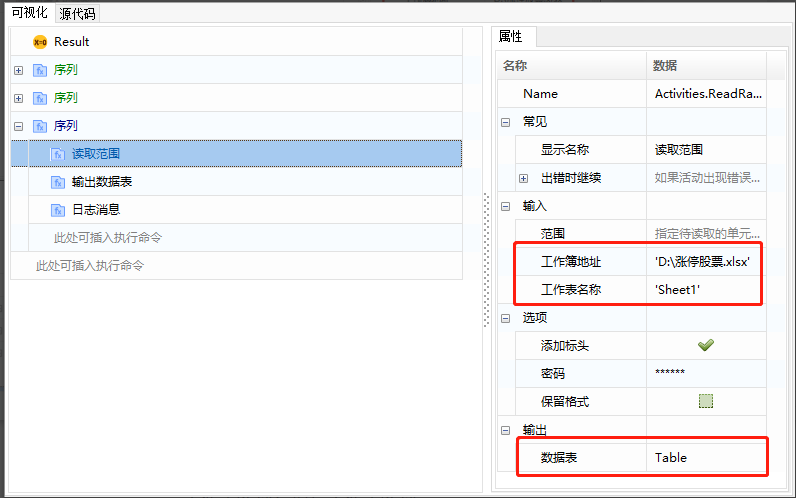

## Excel读取操作(基于Workbook文件读写)

### 读取范围

1. 添加“读取范围”命令（系统-文件-workbook-读取范围），并为输出数据表创建一个变量“Table”。

   常用属性介绍:

   工作簿地址：填写Excel文件的路径。

   工作表名称：填写工作表名称。

   范围: 需要读取的范围，格式（如’A1:E10’）;如果未设值，将会读取整个表格; 如果将范围指定为某个单元格(如：’A2’)，则读取从该单元格开始的整个表格。 

   添加标头：如果选中，将获取指定表格范围的标题。

   

2. 打印数据查看：添加“输出数据表”命令，选择输入为上一步产生的“Table”，并为输出创建一个变量“str_tmp”，然后用“日志消息”命令打印出str_tmp。

   

   

3. 执行结果：

   

### 其他读取操作

包括读取列、读取单元格、读取单元格公式、读取行等。

