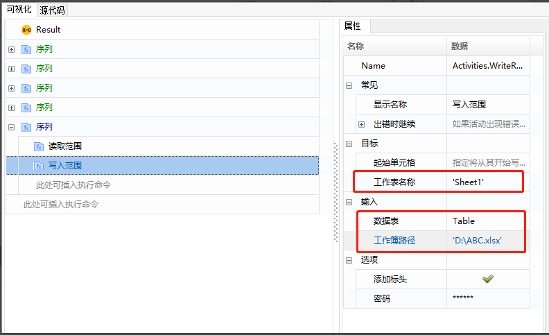
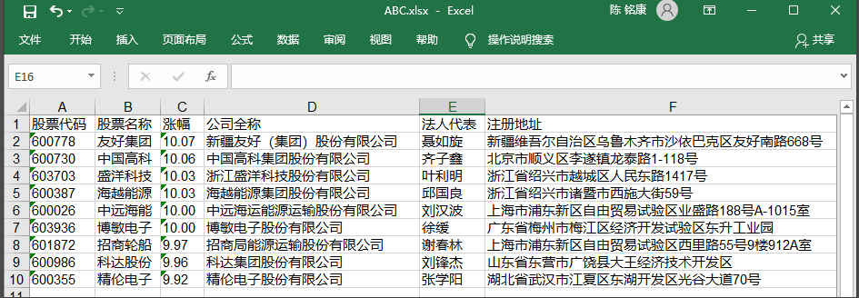
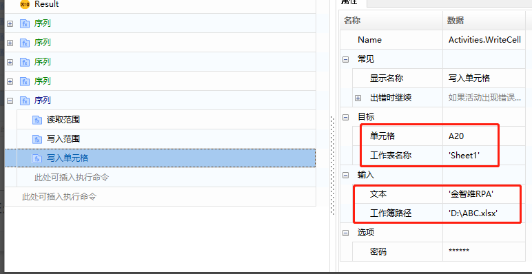

## Excel写入操作(基于Workbook文件读写)

### 写入范围

1. 属性介绍

   起始单元格: 从指定单元格开始的一行中写入值。

   工作表名称：需要写入的工作簿名称。

   数据表: 要写入单元格范围的数据。

   工作簿路径: 需要写入的Excel文件路径。

   添加标头：如果选中，将获取指定表格范围的标题  。

   密码：Excel文件密码(如无可忽略)。

2. 案例介绍

   如图，通过Workbook分类下的读取范围和写入范围命令，包括：工作表名称、数据表（Table）、写入的工作簿路径。

   

   

### 写入单元格

单元格：单元格表达式，如A20。

工作表名称：如Sheet1。

文本：填写要填入单元格的内容。

工作簿路径：写入工作簿的路径。

## Excel Write Operations (Based on Workbook File Read/Write)

### Write Range 

1. Attribute Descriptions

   - Starting Cell: The cell from which to begin writing values.
   - Worksheet Name: The name of the worksheet to write into.
   - Data Table: The data to be written into the cell range.
   - Workbook Path: The path of the Excel file to be written into.
   - Add Headers: If checked, the headers of the specified table range will be written.
   - Password: The password for the Excel file (if any, otherwise ignore).

2. Example Introduction

   As shown in the figure, use the Read Range and Write Range commands under the Workbook category, including: worksheet name, data table (Table), and the path of the workbook to write into.

   

   

### Write Cell 

- Cell: Cell expression, such as A20.
- Worksheet Name: e.g., Sheet1.
- Text: Fill in the content to be entered into the cell.
- Workbook Path: The path of the workbook to write into.

