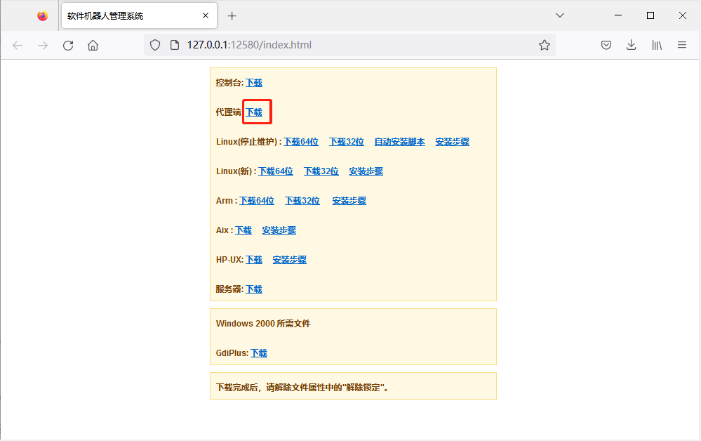
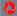
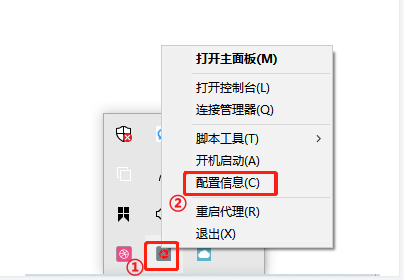
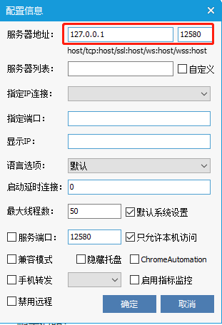
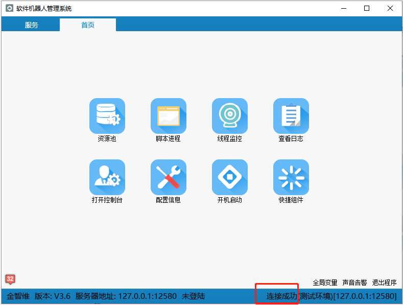

## Agent安装

1. 获取 Agent 程序

   打开浏览器，登录网址：http://服务器IP:端口/index.html ，单击“下载”，下载代理端 Agent 程序，如下图所示：

   > **[info]  提示**  
   >
   >  &emsp;服务器 IP ：Server 安装在本地，则可直接使用 127.0.0.1 地址，否则需要使用实际 IP 。

   

2. 双击运行 Agent 程序，并设置连接 Server 的 IP 和端口

   将下载的 "Agent.exe" 拷贝至安装目录，如：“D：/krpa/Agent/Agent.exe”，双击 “Agent.exe” 运行。

   程序界面默认最小化至托盘，出现  这种状态，说明当前 Agent 未连接至 Server 服务器，需要配置 Server 所在的 IP 和端口。右键  图标，选择“配置信息”，在弹出窗口中完成配置，如下图所示。

   

   

3. Agent 连接成功标志

   设置完成后，单击“确定”。若托盘图标变成  ，则说明当前 RPA 机器人已设置成功，此时双击  图标，弹出 Agent 程序界面，可查看到右下角显示“连接成功”，如下图所示。

   

   

## Agent Installation

1. Obtain the Agent Program

   Open a browser and log in to the URL: http://ServerIP:Port/index.html, click "Download" to download the Agent program, as shown below:

   > **[info] Note**  
   >
   > &emsp;Server IP: If the server is installed locally, you can directly use the 127.0.0.1 address, otherwise, you need to use the actual IP.

   

2. Double-click to Run the Agent Program and Set the IP and Port of the Server

   Copy the downloaded "Agent.exe" to the installation directory, e.g., "D:/krpa/Agent/Agent.exe", and double-click "Agent.exe" to run it.

   The program interface defaults to being minimized to the tray. If it appears as , it indicates that the current Agent is not connected to the Server, and you need to configure the IP and port of the Server. Right-click the  icon and select "Configuration". Complete the configuration in the pop-up window, as shown below.

   

   

3. Successful Agent Connection Indicator

   After setting, click "OK". If the tray icon changes to , it means the current RPA robot is successfully set up. At this time, double-click the  icon, and the Agent program interface will pop up. You can see "Connected successfully" displayed in the lower right corner, as shown below.

   

