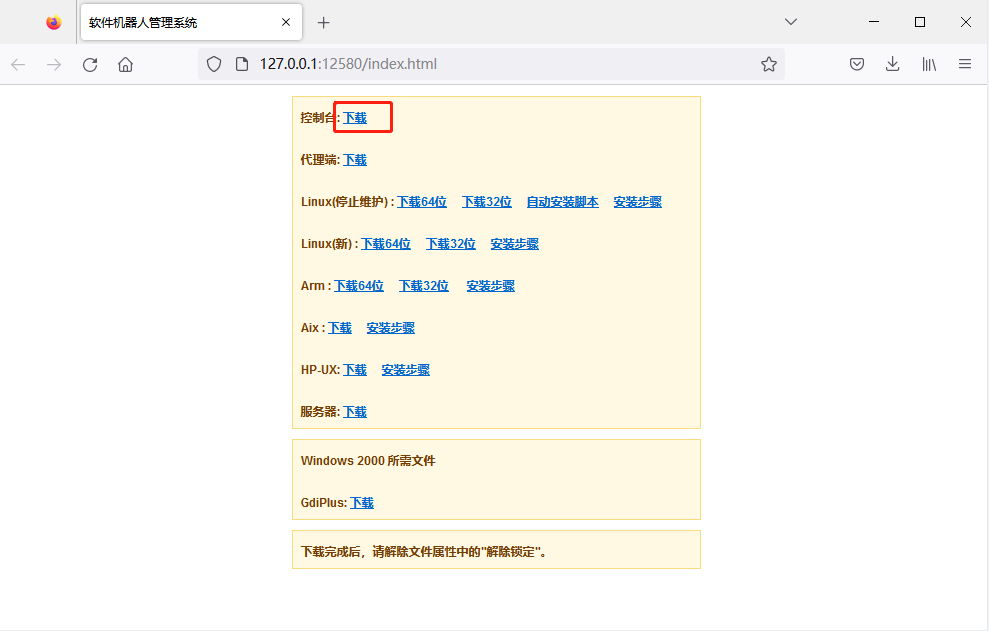
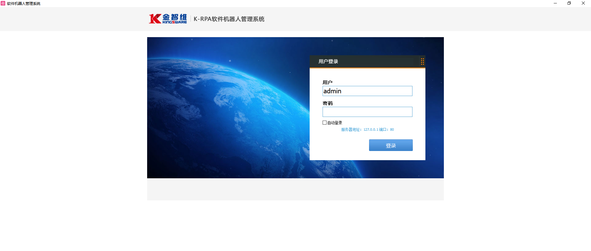
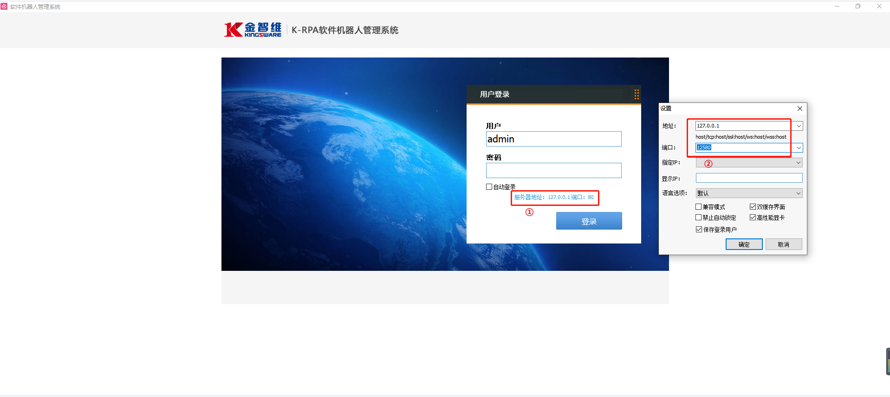
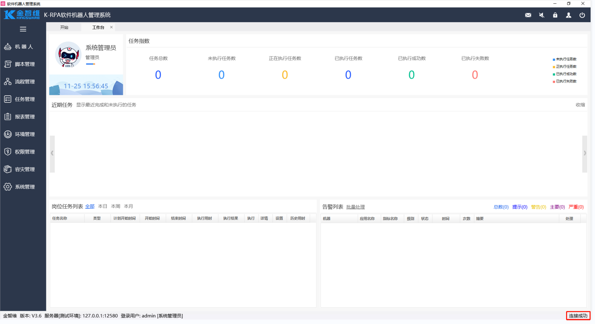

## Control Installation

1. Obtain the Control Program

   Open the browser and go to the URL: http://ServerIP:Port/index.html to download the Control program as shown below.

   > **[Note]**  
   >
   > &emsp;Server IP: If the Server is installed locally, you can directly use the address 127.0.0.1, otherwise, use the actual IP.

   

2. Open the Control Program Main Interface

   Copy the program to the installation directory, such as “D:/krpa/Control/Control.exe”, double-click to run and open the login interface of the program as shown below.

   

3. Set the IP and Port to Connect to the Server

   Click “Server Address”, a “Settings” window will pop up. Set the IP and port to the IP address and port where the Server is located, as shown below.

   

   Click “OK”, and the connection information will be set successfully as shown below.

   

4. Log in to the Control Console

   Enter the initial username and password, click login to enter the system homepage. If "Connection Successful" is displayed at the bottom right, it means that the Control has successfully connected to the Server, as shown below.

   > **[Note]**  
   >
   > - Initial User: admin
   > - Initial Password: 1

   

