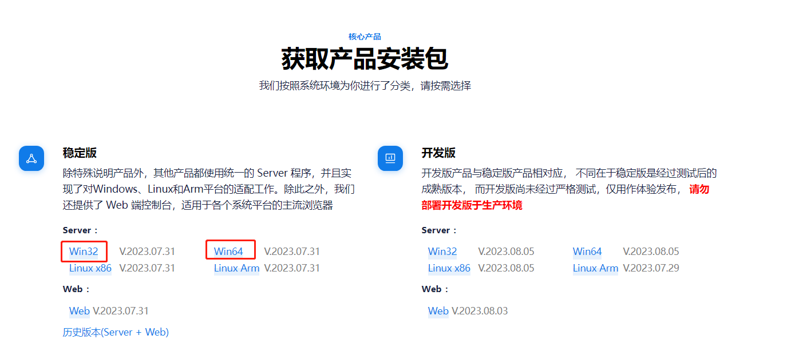
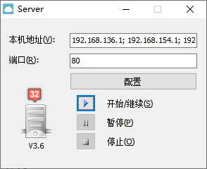
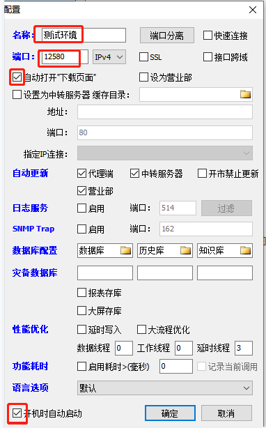
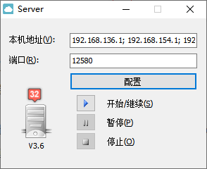
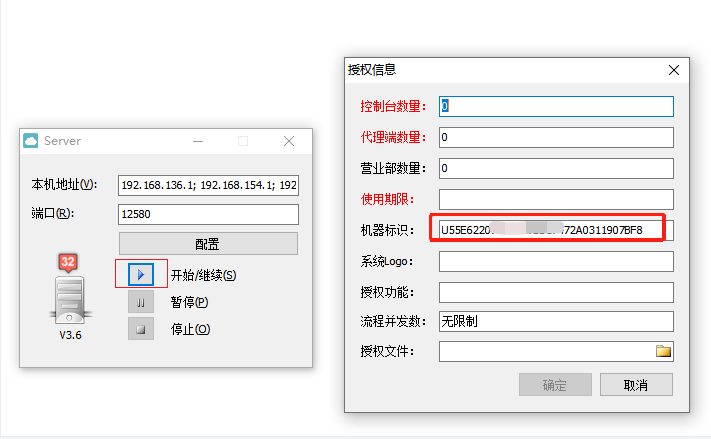
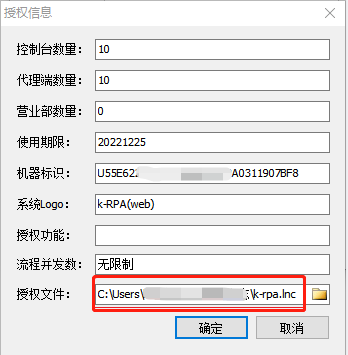
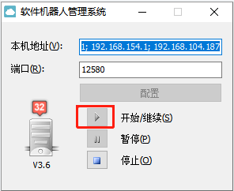

# K-RPA Installation and Deployment

This chapter mainly describes how to install and deploy the K-RPA system on the Windows platform. K-RPA adopts a three-layer architecture, consisting of Server, Robot (Agent), and Control programs. K-RPA is a portable software, which can be directly installed once the commercial version of the software is obtained.

> **[Note]**  
> 
> - The K-RPA system adheres to the concept of portable software, requiring no installation process, and can be used directly by copying a single file, making deployment convenient, quick, and simple, supporting batch upgrades.
> - In addition to supporting installation and deployment on the Windows platform, the K-RPA system also supports installation and deployment on Linux, Arm, and Xinhua platforms.

## Server Installation 

1. Ways to obtain the Server program installation package:

   - Internal personnel can download it from the product download center website;

     

   - External personnel will be provided by project implementation personnel.

2. Run the Server Program

   Extract the Server program installation package to the installation directory, e.g., "D:/krpa/Server/Server.exe". Double-click "Server.exe" to open the main interface, as shown below.

   

3. Configuration Information

   Click the "Configure" button to pop up the Server "Configuration" window, as shown below.

   

   Configuration instructions:

   - Name: Server description, customizable.
   - Port: Server's external service port, recommended 12580, but can be customized. Both Robot and Control establish a Socket connection with the Server through this port. The direction of the port opening is from Robot and Control to Server.
   - Automatically open the "download page": Check this option, and the download page and installation instructions for Control and Robot will automatically pop up when the Server starts.
   - Start automatically at boot: Check this option, and the Server will start with the machine.
   - Other options do not need to be set, default settings are sufficient.

4. Return to the Server Main Interface

   After configuration, click "OK" to return to the Server start interface.

   

5. Apply for the License File

   Click the "Start/Continue (S)" button to pop up the "License Information" window. Copy the "Machine Identifier" string and send it to the Jinzhiwei manufacturer, as shown below.

   

   > **[Note]**  
   > 
   > - You only need to apply for a license during the first installation or if the license file has expired.
   > - If you need to use the web version, please note this requirement when applying for the license.

6. Import the License File

   After receiving the Machine Identifier, Kingsware will return a license file with the extension ".lnc". Import the license file at this point, as shown below.

   

7. Start the Server

   Click the "OK" button. If the Server program minimizes to the tray, double-click the  icon to open the main interface. When the start button turns gray, it indicates that the Server has started successfully, as shown below.

   > **[info] Explanation**  
   > 
   > &emsp;  is the old version of the Server icon, and the new version of the icon has been updated to 

   

