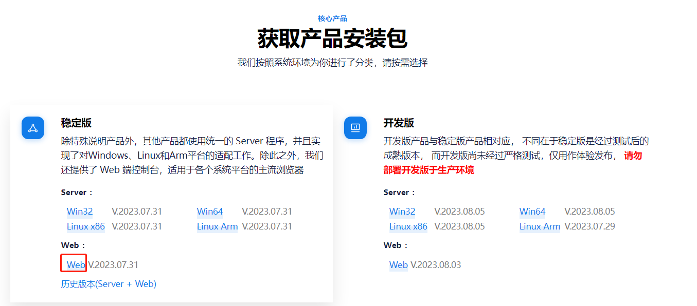
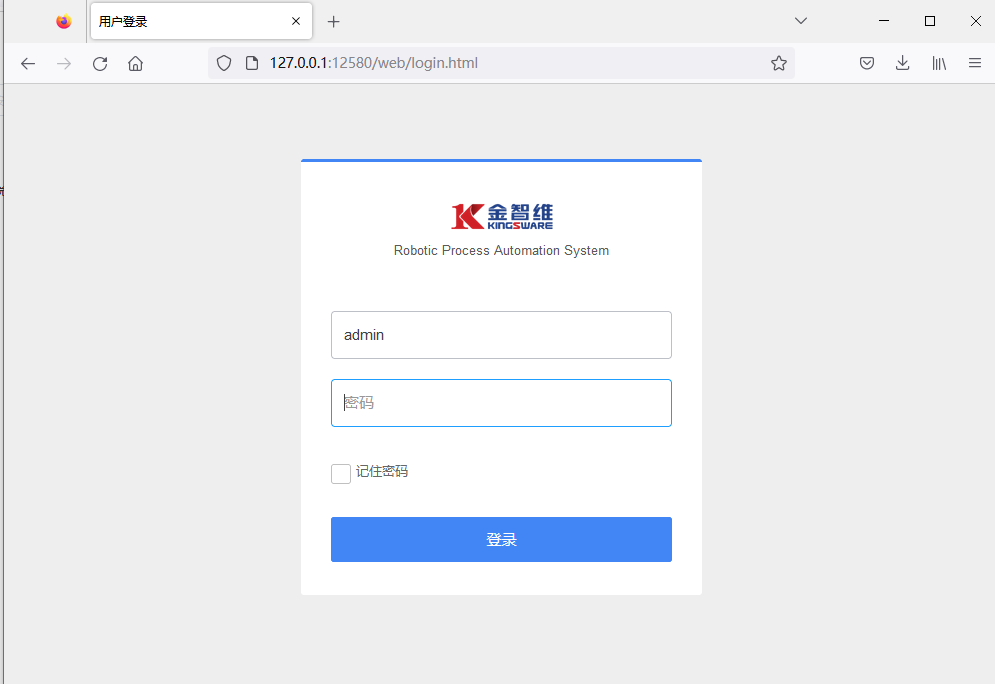
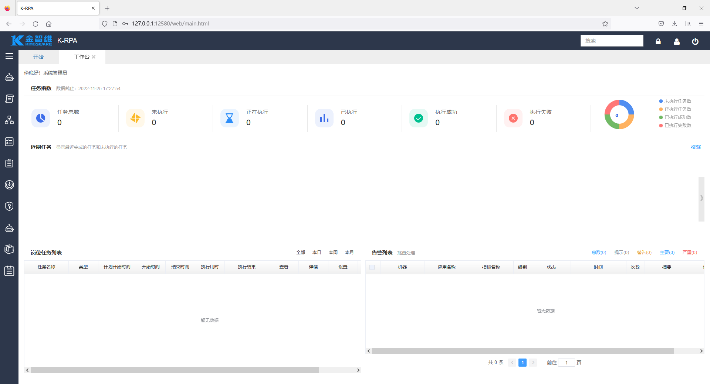
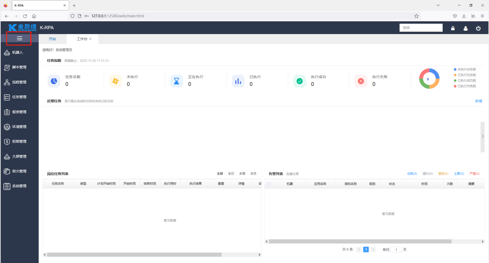

## Web Installation

1. Obtaining the "web.dat" File:

   - Internal Personnel: Can be downloaded from the product download center website.

     

   - External Personnel: Provided by project implementation personnel.

2. Place the "web.dat" File in the Specified Location and Restart the Server

   Place the obtained "web.dat" file in the same directory as "Server.exe" and double-click "Server.exe" to start the Server.

   > **[Note]**  
   >
   > &emsp;If the current Server is already running, you need to right-click the tray icon  to exit the Server, then restart it. ( is the old version Server icon, the new version icon has been updated to )

3. Log in to the Web Console

   Open the browser and go to the URL: http://ServerIP:Port/web/login.html.

   > **[Note]**  
   >
   > &emsp;Server IP: If the Server is installed locally, you can directly use the address 127.0.0.1, otherwise, use the actual IP.

   

   Enter the initial username and password, and click login to successfully enter the system homepage as shown below.

   > **[Note]**  
   >
   > - Initial User: admin
   > - Initial Password: 1

   

4. View Menu Modules

   Click the left icon  to display the system menu modules.

   

