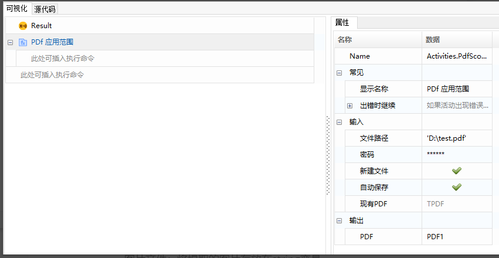
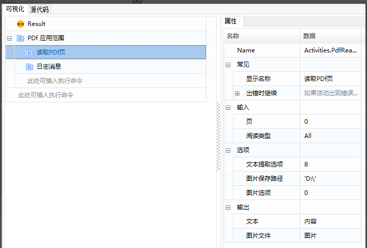
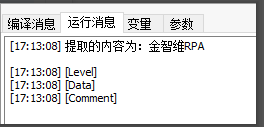
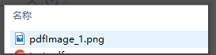

## PDF读取操作

### 读取PDF页

1. 属性介绍

   页: 希望读取内容的位置（下标从0开始）。

   阅读类型: 需要读取的内容的类型，支持读取“所有”，只读取“文本”和只读取“图片”三种模式。

   文本提取选项: 可以选择提取文本的算法，默认为8。

   图片保存路径：设置提取出的文件的保存路径。

   图片选项：有0和非0两种选项，默认为0（无法枚举页面上的图像），非0（imageListID值）。

   文本：将提取的文本内容存放在string变量。

   图片文件：将提取的图片存放在string变量。

2. 案例说明

   给定PDF文件“test.pdf”，对其进行读取操作。

3. 操作步骤

   1. 使用 “PDF应用范围”函数，打开指定PDF文件。

      

   2. 使用 “读取PDF页”函数，读取里面的文本和图片，并将内容在控制台输出。

      

      运行结果如下：

      (1) 提取的文本：

      

      (2) 提取的图像：

      
      
## PDF Reading Operations

### Read PDF Page 

1. Property Introduction

   Page: The desired position of content to be read (indexed starting from 0).

   Reading Type: Type of content to be read, supporting "all", "text" only, and "image" only modes.

   Text Extraction Options: Algorithms available for text extraction, default is 8.

   Image Save Path: Path to save extracted files.

   Image Options: Options for images, 0 and non-0 values, default is 0 (cannot enumerate images on page), non-0 (imageListID value).

   Text: Stores extracted text content in a string variable.

   Image File: Stores extracted images in a string variable.

2. Case Example

   Given PDF file "test.pdf", perform reading operations on it.

3. Operational Steps

   1. Use the "PDF Application Range" function to open the specified PDF file.

      

   2. Use the "Read PDF Page" function to read text and images inside, and output the content to the console.

      

      Running result:

      (1) Extracted text:

      

      (2) Extracted image:

      
