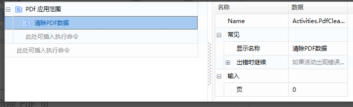

## PDF Modification Operations

### PDF Clear Page Data

**Properties:**

- **Page Number:** The specific page to clear data from (index starts from 0).

### PDF Delete Pages

**Properties:**

- **Start Page:** The page to start deleting from (index starts from 0).
- **Page Count:** The number of pages to delete.

### Save PDF

**Properties:**

- **PDF File Path:** The path to save the PDF file.

### Close PDF

**Properties:**

- **PDF:** The PDF file to close.

