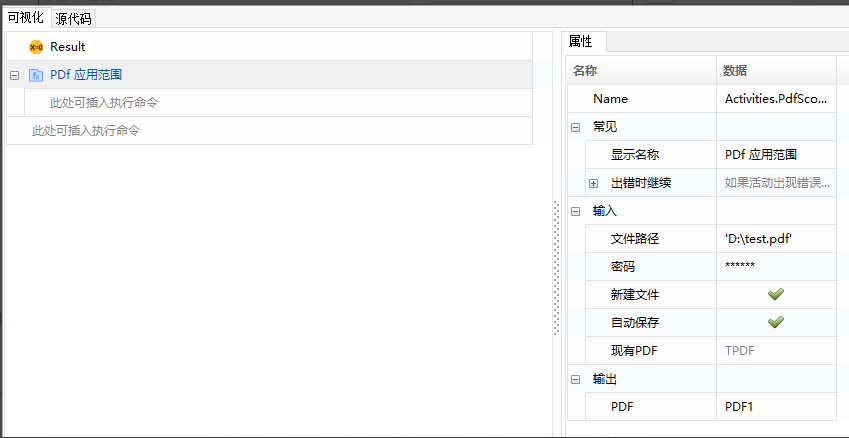
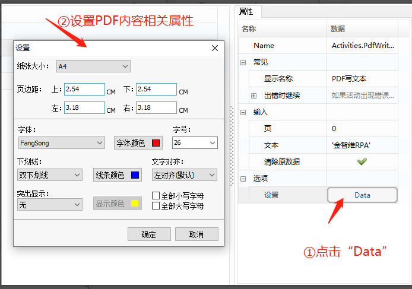
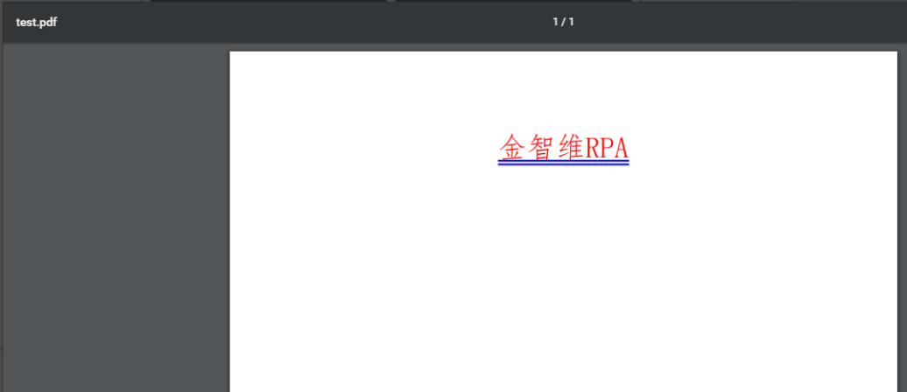
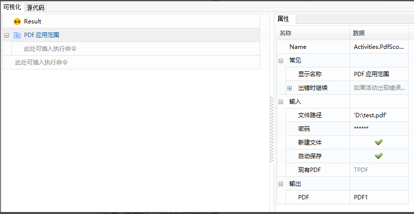
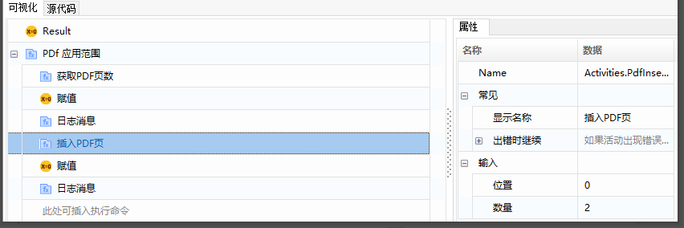
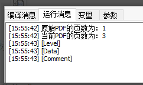
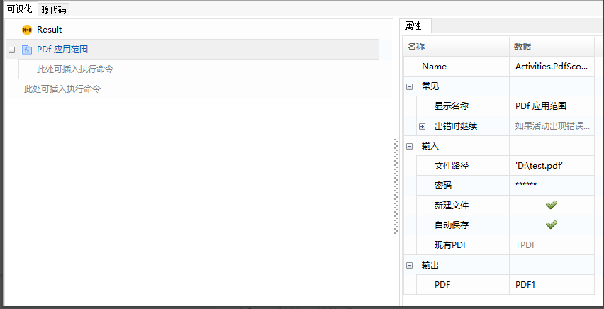
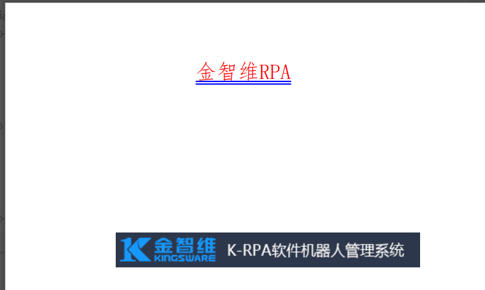

## PDF写入操作

### PDF写入文本

1. 部分属性介绍

   设置: 可以设置写入PDF内容的一些格式。

   页：写入内容的位置（下标从0开始）。

   文本: 需要写入的内容。

   清除原数据：若勾选，会在写入数据之前清除原有的数据。

2. 案例说明

   给定PDF文件“test.pdf”，对其进行写入内容操作。

3. 操作步骤

   1. 使用 “PDF应用范围”函数，打开指定PDF文件。

      

   2. 使用 “PDF写文本”函数，在“输入”属性中，设置希望写入的页数位置，设置文本内容，并对写入的文本进行格式的设置。

      

      运行结果如下：

      

### 插入PDF页

1. 常用属性介绍

    位置: 希望插入新的PDF页的位置（下标从0开始）。

   数量: 需要插入的PDF页的数量。

2. 案例说明

   给定PDF文件“test.pdf”，插入新的2页。

3. 操作步骤

   1. 使用 “PDF应用范围”函数，打开指定PDF文件。

      

   2. 依次使用 “获取PDF页数”函数，获取当前PDF的页数，使用“插入PDF页”函数，插入新的2页，再次使用“获取PDF页数”函数，获取PDF数量。

      

      运行结果如下：

      

### PDF插入图片

1. 常用属性介绍

   页: 希望插入图片的位置（下标从0开始）。

   图片文件: 图片存在的路径。

   设置：可以设置插入图片的一些格式。

2. 案例说明

   给定PDF文件“test.pdf”，插入一张图片。

3. 操作步骤

   1. 使用 “PDF应用范围”函数，打开指定PDF文件。

      

   2. 使用 “PDF插入图片”函数，设置图片格式。

      

      运行结果如下：

      
      
      
 ## PDF Writing Operations

### Write Text to PDF

1. **Property Descriptions:**

   - **Settings:** Options for formatting the text to be written to the PDF.
   - **Page:** The page where the text will be written (index starts from 0).
   - **Text:** The content to be written.
   - **Clear Existing Data:** If checked, existing data on the page will be cleared before writing.

2. **Case Description:**

   Given a PDF file "test.pdf", perform a text-writing operation.

3. **Steps:**

   1. Use the "Open PDF" function to open the specified PDF file.

      

   2. Use the "Write Text to PDF" function to set the page location, text content, and text formatting settings.

      

      Result:

      

### Insert PDF Page

1. **Property Descriptions:**

   - **Position:** The position to insert the new PDF pages (index starts from 0).
   - **Quantity:** The number of PDF pages to insert.

2. **Case Description:**

   Given a PDF file "test.pdf", insert 2 new pages.

3. **Steps:**

   1. Use the "Open PDF" function to open the specified PDF file.

      

   2. Use the "Get PDF Page Count" function to retrieve the current number of pages, then use the "Insert PDF Page" function to insert 2 new pages, and again use the "Get PDF Page Count" function to check the updated number of pages.

      

      Result:

      

### Insert Image into PDF

1. **Property Descriptions:**

   - **Page:** The page where the image will be inserted (index starts from 0).
   - **Image File:** Path to the image file.
   - **Settings:** Options for formatting the inserted image.

2. **Case Description:**

   Given a PDF file "test.pdf", insert an image.

3. **Steps:**

   1. Use the "Open PDF" function to open the specified PDF file.

      

   2. Use the "Insert Image into PDF" function to set the image formatting.

      

      Result:

      
