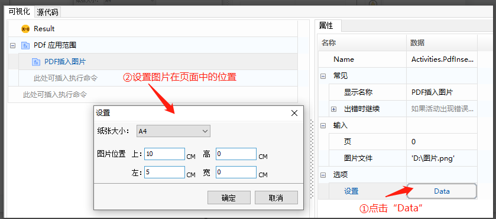

## PDF Writing Operations

### Write Texts to PDF Page

1. **Property Descriptions:**

   - **Font Set:** Options for formatting the text to be written to the PDF.
   - **Page Number:** The page where the text will be written (index starts from 0).
   - **Text:** The content to be written.
   - **Clear Old Data:** If checked, existing data on the page will be cleared before writing.

2. **Example:**

   Given a PDF file "test.pdf", perform a text-writing operation.

3. **Steps:**

   1. Use the "PDF Scope" function to open the specified PDF file.

      

   2. Use the "PDF Write Text" function to set the page location, text content, and text formatting settings.

      

      Result:

      

### Insert PDF Pages

1. **Property Descriptions:**

   - **Position:** The position to insert the new PDF pages (index starts from 0).
   - **Page Count:** The number of PDF pages to insert.

2. **Example:**

   Given a PDF file "test.pdf", insert 2 new pages.

3. **Steps:**

   1. Use the "PDF Scope" function to open the specified PDF file.

      

   2. Use the "PDF Get Page Count" function to retrieve the current number of pages, then use the "PDF Insert Pages" function to insert 2 new pages, and again use the "PDF Get Page Count" function to check the updated number of pages.

      

      Result:

      

### Insert Images into PDF

1. **Property Descriptions:**

   - **Page Number:** The page where the image will be inserted (index starts from 0).
   - **Image File:** Path to the image file.
   - **Image Set:** Options for formatting the inserted image.

2. **Example:**

   Given a PDF file "test.pdf", insert an image.

3. **Steps:**

   1. Use the "PDF Scope" function to open the specified PDF file.

      

   2. Use the "PDF Insert Image" function to set the image formatting.

      

      Result:

      
