# Basic Knowledge

## Components

### Component Description

Components are scripts with specific functions, abstracted as "functional parts" in specific scenario implementations.

1. Components are part of the process, serving as a single node in the process.
2. Components have specific functions in the implementation of scenarios. For example, in the scenario of downloading bank statements, online banking login can be abstracted as a component; entering the corresponding menu to query and download statements can be abstracted as a component; closing the browser can be abstracted as a component, etc.

### Script Wizard Description

The script wizard is a visual development language used in component programming. Users can develop script wizard components through drag-and-drop operations.

### Path to Enter Script Wizard

1. Enter the [Component Management] page:

   In the left menu bar of the interface, click "Script Management", then click "Component Management" on the page to enter the component management interface.

   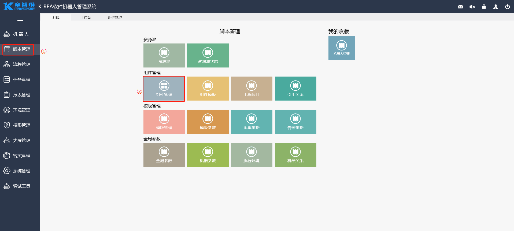

2. Add Components:

   On the [Component Management] interface, select a group, click "Add" - "Add Component", and choose "Script Wizard" as the component type.

   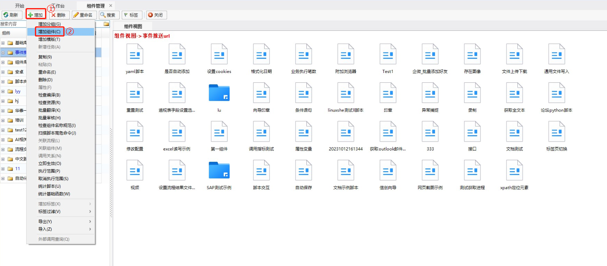

   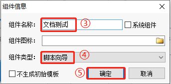

3. After adding the component, you will automatically enter the script wizard editing page. The page is divided as follows.

   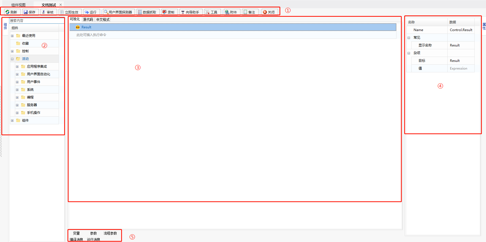

   ①: Toolbar;

   ②: Basic Components;

   ③: Component Editing Area;

   ④: Function Attribute Setting Area;

   ⑤: View Compilation and Execution Results, and View Variable and Parameter Information.

### Component Programming Basics

Component development will be introduced in the following steps:

- [Add Function](#add-function)
- [Delete Function](#delete-function)
- [Copy Function](#copy-function)
- [Move Function](#move-function)
- [Comment Function](#comment-function)
- [View Help](#view-help)
- [Favorite Function](#favorite-function)
- [Recently Used](#recently-used)

#### Add Function

In the component editing panel, there are several ways to add a function:

- Double-click to add

  Search for the function you need to add in the search bar, and double-click the function with the mouse to add it.

  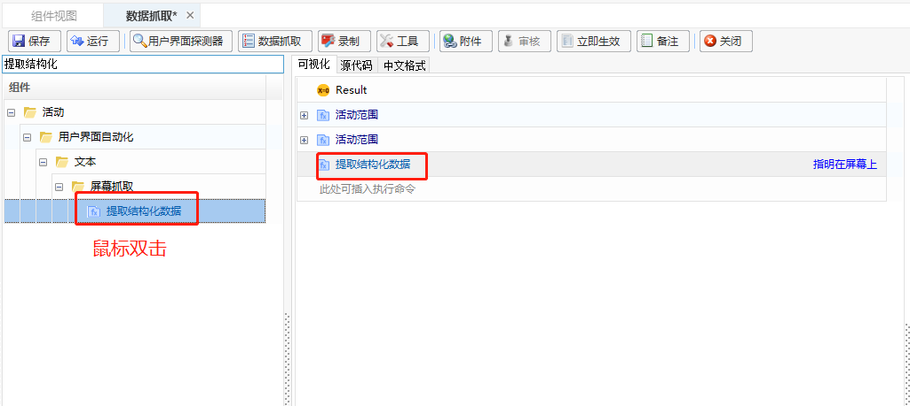

- Drag to add: Search for the function you need to add in the search bar, and drag it with the mouse to the specified editing area.

- Right-click to add

  In the editing area, right-click with the mouse and select "Insert" from the pop-up menu.

  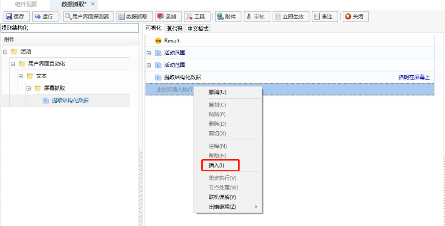

  Enter the name of the function you need to add in the input box.

  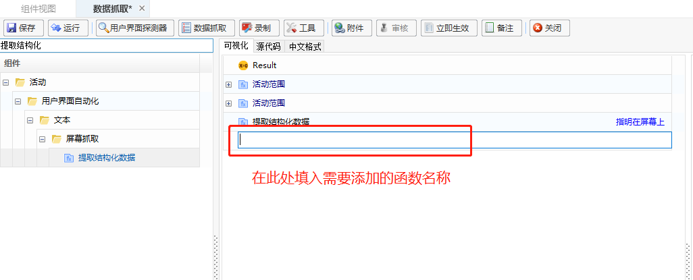

  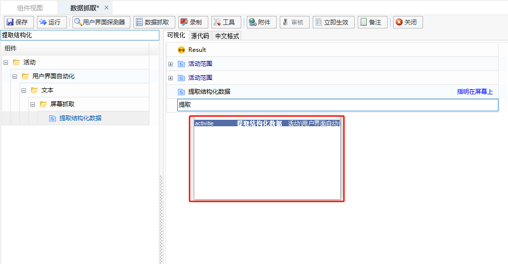

#### Delete Function

Select the function you want to delete, you can directly press the Delete key to delete it, or select the function, right-click with the mouse, and click the [Delete] button to delete it.

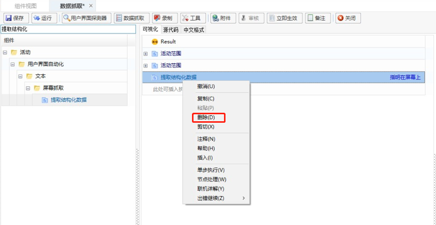

#### Copy Function

Select the function you want to copy, you can use Ctrl+C and Ctrl+V to copy and paste, or you can use the mouse right-click, and select the copy and paste buttons from the pop-up menu to copy and paste.

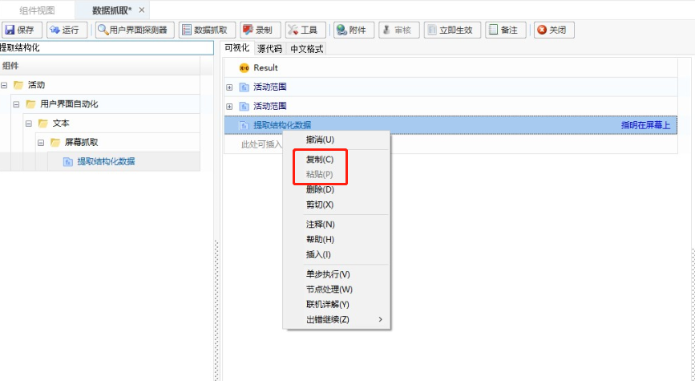

#### Move Function

Select the function you want to move, and drag it to the specified position.

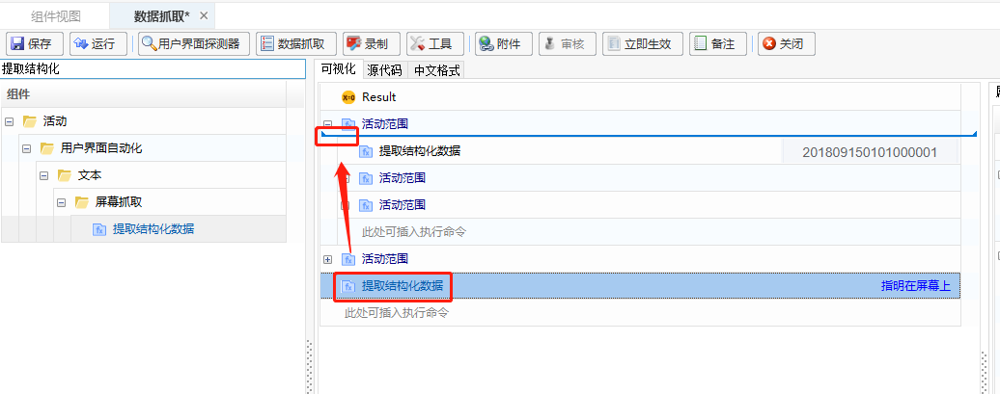

#### Comment Function

Select the function you want to comment on, right-click with the mouse, and click the [Comment] button in the pop-up box to comment, or use the shortcut key "Ctrl+/" to comment. The color of the commented function will be green.

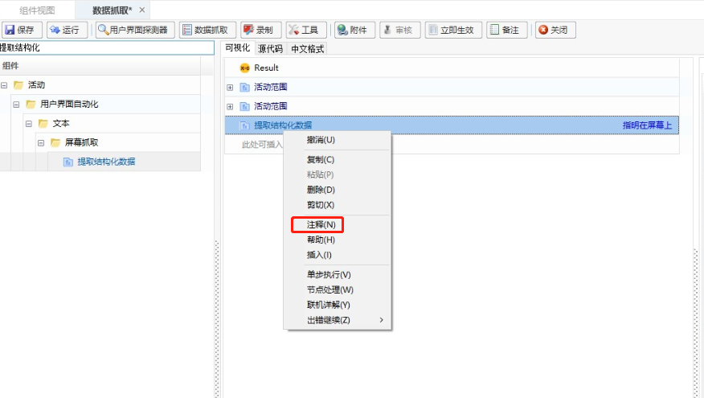

#### View Help

1. In the visual editing area, users can view the function analysis, usage requirements, etc., of the component. The methods for viewing component help are as follows:

   1. Hover the mouse over the function attribute item to view the corresponding parameter description;

      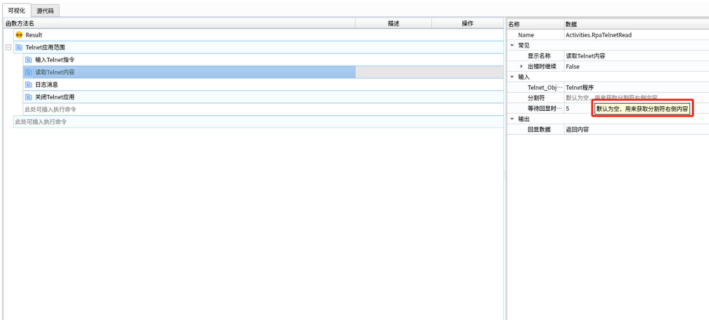

   2. Select the component in the visual editing area, right-click, and click "Help" in the drop-down menu to view the function help information in the following ways:

      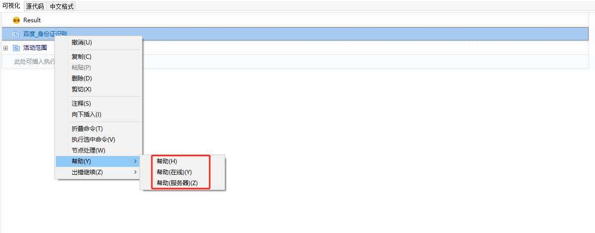

      ① Help - Help: A simple usage description of the function, built-in help, click to view a brief description of this function.

      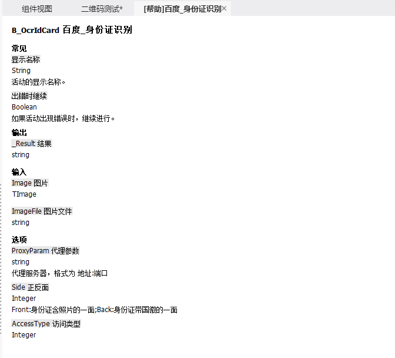

      ② Help - Help (Online): Detailed usage instructions for the online version of the function, the content of this description is the same as "Help - Help (Server)", but it requires an external network connection to view.

      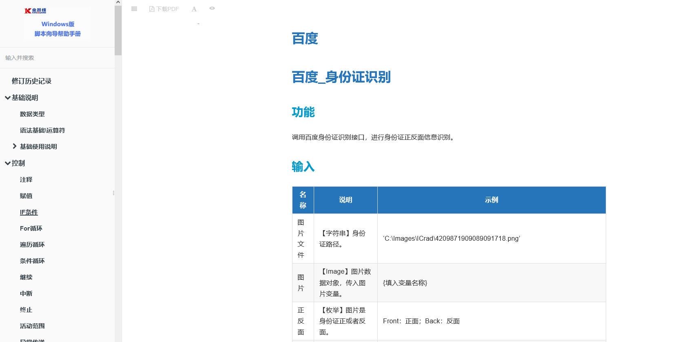

      ③ Help - Help (Server): Detailed usage instructions for the offline version of the function, the content of this description is the same as "Help - Help (Online)", no external network connection is required but server help information configuration is needed:

      - Obtain the "win_script_wizard_help_document.zip" file from the "Product Download Center", store it in the "~server/Resources" path, and then click "Help" - "Help (Server)" to complete the configuration.

        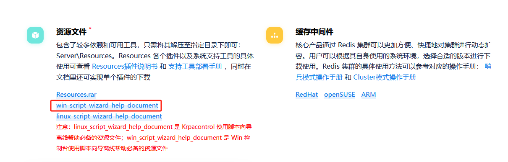

      - After completing the configuration, click "Help" - "Help (Server)" to view the detailed description of the function by accessing the server.

        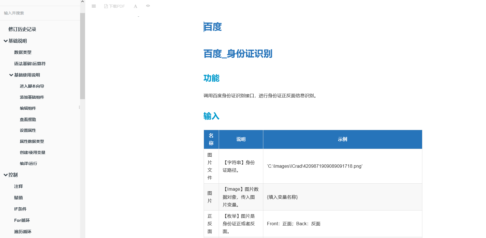

#### Favorite Function

After selecting the script wizard function, right-click to add the selected script wizard function to favorites. The favorited script wizard functions will be recorded in the "Favorite Functions" group. The script wizard functions under the "Control" group do not support favorites.

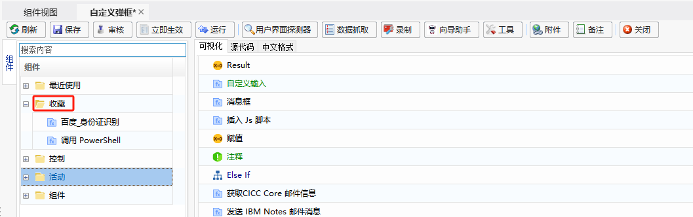

#### Recently Used

The "Recently Used" group dynamically records the functions and components that users have recently used in the script wizard editing interface, with the most recent one displayed at the top, supporting up to 10 items.

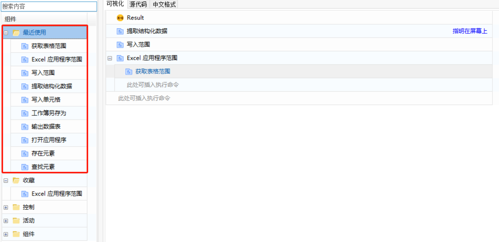