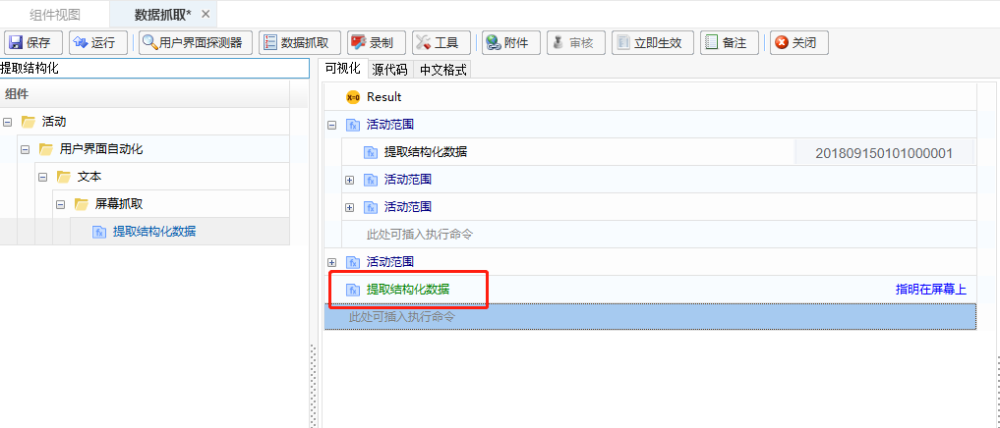

# 基础知识

## 组件

### 组件说明

组件是具备某特定功能的脚本，是具体场景实现中抽象出来的“功能零件”。

1. 组件是流程的组成部分，作为流程的一个单独节点。
2. 组件是具体场景实现中的一个特定功能，比如银行流水下载场景中，网银登录可抽象为一个组件；进入对应菜单查询下载流水可抽象为一个组件；关闭浏览器可抽象为一个组件等。

### 脚本向导说明

脚本向导是组件编程中的一种可视化开发语言，用户可以通过拖拉拽的形式进行脚本向导组件的开发。

### 进入脚本向导路径

1. 进入【组件管理】页面：

   在界面左边菜单栏，单击“脚本管理”，在页面中单击“组件管理”，进入组件管理界面。

   

2. 增加组件：

   在【组件管理】界面，选中一个分组，单击“增加”-“增加组件”，组件类型选择“脚本向导”。

   

   

3. 增加完组件后，会自动进入到脚本向导编辑页面，页面各区域划分如下。

   

   ①：工具栏；

   ②：基础组件；

   ③：组件编辑区域；

   ④：函数属性设置区域；

   ⑤：编译和运行结果查看，以及变量和参数信息的查看。

   ### 组件编程基础
   
   组件开发将分为以下几步进行介绍：
   
   - [添加函数](#添加函数)
   - [删除函数](#删除函数)
   - [复制函数](#复制函数)
   - [移动函数](#移动函数)
   - [注释函数](#注释函数)
   - [查看帮助](#查看帮助)
   - [收藏函数](#收藏函数)
   - [最近使用](#最近使用)
   
   #### 添加函数
   
   在组件编辑面板中，添加函数的方式有以下几种：
   
   - 双击添加
   
     在搜索栏搜索处需要添加的函数，鼠标双击该函数进行添加。
   
     
   
   - 拖拽添加：在搜索栏搜索需要添加的函数，鼠标拖拽到指定编辑区域。
   
   - 右键插入添加
   
     在编辑区域，鼠标右击，在弹出的菜单栏中选择“插入”。
   
     
   
     在编辑框中输入需要添加的函数名称。
   
     
   
     
   
   #### 删除函数
   
   选中需要删除的函数，可直接按Delete键进行删除，也可选中该函数鼠标右击，单击【删除】按钮进行删除。
   
   
   
   #### 复制函数
   
   选中需要复制的函数，可通过Ctrl+C和Ctrl+V进行复制粘贴，也可通过鼠标右键，在弹出菜单的复制和粘贴按钮进行复制粘贴。
   
   
   
   #### 移动函数
   
   选中需要移动的函数，拖拽移动到指定位置。
   
   
   
   #### 注释函数
   
   选中需要注释的函数，可通过鼠标邮件，在弹出框中单击【注释】按钮进行注释，也可通过“Ctrl+/”快捷键进行注释，注释的函数颜色显示为绿色。
   
   
   
   
   
   
   
   #### 查看帮助
   
   1. 在可视化编辑区域，用户可查看组件的功能解析、使用要求等，查看组件帮助的方法如下：
   
      1. 鼠标在函数属性项上悬浮，可查看对应参数的相关说明；
   
         
   
      2. 选中可视化编辑区域的组件右键，在下拉菜单中单击“帮助”，可通过以下方式查看函数帮助信息：
   
         
   
          ① 帮助-帮助：函数的简易使用说明，程序自带帮助，单击可查看到此函数的的简要说明。 
   
         
   
          ② 帮助-帮助(在线)：在线版的函数使用**详细**说明，此处的使用说明内容和“帮助-帮助(服务器)”一致，但是此处说明**需连接外网**才能查看。 
   
         
      
          ③ 帮助-帮助(服务器)：离线版的函数使用**详细**说明，此处的使用说明内容和“帮助-帮助(在线)”一致，无需连接外网但是需先进行服务器帮助信息配置： 
      
         -  在“产品下载中心”获取 “win_script_wizard_help_document.zip” 文件，将其存放到 “~server/Resources” 路径下，然后单击“帮助”-“帮助(服务器)”，等待完成配置即可。 
      
           
      
         - 完成配置后，单击“帮助”-“帮助(服务器)”，则会可通过访问服务器查看函数的详细说明。
      
           
   
   #### 收藏函数
   
   用户选中脚本向导函数后右键，可将选中的脚本向导函数添加至收藏，已收藏的脚本向导函数将记录到“收藏函数”分组里，其中“控制”分组下的脚本向导函数不支持收藏。
   
   
   
   #### 最近使用
   
   “最近使用”分组将动态记录用户在脚本向导编辑界面中最近使用的函数和调用的组件，最近第一个将显示在最上层，最多支持10个。
   
   
   
