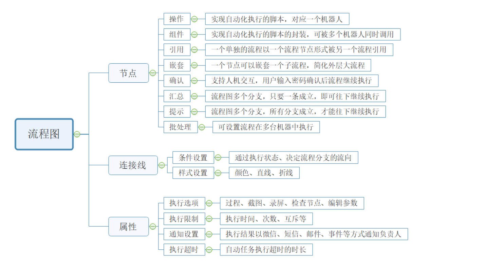
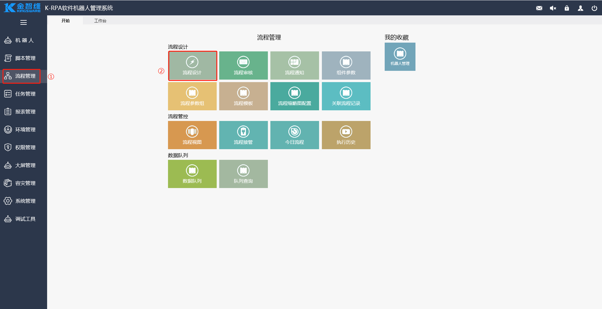
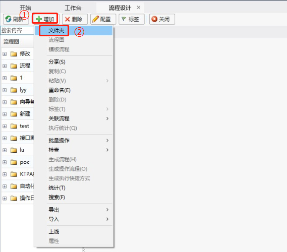
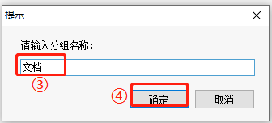
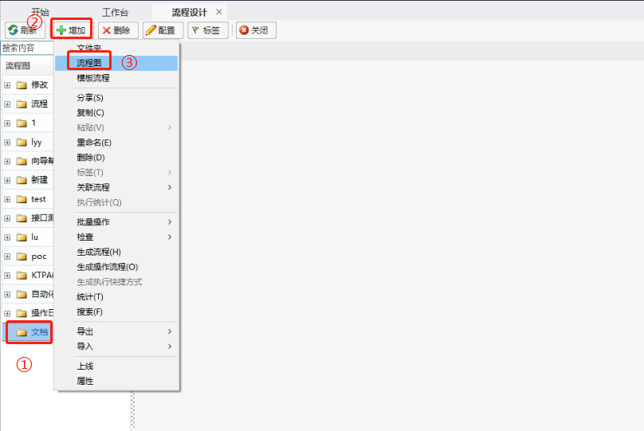
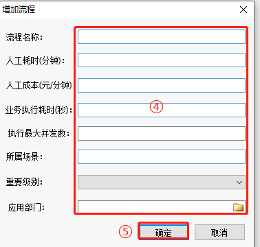

## Process

### Process Design Principles

Processes are the core of RPA, typically corresponding to the automation of a scenario task.

Process design is akin to a factory, where multiple scenario-related functional components are connected through certain logic and sequences, along with parameter information, to form a process.

Principles of process design:

1. A process must include at least "Start" and "End" nodes.
2. Process connections must form a closed loop, meaning process nodes should be directly or indirectly (through other nodes) connected to the "Start" and "End" nodes.
3. Process connections can be conditional but must be used in conjunction with the execution returns of the process nodes.
4. A process can be directly referenced by another process, supporting an infinite number of layers of references.
5. A process can directly nest subprocesses, supporting infinite nested drilling.

### Process Components and Description

### Introduction to Process Design

The purpose of process design is to connect various operations in a predetermined execution sequence and conditions, and after editing, submit them to the process view and task configuration to achieve batch operation automation.

A complete process must have "Start" and "End" nodes as fixed nodes of the process, while other nodes are functional nodes for achieving robotic process automation.

When designing a process chart, the process can be designed as a single-branch process or a multi-branch process.

### Process Creation

1. Enter the [Process Design] page:

   In the left menu bar of the interface, click "Process Management", then click "Process Design" on the page to enter the process design interface.

   

2. Add a Process Group:

   On the [Process Design] page, click "Add" - "Folder" to add a process group.

   

   

3. Add a Process:

   Select a group, click "Add" - "Process Chart" to add a process. In the "Add Process" pop-up box, usually, only the "Process Name" needs to be filled in. If you need to associate the new process with the operations management platform, then fill in other attributes.

   

   
