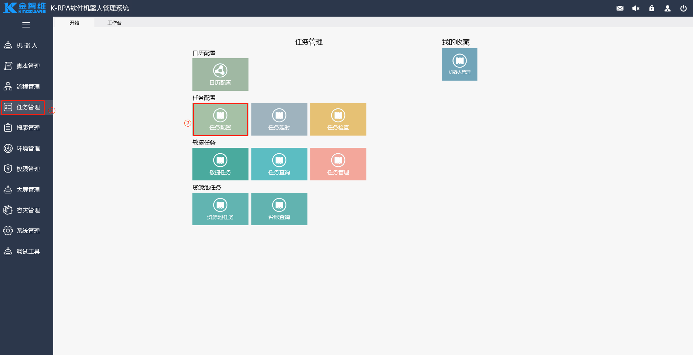
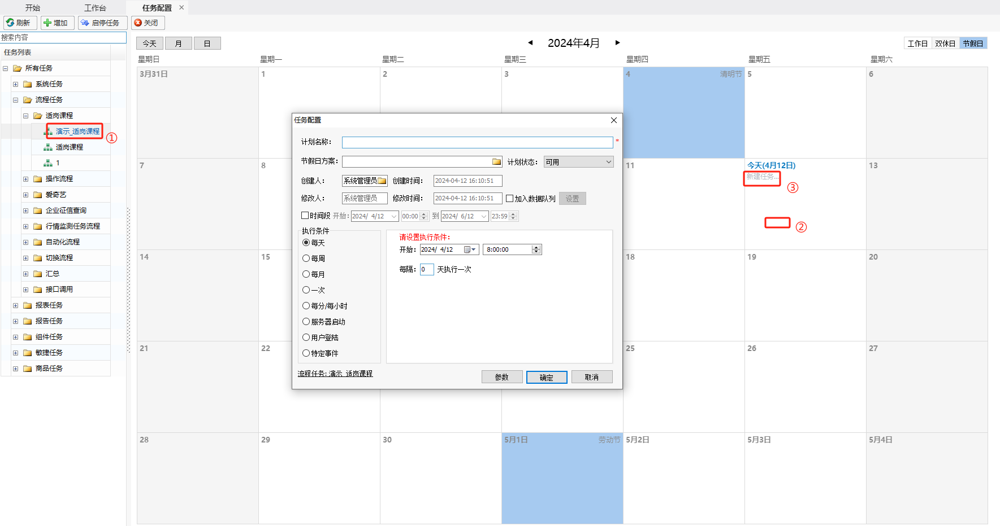
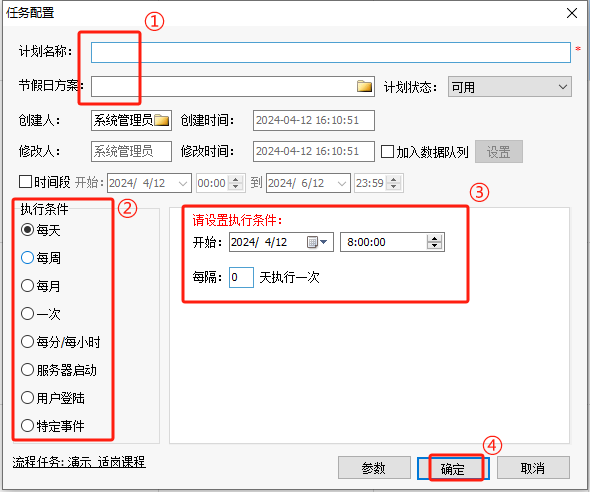

## 任务

### 什么是任务

 用户可以根据自身需求配置不同类型的自动任务，如系统任务、流程任务、报表任务、敏捷任务等，其中系统任务只有管理员登录才能查看到。自动任务支持配置成每天、每周、每月、一次、每分/每小时、服务器启动、用户登录以及特定事件来触发执行。另外，当天流程任务会显示在【任务延时】界面，若此时需要延长流程任务开始执行的时间，则可以在【任务延时】界面进行延时操作。变更完成后的流程任务执行时间以变更后的时间为准，并且变更仅一次有效。

### 任务配置

创建自动任务的操作步骤如下：

1. 进入【任务配置】菜单

   在界面左边菜单栏，单击【任务管理】，在页面中单击【任务配置】，进入任务配置界面。

   

2. 新建任务

   选中左边树中任务列表中的一个任务，把鼠标移到当天日期下单击【新建任务】，弹出“任务配置”弹框后进行相关信息设置即可。

   

3. 配置任务

    填写好“计划名称”、“节假日方案”和“执行条件”后单击“确定” 。

   

   任务配置弹框说明：

   计划名称：任务计划的名称。

   节假日方案：选择当前系统适用的节假日方案，节假日方案来源【日历配置】界面的默认日历。系统默认不选，不选则不受节假日方案限制。

   执行条件：根据实际进行选择。

   请设置执行条件区域：根据执行条件的选择进行具体时间的设置。

   
