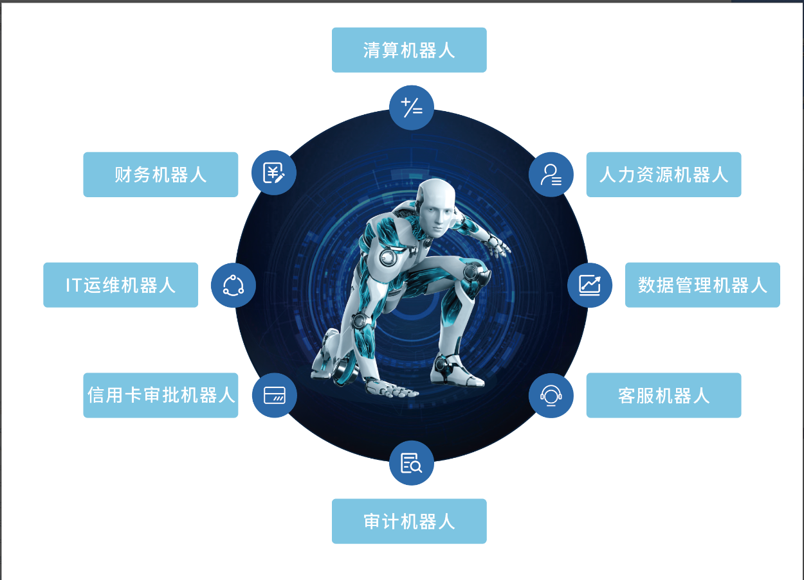

# 引言

## 什么是RPA

RPA (Robotic Process Automation, 机器人流程自动化)，这是一种能够通过模拟人类来执行重复性任务的软件。通过软件机器人自动处理大量重复性、具备规则性的工作流程任务。

各行各业都可以通过使用 RPA 实现企业中所需要的自动化流程任务，例如：

除上述机器人外，根据业务需求，能够定制开发出更多的机器人 ——RPA 将“机器人劳动力”带入传统的组织结构中，执行并提升业务工作流，为企业提高工作效率，加速实现价值，并降低人为错误。其代表着自动化技术发展的技术结晶，是工业革命4.0时代的必然产物。

# Introduction

## What is RPA 

RPA (Robotic Process Automation) is software that can execute repetitive tasks by mimicking human actions. Software robots automatically handle large volumes of repetitive, rule-based workflow tasks.

Various industries can achieve the necessary automation of business processes using RPA, for example:

Besides the robots mentioned above, more robots can be custom-developed based on business needs. RPA brings "robotic labor" into traditional organizational structures, executing and enhancing business workflows, improving work efficiency, accelerating value realization, and reducing human errors. It represents the technological crystallization of automation technology development and is an inevitable product of the Industry 4.0 era.
