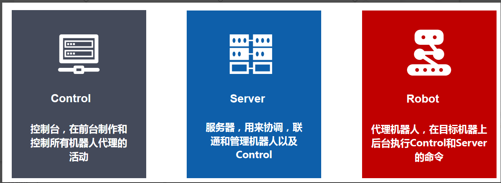

## 金智维K-RPA

金智维 RPA（以下简称“**K-RPA**”）系统 由 Server 、Control 、Robot（或称  Agent）三个程序部分组成，整体上采用了三层架构，除了提供 C/S 模式之外，还支持 B/S 模式。系统的核心引擎采用高效的 C++ 语言开发，注重对资源开销的低能耗。系统基于原子化、部件化的设计理念，确保技术架构的可复用性、灵活性。

系统遵循绿色软件理念，无需安装过程，单个文件直接拷贝即可使用，部署方便，快捷简单，支持批量升级。K-RPA 产品架构如下图所示。

- Robot 应用程序（即机器人代理端），安装在执行操作的目标机器上，在在目标机器上执行指令进行自动化操作的程序，包括物理机或虚拟机安装代理端，可分时段执行不同的任务,负责具体的流程操作任务，是全天候的虚拟员工。
- Server 应用程序（即 RPA 控制器），用来协调，联通和管理机器人以及 Control， 同时对所有的系统资源（包括流程、脚本、用户权限等信息）进行集中存储 管理。Server 端分别限制 Control 和 Robot 的同时接入总数量。
- Control  应用程序（即机器人编辑设计端），用于用户与机器人交互的操作程序，可在此应用程序上进行场景脚本的开发、流程配置、流程管理、流程触发、机器人运行管理、系统配置等。Control 端只有连接到 Server 端的时候，才能进行能够进行流程定义、机器人控制等工作。

## Jinzhiwei K-RPA

The Jinzhiwei RPA system (hereinafter referred to as "**K-RPA**") consists of three program parts: Server, Control, and Robot (also known as Agent). The overall architecture adopts a three-tier structure and supports both C/S and B/S modes. The system's core engine is developed using the efficient C++ language, focusing on low energy consumption for resource overhead. Based on an atomized and componentized design concept, the system ensures the reusability and flexibility of its technical architecture.

The system follows the green software concept, requiring no installation process; a single file can be copied directly for use, making deployment convenient, fast, and simple, and supporting batch upgrades. The K-RPA product architecture is shown in the figure below. 

- Robot application (i.e., robot agent), installed on the target machine where operations are executed, is the program that performs automated operations on the target machine, including installing the agent on physical or virtual machines. It can execute different tasks at scheduled times and is responsible for specific process operations tasks, serving as a 24/7 virtual employee.
- Server application (i.e., RPA controller), used to coordinate, connect, and manage robots and Control, while centrally storing and managing all system resources (including process, script, user permission information, etc.). The Server limits the total number of simultaneous connections from Control and Robot.
- Control application (i.e., robot editing and design end), used for user interaction with the robot. This application allows for the development of scenario scripts, process configuration, process management, process triggering, robot operation management, and system configuration. The Control end can only perform process definition and robot control tasks when connected to the Server.
