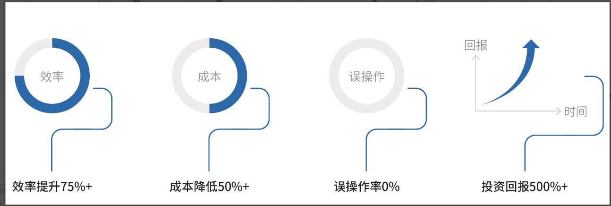
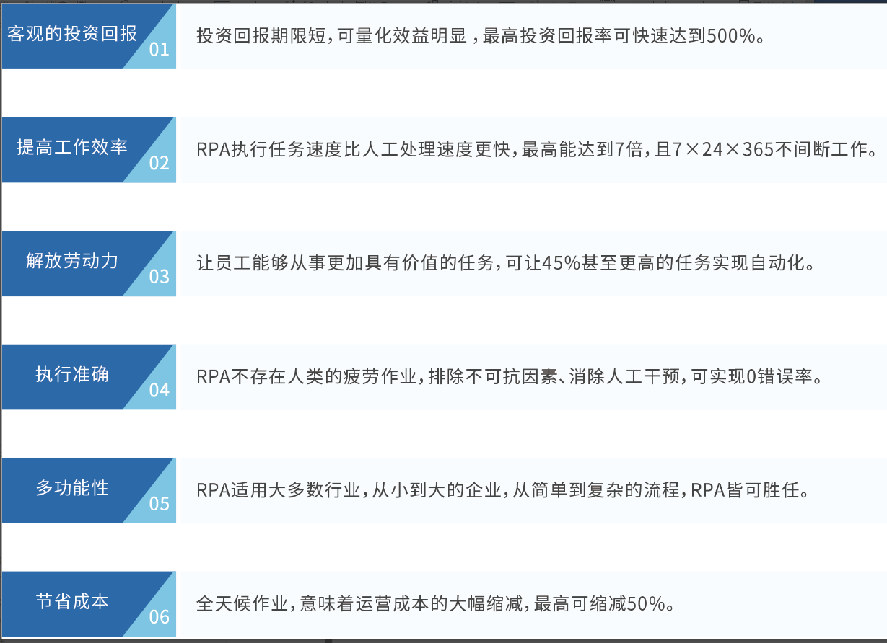

## RPA建设价值

RPA 机器人受到了愈来愈多的青睐，主要得益于 RPA 能够实现将**大量的、重复的、耗时的**事务转交给 “Robot” ，从而将员工从疲于应付的情况下解放出来，让员工发挥主观能动性，执行具有更高价值的事务。RPA 机器人与员工相比，能够更加的**快速、精确**，并且机器人不知疲倦，**全天候**执行相应事务。

## Value of RPA Implementation

RPA robots have gained increasing favor mainly because RPA can transfer **large, repetitive, and time-consuming** tasks to "robots," thus freeing employees from tedious work. This allows employees to leverage their initiative and perform tasks of higher value. Compared to employees, RPA robots can execute tasks more **quickly and accurately**, and robots can work tirelessly, **24/7**, to perform the necessary tasks.

