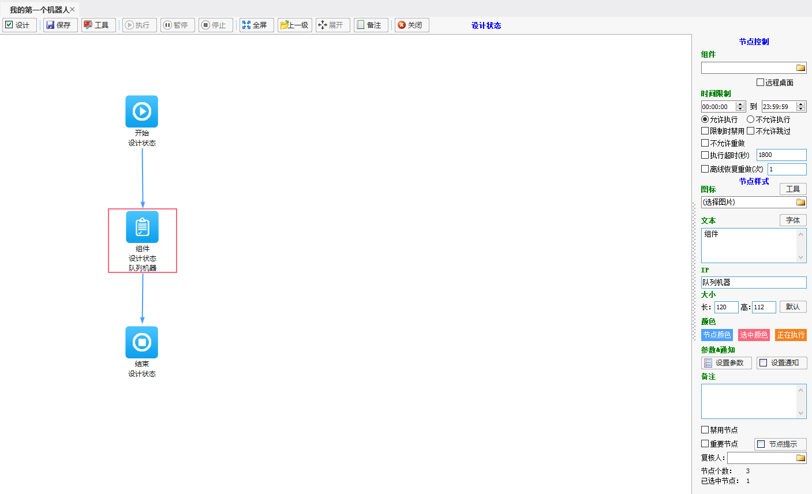
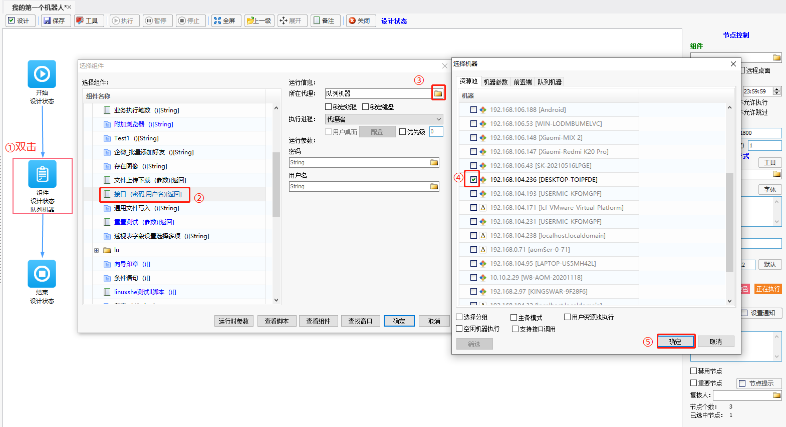
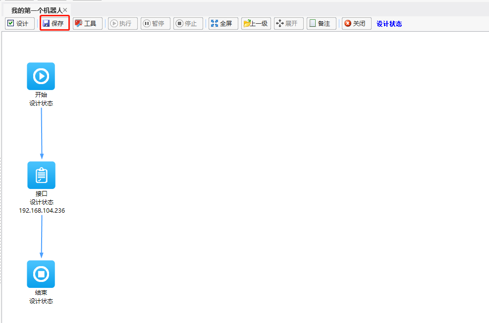
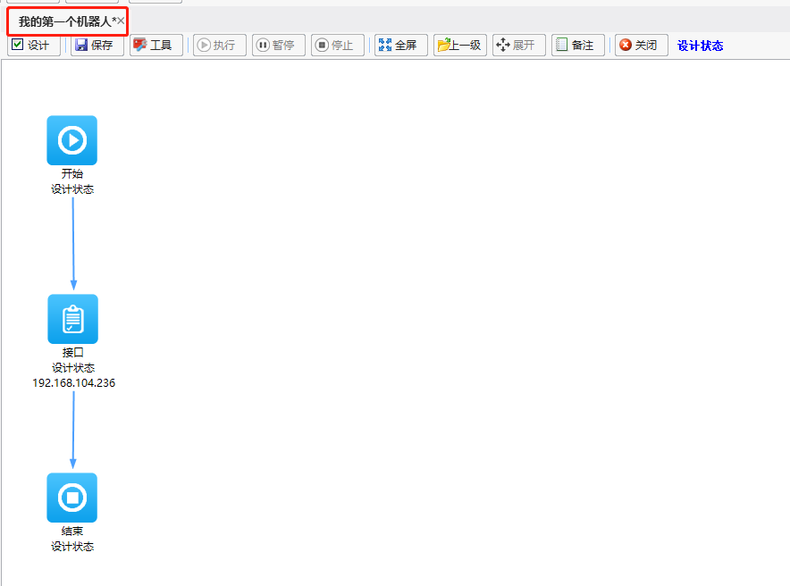

### 编辑流程节点

> **[info]  提示**  
>
> - 节点增加：在流程编辑界面右侧的流程节点栏，单击需要增加的节点（被选中的节点，字体将会变成绿色），鼠标移动到流程编辑界面的空白处，鼠标单击，即可完成节点的添加。
> - 节点或连线的删除：鼠标选中需要删除的节点，单击“Delete”键，即可完成节点的删除操作。
> - 节点连线：在界面又测流程节点栏，勾选“连接线”，鼠标移动到编辑区域的节点处，单击已增加的节点-按住鼠标拖动至另外一个节点-松开鼠标即可完成节点连接。

 在增加完流程后，会自动生成一个以开始节点、结束节点和组件节点所组成的流程模板。我们可在该流程的基础上进行编辑。

此处以组件节点为例进行介绍。

1. 在流程编辑界面，选中组件节点双击，在“选择组件”窗口中，选择要调用的组件且选择执行该节点的代理机器；

   

2. 待流程编辑完成后，单击【保存】，即可保存当前所编辑的流程。

   

   若流程名称右侧存在“*”号，则表明该流程未保存，则需要先进行保存。

   

    

   

   

   
