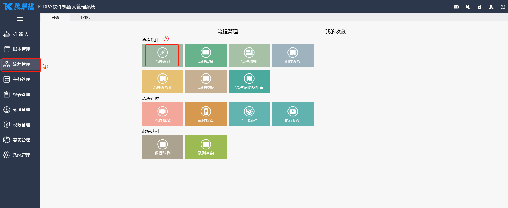

## 开发流程机器人

### 创建流程

1. 单击【流程管理】-【流程设计】，进入流程编辑界面。

   

2. 在【流程设计】界面，新增流程目录（*若已有目录，则可跳过此步骤*）。

   

3. 选中指定分组，在该分组下新增流程。

   

   

4. 单击“确定”后，系统自动生成一个流程模板，包含开始、组件、结束三个节点。可直接在该模板上进行编辑，也可删除该模板重新设置流程。

   

   

