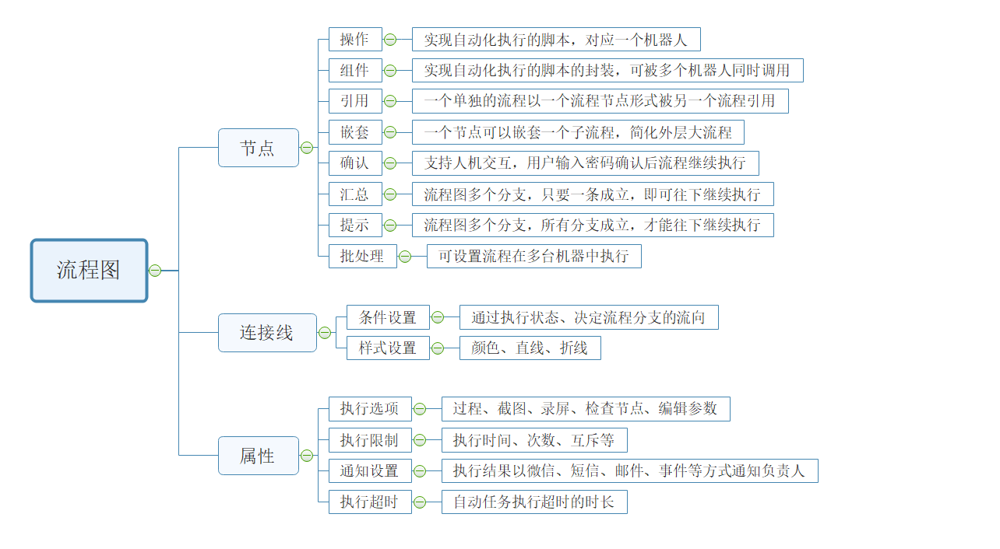

# Process Design

## Process Design Principles and Composition 

### Process Design Principles

The process is the core of RPA, and a process usually corresponds to the automation of a scenario task.

Process design is akin to a factory, where multiple scenario-related functional components are connected in a certain logic and order, with added parameter information, to form a process.

Process design principles:

1. A process must include at least "Start" and "End" nodes.
2. The process connection must be a closed loop, meaning process nodes should be directly or indirectly (through other nodes) connected to the "Start" and "End" nodes.
3. Process connections can set conditions but must be used in conjunction with the execution return of process nodes.
4. One process can be directly referenced by another process, supporting infinite layers of referencing.
5. One process can directly nest sub-processes, supporting infinite drill-down nesting.

### Process Composition and Description

