# 流程设计

## 流程编辑

### 设置组件参数

当流程在调用组件节点时，可设置组件的运行参数，即在用户设置组件时，可在组件中设置参数，这样便于后续运行参数值的更改。组件的运行参数需要改变时，只要在流程中对该参数进行更改即可，不需要到流程所调用的组件中进行更改。

- 组件参数的设置

  设置方法如图所示：

  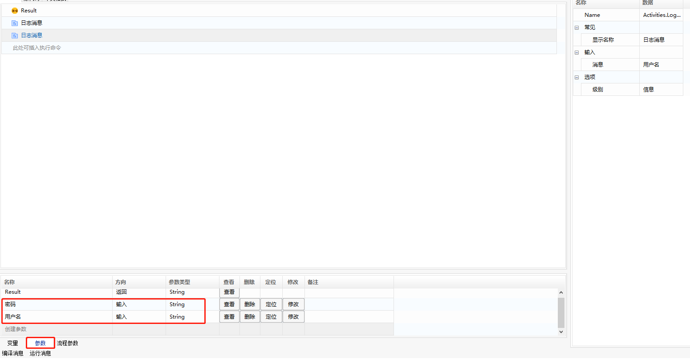

- 在流程中设置组件参数

  在流程中调用名为“接口”的组件，并且传入组件参数，将参数结果进行输出。

  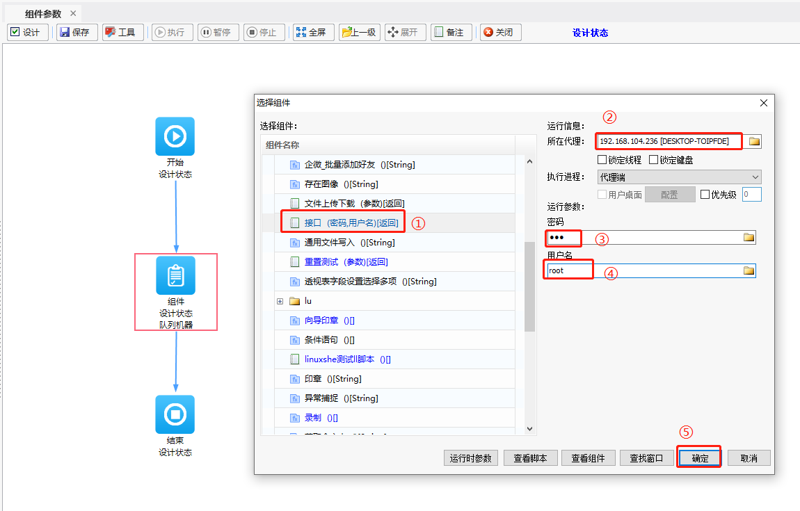

  执行流程，待流程执行完成后，选中该组件节点，鼠标右击，选择查看步进日志，可查看结果。

  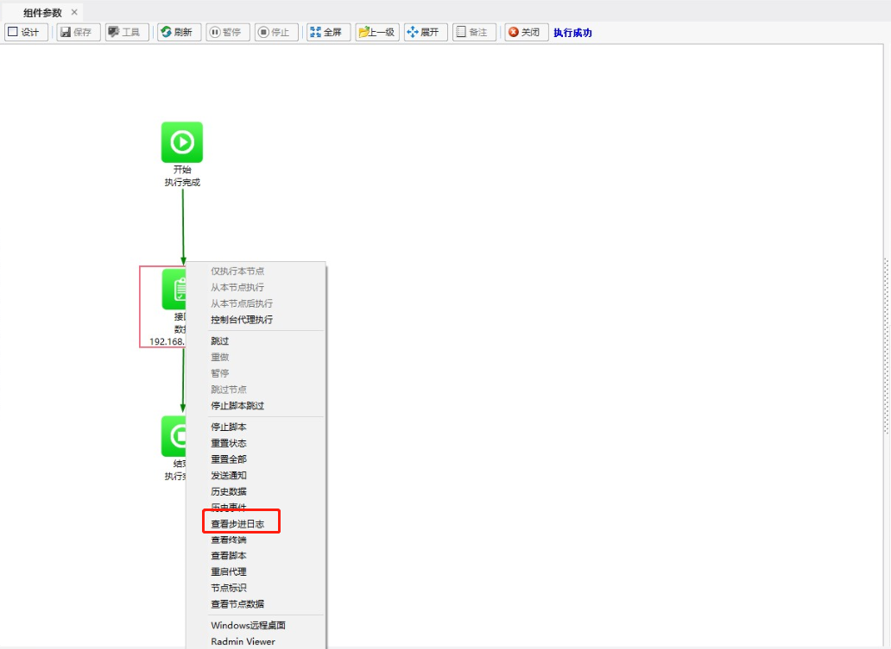

  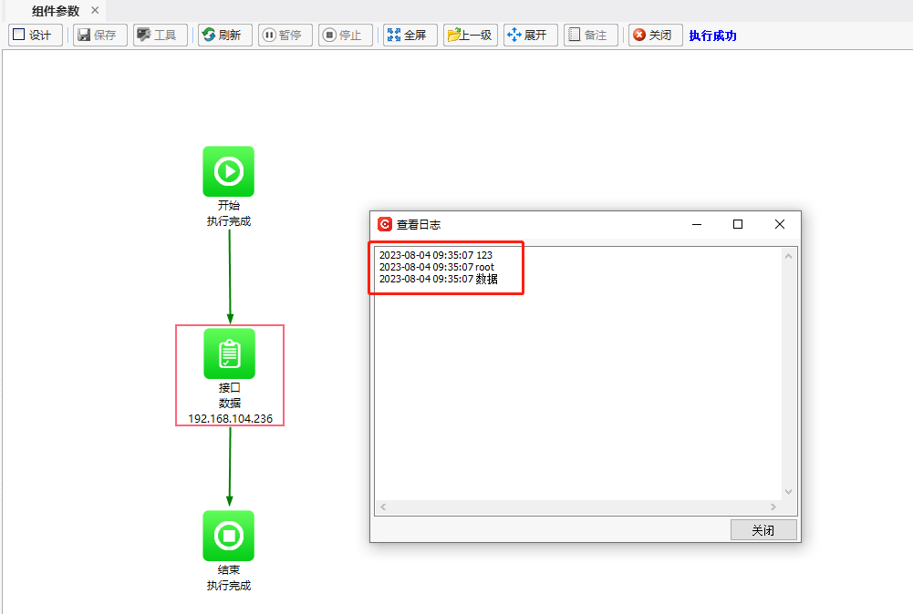

### 设置流程属性

#### 整个流程

对于流程的设计，用户在使用流程时，可根据不同的需求进行不同的设置，具体请查看下述描述。

在流程设计界面，只有当勾选了“设计”，才能进行流程的编辑，当取消“设计”后，便可对流程进行“执行”操作。

当前处于可编辑状态：

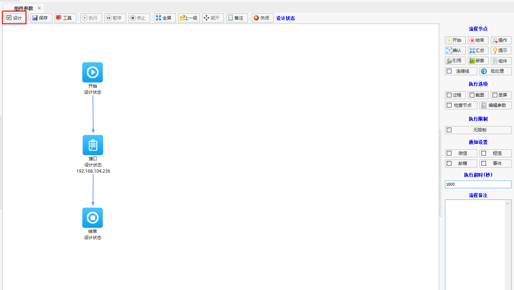

当前处于可执行状态：

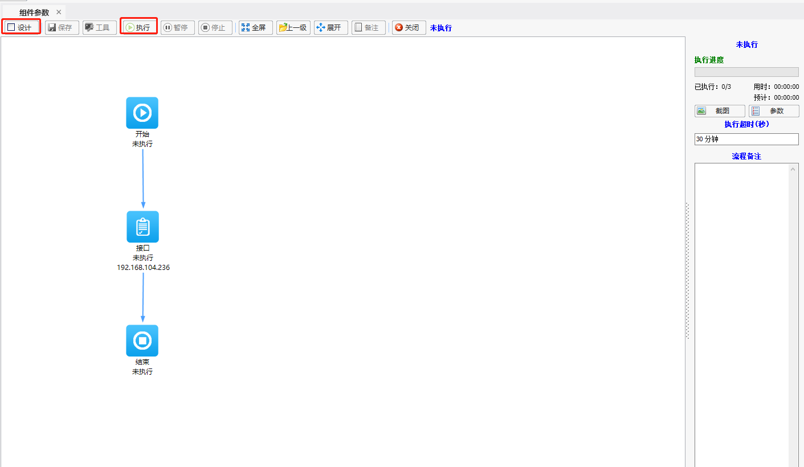

单击流程编辑界面的空白处，在界面的右侧会显示流程属性的设置项，该属性是针对整个流程的设置，此处可将该属性分为三部分进行介绍，如下所示：

[执行选项](#执行选项)

[执行限制](#执行限制)

[通知设置](#通知设置)

##### 执行选项

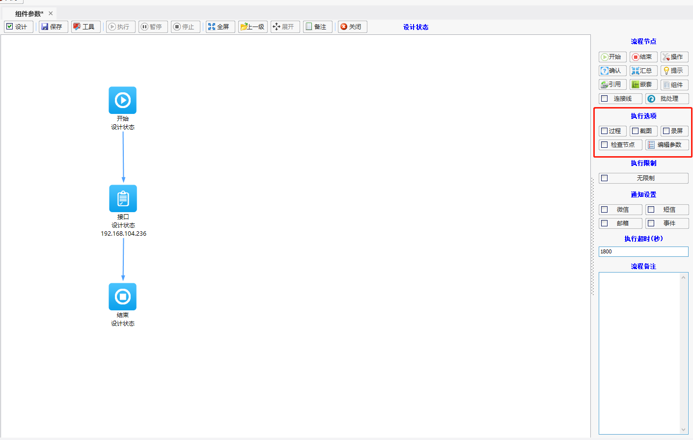

- 过程：当勾选了“过程”，在流程执行完成后，可在【执行历史】界面，回放流程执行过程。

- 截图：当勾选上“截图”，可将流程执行的界面进行截图，待流程执行完成后，可单击查看截图效果。

  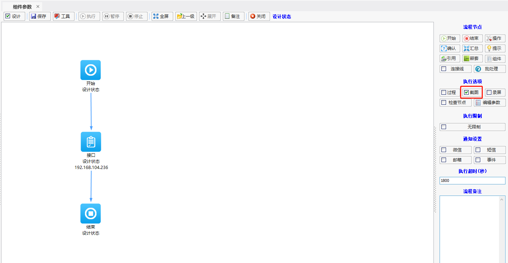

  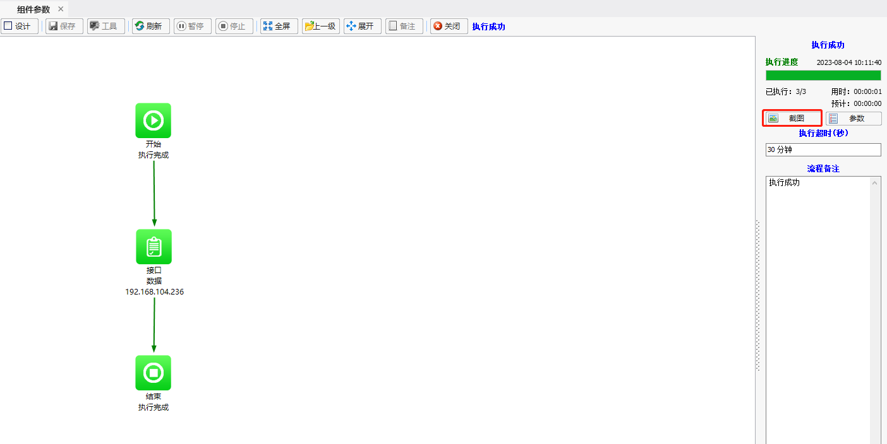

  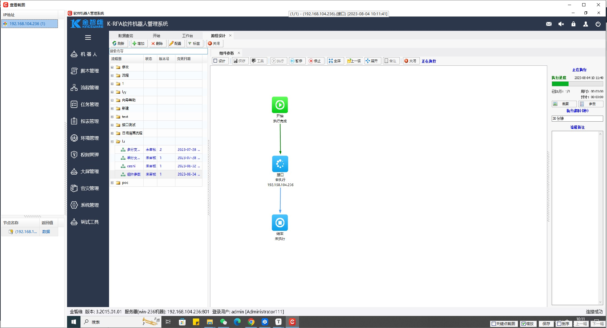

- 录屏：录制流程执行过程。在使用录屏功能时，要先做好录屏配置工作。具体录屏配置，请查看[《录制屏幕功能操作手册》](http://doc.kingsware.cn:8096/public/Uploads/Doc/B5A01561B0E24FB614BF110AB8650F93/index.html)。

- 检查节点：勾选“检查节点”，则在执行此流程时，会检查流程关联的代理端的状态及节点的状态。

  - 未勾选“检查节点”，单击【执行】，在“提示”窗口中无任何节点相关的提示信息；

    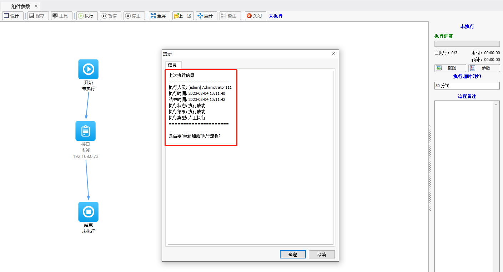

  - 勾选“检查节点”，单击【执行】，在“提示”弹框中将会提示相关的节点信息。

    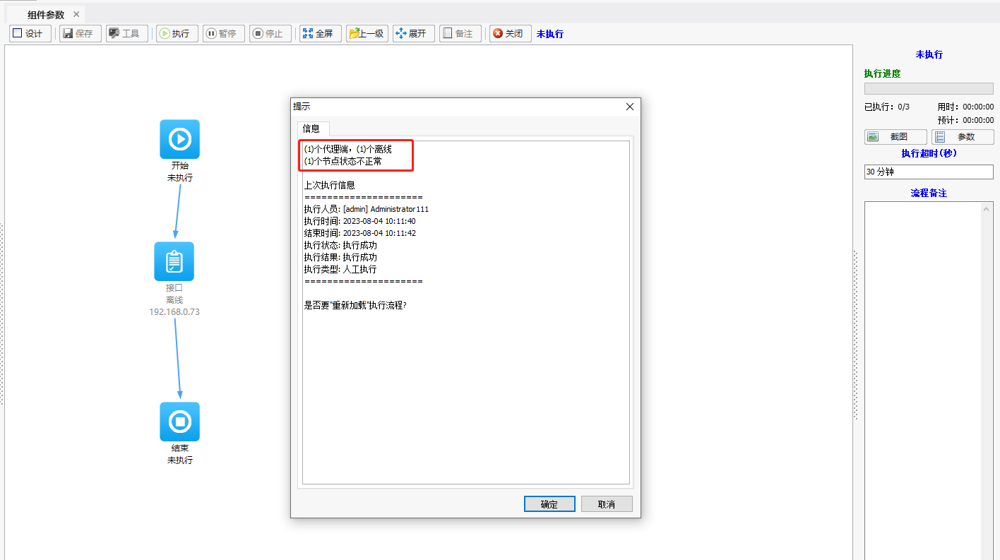

- 编辑参数：

  通过单击【编辑参数】按钮功能进行参数编辑。在流程设计编辑界面中，单击【编辑参数】-在弹出的“运行配置”弹框中定义一个参数。

  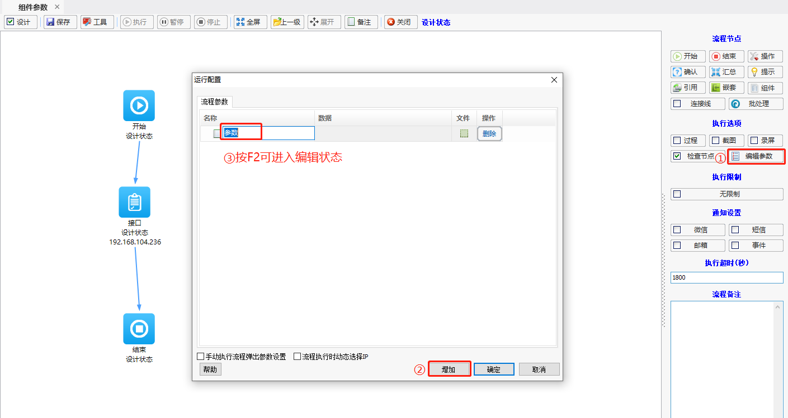

##### 执行限制

对于流程进行执行限制的设置，单击“无限制”，弹出“执行限制”窗口，在此窗口可以对流程进行每天执行次数、每天执行时间、流程执行日期、每周执行日期、用户确认、流程互斥等限制，如下图所示：

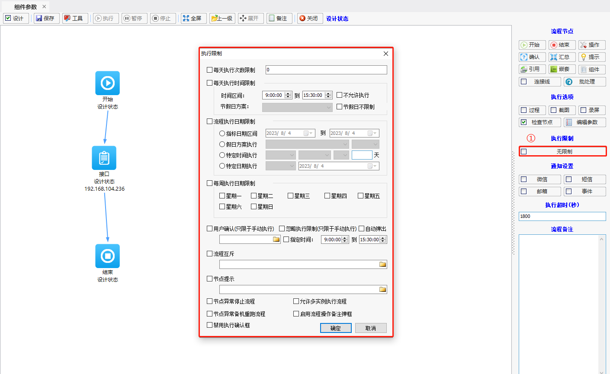

执行限制具体的设置，请查看[《K-RPA软件机器人用户操作手册》](http://doc.kingsware.cn:8096/public/Uploads/Doc/F9E2872F5A30B7E3A2F482499F3ED0B3/index.html)。

##### 通知设置

流程执行的结果或其他状态的信息，可通过短信、微信、邮件、事件的方式通知给指定的人员。在进行短信、微信、邮件通知前，需要进行相关的配置，且被通知人员需要配有手机号码、微信号或者邮箱账号。

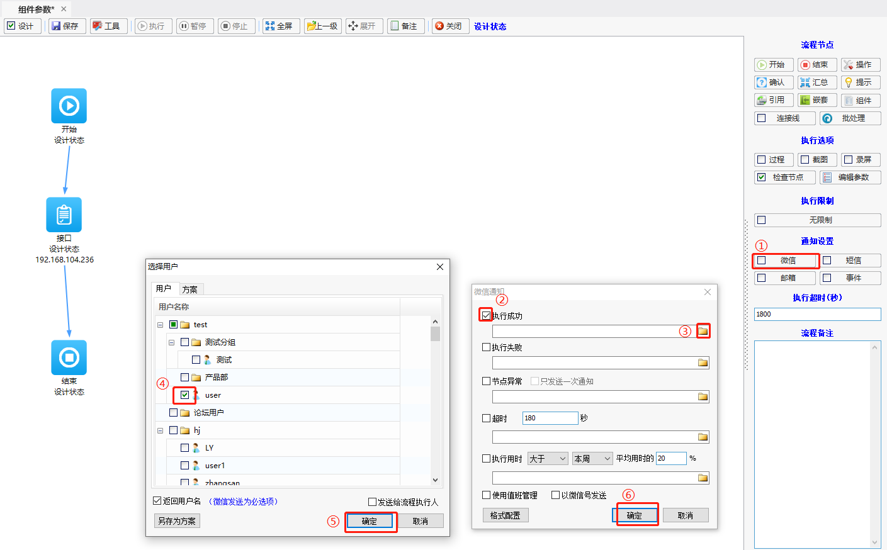

#### 流程节点

在流程设计中，有开始、结束、操作、确认、汇总、提示、引用、嵌套、组件和批处理等10个节点供选择。下述将对这10个节点进行介绍。

- 开始节点：流程的起点，标志着流程的开始，在一个完整的流程里必须存在“开始”节点。

- 结束节点：流程的终点，标志着流程的完成，在一个完整的流程里必须存在“结束”节点。

- 操作节点：双击操作节点，在弹出的“选择指标”弹框中，选择相应的指标，该指标来源于资源池。

  **使用场景：**在流程中调用操作节点，可通过选择指标实现流程要执行的动作。

  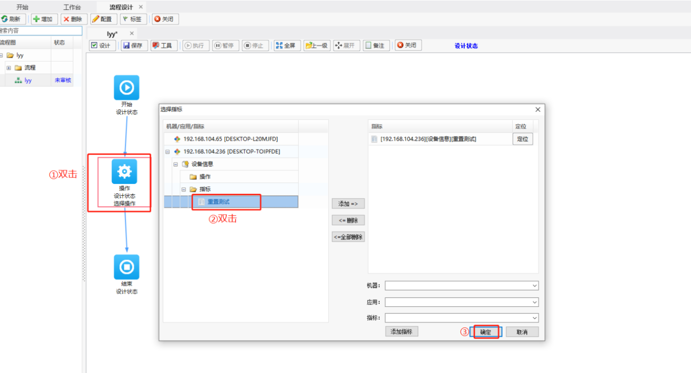

- 确认节点：指定确认用户，当流程执行到该节点是，需要用户输入密码进行确认，流程方可继续执行。

  **使用场景：**在需要复核人员进行确认才能继续执行流程的场景中，可以通过应用确认节点，等待流程复核人员确认流程节点。

- 汇总节点：将多个分支的流程，汇总成一条，连线情况如下所示：

  **使用场景：**在流程中调用汇总节点，可检验此节点前至少有一个流程分支执行成功，若执行成功就会执行此节点。

  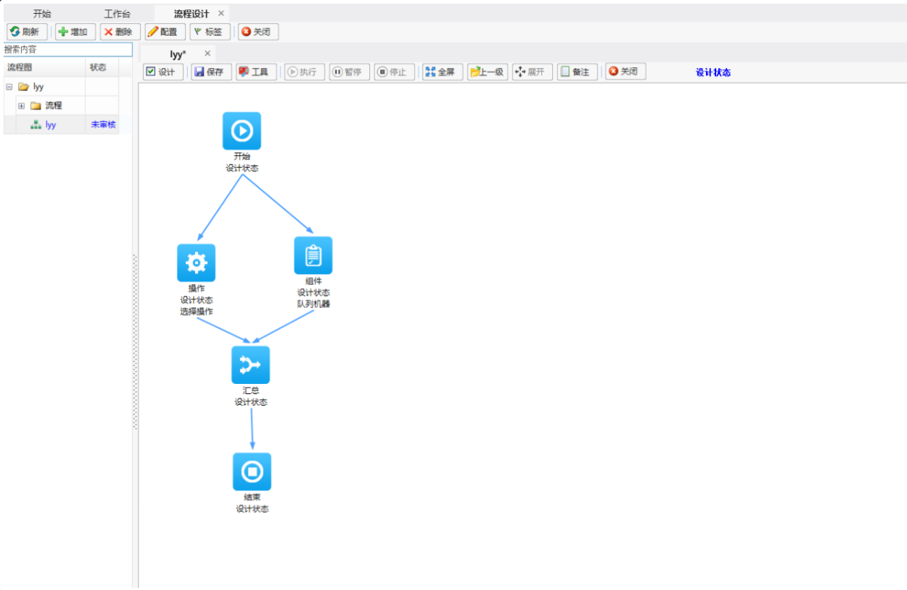

- 提示节点：在一个流程里，若提示节点之前连接了多个流程节点，则必须要前面的所有流程节点都正常执行，才会执行到提示节点，流程才会继续往下执行，一旦在提示节点之前有一个节点有异常，则该流程都无法继续往下执行。

  **使用场景：**在流程中调用提示节点，可检验流程中此节点前所有分支是否执行成功，若都执行成功就会执行此节点。

  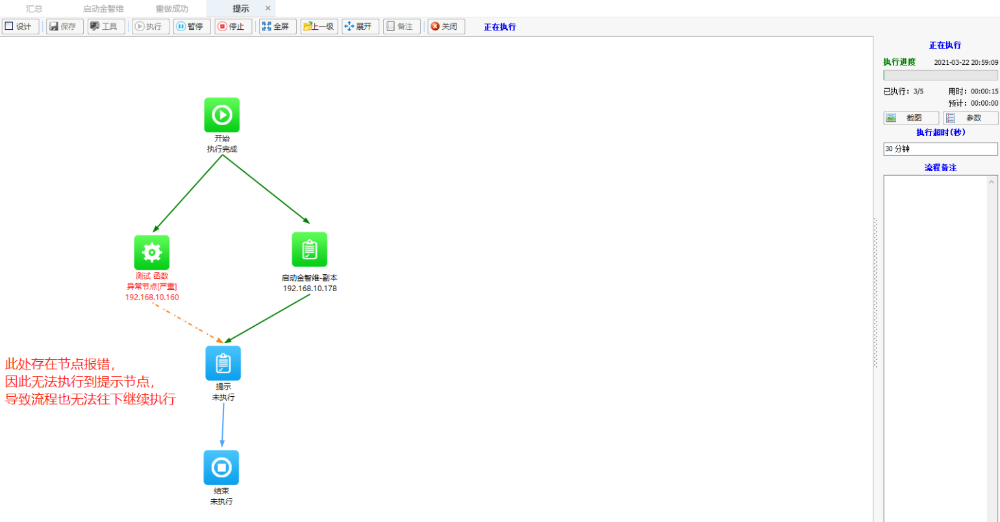

- 引用节点：双击引用节点，在弹出的“引用流程”弹框中，选择需要引用的流程，引用的流程必须是已审核的流程。

  **使用场景：**在主流程中调用引用节点，可在该节点中引用单条已有流程，实现主流程更加简洁明了。

- 嵌套节点：双击嵌套节点，进入嵌套节点的子流程界面，在该界面可以编辑子流程，编辑完成后保存，返回【上一级】即可。

  **使用场景：**当一个流程中存在很多复杂活动或分支时，可通过应用嵌套节点嵌套多个独立子流程，实现主流程更加简洁明了。

- 组件节点：选中组件节点进行双击，进入组件节点的编辑界面，在该界面中选择该节点需要调用的组件及指定执行的代理机器。

  **使用场景：**在流程中调用组件节点，通过组件中的函数实现流程要执行的动作，同时可以进行传参，通用性较高。

  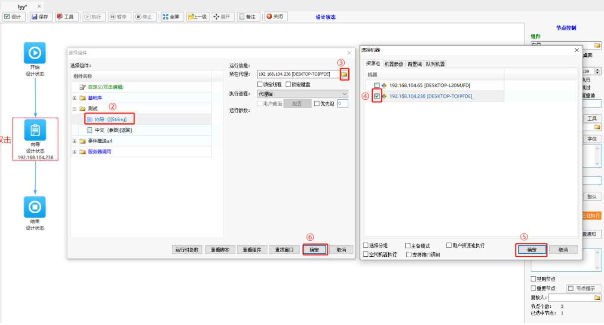
  
  > **[info]  提示**
  >
  >  - 所调用的组件数据来源于[组件管理](\3.组件设计\manual_addition.html)  界面所创建的组件。
  >  - 所调用的组件为已审核组件。
  
- 批处理节点：双击批处理节点，在此节点中可以设置多个执行流程的代理，然后选择执行模式（并行执行或串行执行），即可实现同一流程在多台机器中执行。

  **使用场景：**在需要多台机器执行相同流程的场景中，可以通过应用批处理节点，使这些机器一起执行流程。

  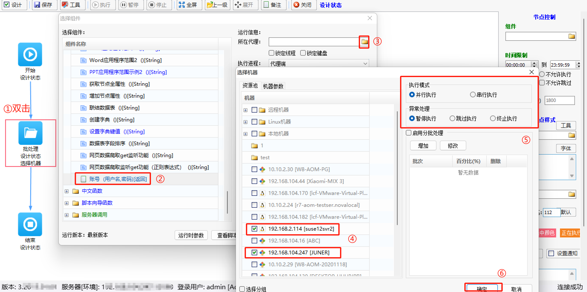

#### 流程线

在流程编辑界面，添加了流程节点后，需要通过连线将各个节点间串联起来。流程各节点间连线的方法如下：

在界面右侧流程节点栏，勾选“连接线”，鼠标移动到编辑区域的节点处，单击已增加的节点-按住鼠标拖动至另外一个节点-松开鼠标即可完成节点连线。

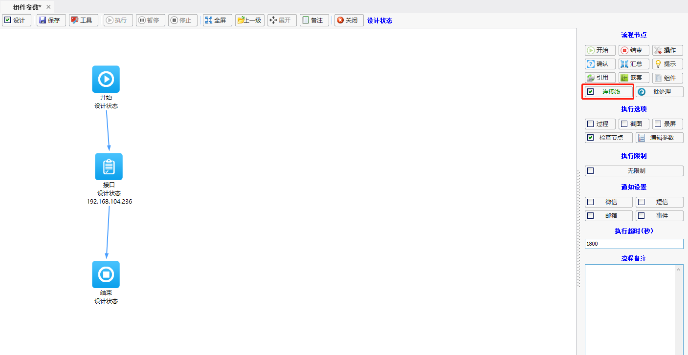

 > **[info]  提示**  
 >
 >  &emsp;快速连线的方法：勾选上“连接线”，接着按住Ctrl，用鼠标逐个节点进行连接，连接完成后，需取消“连接线”的勾选 。

### 流程运行

在多节点的流程中，各个流程节点所选择的执行代理机器可根据实际情况进行选择，不需要所有节点的执行机器必须相同。

对于流程各节点的执行代理机器都相同的，可称为单机器运行流程；

对于流程各节点的执行代理机器不相同的，可称为多机器运行流程。

#### 单机器运行流程

在下述的流程例子中，流程的各个节点都选择同一台执行代理机器。

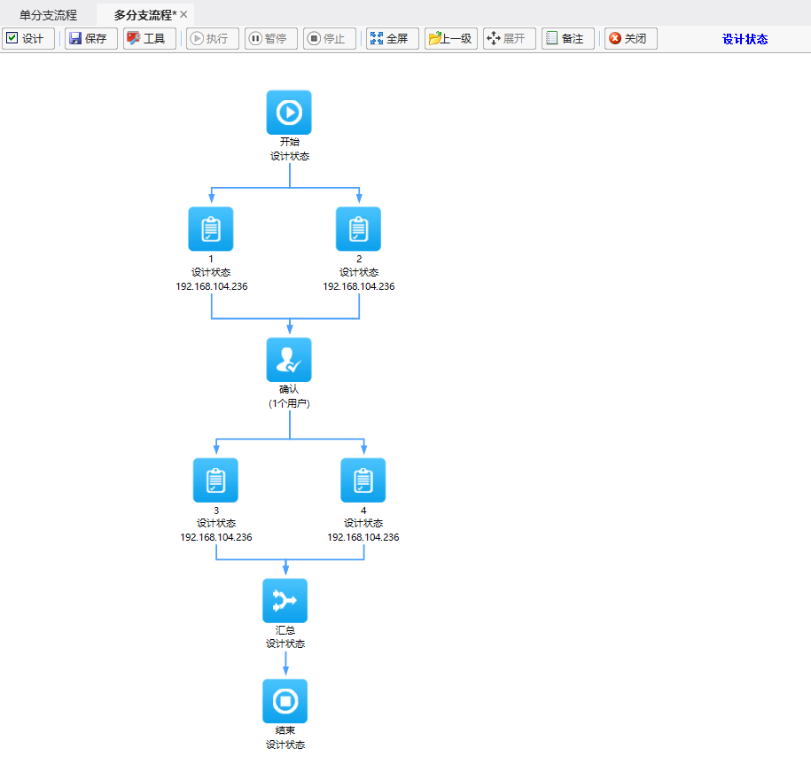

#### 多机器人协同流程

在下述的例子中，K-RPA流程支持多机器人协同执行，即一个流程不同的节点可以选择不同的执行代理机器进行执行。

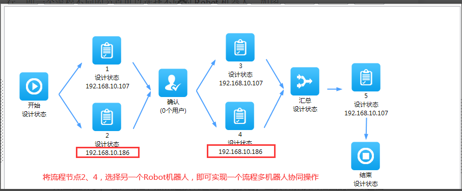

