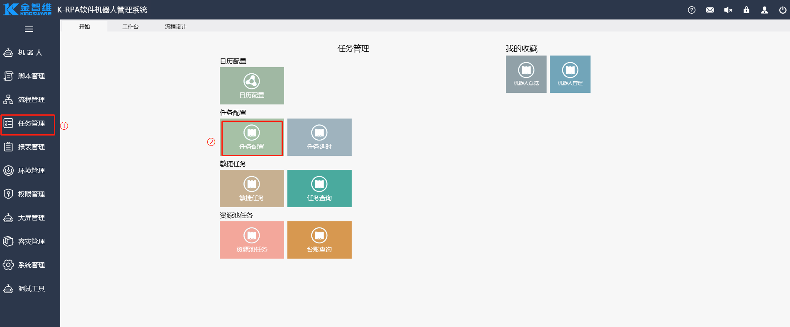
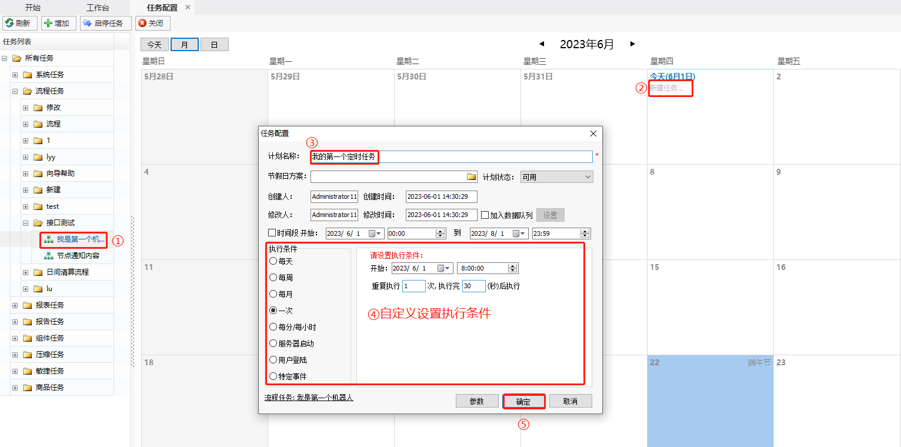

### 任务配置

[运行流程](\流程设计\Function.html#运行流程)章节中，执行流程的操作为手动执行流程的操作，我们也可设置自动任务，让流程自动执行，具体操作如下：

1. 进入【任务配置】界面，配置自动任务。

   

2. 选中需自动执行的流程，配置自动流程任务。

   

3. 配置完成后，机器人即可在设定的条件下自动执行，可以在当天的任务下看到该任务的定时触发记录。

   

### Task Configuration

In the [Running Process](\流程设计\Function.html#运行流程) section, the process execution operation is performed manually. However, we can also set up automatic tasks to allow processes to execute automatically. The specific steps are as follows:

1. Enter the 【Task Configuration】 interface to configure automatic tasks.

   

2. Select the process that needs to be executed automatically and configure the automatic process task.

   

3. After configuration, the robot will automatically execute under the set conditions, and you can see the scheduled trigger record of the task under the day's tasks.

   
