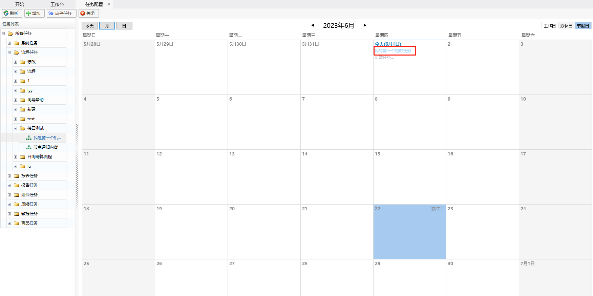

### 任务配置

[运行流程](\流程设计\Function.html#运行流程)章节中，执行流程的操作为手动执行流程的操作，我们也可设置自动任务，让流程自动执行，具体操作如下：

1. 进入【任务配置】界面，配置自动任务。

   

2. 选中需自动执行的流程，配置自动流程任务。

   

3. 配置完成后，机器人即可在设定的条件下自动执行，可以在当天的任务下看到该任务的定时触发记录。

   

