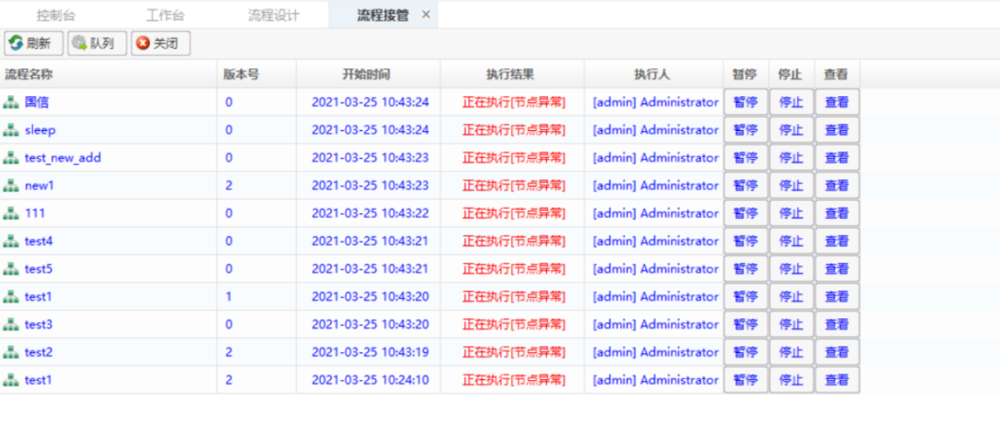

## 管控流程机器人

流程正在运行的过程中，如果需要在另一台机器的控制台查看或者操作该流程，则可以使用该流程接管的功能把流程接管进来。

流程接管，可在【流程接管】界面进行相关的操作，在该界面可以查看到自身有权限的流程。

【流程接管】界面的功能场景有：调阅任务配置中正在执行的流程、调阅任务配置中执行失败的流程、临时接手其他人员正在执行的流程。

## Managing Process Robots

If you need to view or operate the process from the console of another machine while it is running, you can use the process takeover feature to bring the process over.

Process takeover can be done in the 【Process Takeover】 interface, where you can view processes that you have permission for.

The scenarios for the 【Process Takeover】 interface include: reviewing processes currently being executed in task configuration, reviewing processes that failed to execute in task configuration, and temporarily taking over processes currently being executed by other personnel.

