### Process Parameters

In the script wizard editing interface, a "Process Parameters" panel has been added, where you can set and obtain process parameters for the current component.

- By parameter type, they can be divided into "String" and "File", i.e., setting/getting "String" and "File" type parameters for the process;
- By process type, they can be divided into "Process" and "Node", i.e., setting/getting "Process" parameters or process "Node" parameters;
- By status type, they can be divided into "Design-time" and "Run-time", i.e., setting/getting process "Design-time" or "Run-time" status parameters;
- By parameter direction, they can be divided into "Input" and "Output":
  - Input: Similar to using "Get Process Parameter" and "Get Process Parameter File" functions in the component, you can get the parameter values during the design or run-time states.
  - Output: Similar to using "Set Process Parameter" or "Set Process Result File" in the component, you can set parameter values during the design or run-time states.

#### Creating Process Parameters 

Create process parameters in the process parameter panel. If the process parameter panel is not displayed at the bottom of the component editing interface, click on "Process Parameters" as shown in the figure below to expand the process parameter panel:

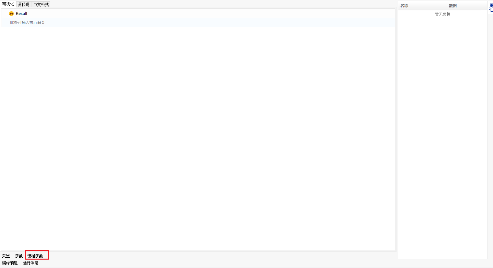

In the expanded process parameter panel, click F2 to enter edit mode and create new process parameters.

> **[info] Tip**
>
> &emsp;Supported directions, parameter types, process types, and status types for process parameters can be selected by clicking the corresponding column and pressing F2 for a dropdown selection. The process parameter names established here need to be consistent with the parameter names of the process calling this component.

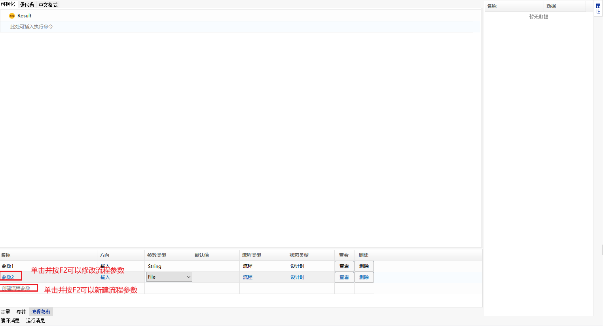

#### Using and Passing Process Parameters 

- String Type

  1. Create a wizard component, and edit and review the component

     Open the 【Component Management】 interface, add a script wizard component named "Process Parameter Test", switch to the "Process Parameters" panel to create an input parameter named "Parameter 1" and an output parameter named "Parameter 2", and add two lines of 【Log Message】 function in the script editing interface to print "Parameter 1" and "Parameter 2".

     > **[Tips]**
     >
     > &emsp;"Parameter 1" is an input parameter and does not require a default value; "Parameter 2" is an output parameter and requires a default value.

     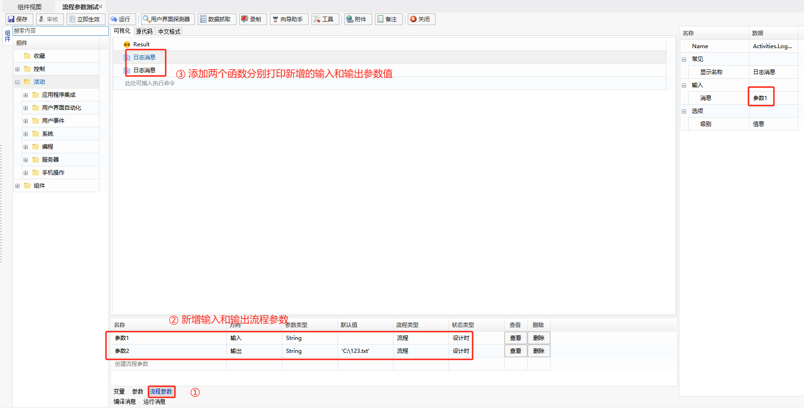

     After editing and debugging, save and review the component.

     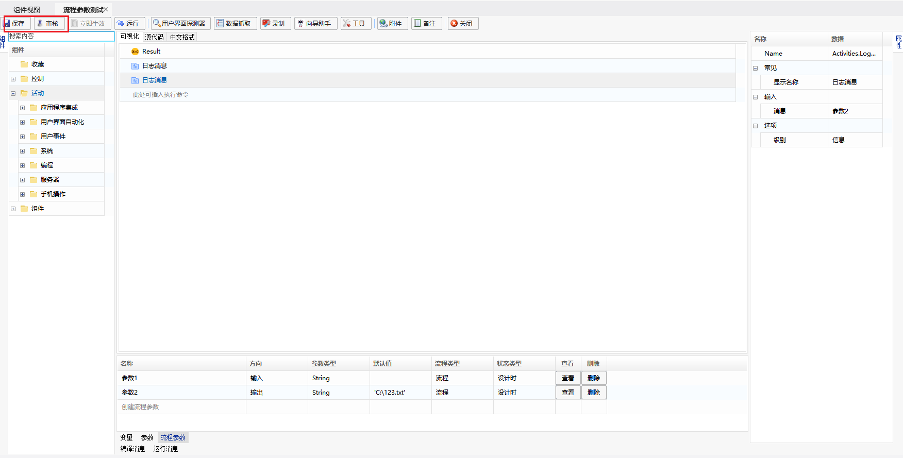

  2. Create a new process and call the "Process Parameter Test" component

     Open the 【Process Design】 interface, create a process named "Process Parameter Process", and call the "Process Parameter Test" component.

     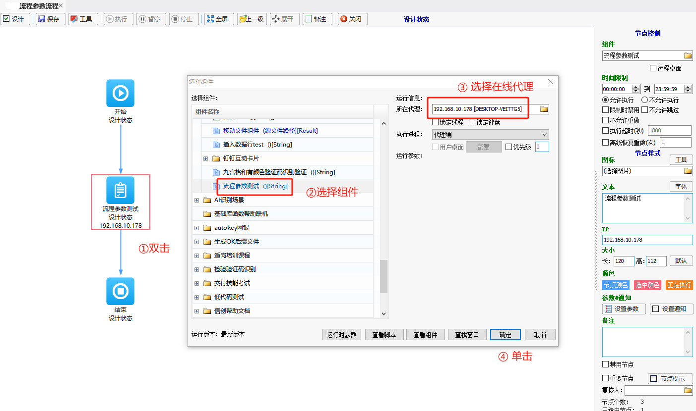

     Set process parameters with the same name and type as those in the "Process Parameter Test" component in the process parameters panel, assigning the appropriate parameter value to "Parameter 1".

     > **[Tips]**
     >
     > &emsp;Set the parameter value for "Parameter 1"; "Parameter 2" does not need a value.

     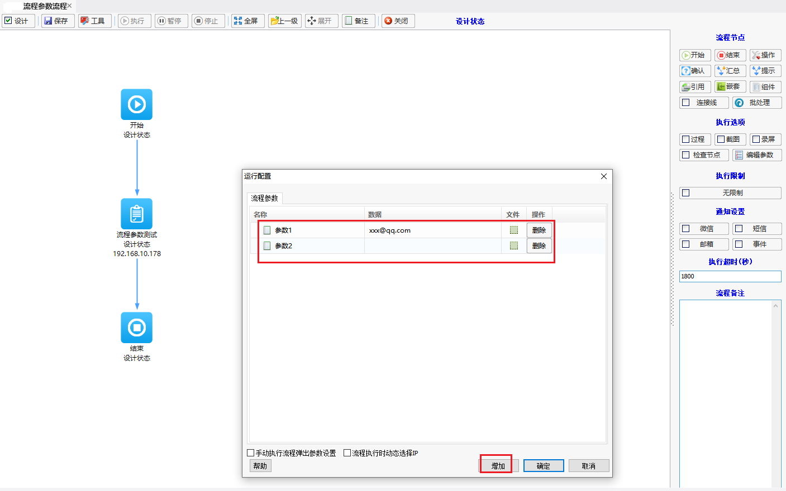

  3. Save and execute the process, and view the printed values of "Parameter 1" and "Parameter 2" in the process logs.

     > **[Explanation]**
     >
     > - The first line of the log prints the value of "Parameter 1", which comes from the value set for "Parameter 1" in the 【Process Design】 interface, indicating that the value set for "Parameter 1" in the 【Process Design】 interface was passed to "Parameter 1" in the component.
     > - The second line of the log prints the value of "Parameter 2", which comes from the default value set for "Parameter 2" in the component, indicating that the default value set for "Parameter 2" in the component was passed to "Parameter 2" in the 【Process Design】 interface.

     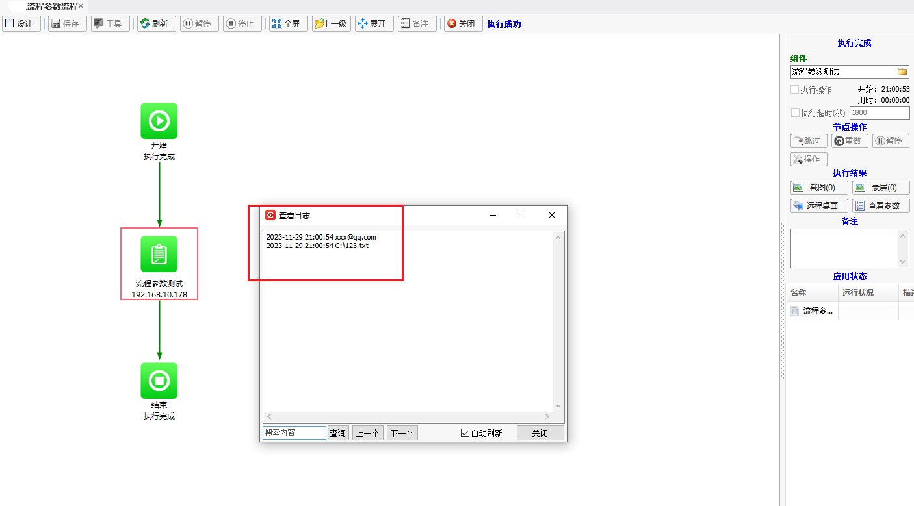

     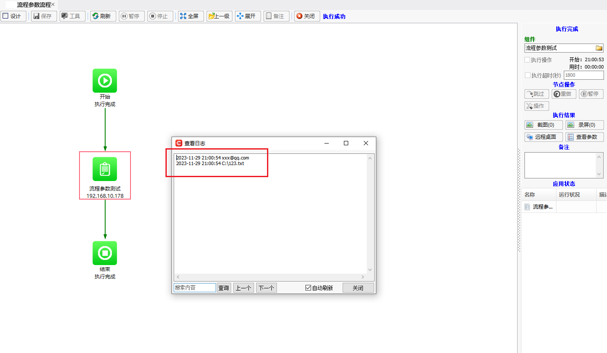

  4. In summary, for "String" type process parameters: **Input process parameters** in the component can get the same name parameter values of the process and use the obtained parameter values in the component; **Output process parameters** in the component can pass the set default values to the same name parameters of the process and use the set default values in the process.

     > **[Explanation]**
     >
     > - Operations during run-time are similar, except that in design-time you can view it in the interface, while in run-time you cannot.
     > - Operations under node type are similar. If the process parameter in the component is of the "Process" type, there is no need to select the node and create a parameter with the same name in the process. If the process parameter in the component is of the "Node" type, you need to select the node that calls the component in the process and then create a process node parameter with the same name.

- File Type

  1. Create a wizard component, and edit and review the component

     Open the 【Component Management】 interface, add a script wizard component named "Process Parameter Test", switch to the "Process Parameters" panel to create an input parameter named "File Parameter 1" and an output parameter named "File Parameter 2", and add two lines of 【Log Message】 function in the script editing interface to print "File Parameter 1" and "File Parameter 2".

     > **[Tips]**
     >
     > &emsp;Since both "File Parameter 1" and "File Parameter 2" are "File" type process parameters, default values need to be set for both, i.e., two default file paths need to be set. Below are the contents of the two default files "D:\1.txt" and "D:\2.txt".
     >
     > 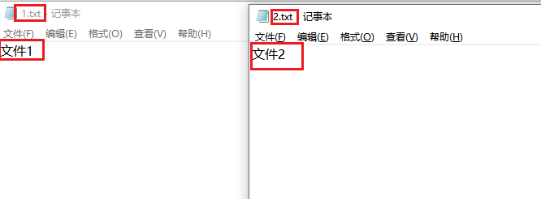
  
     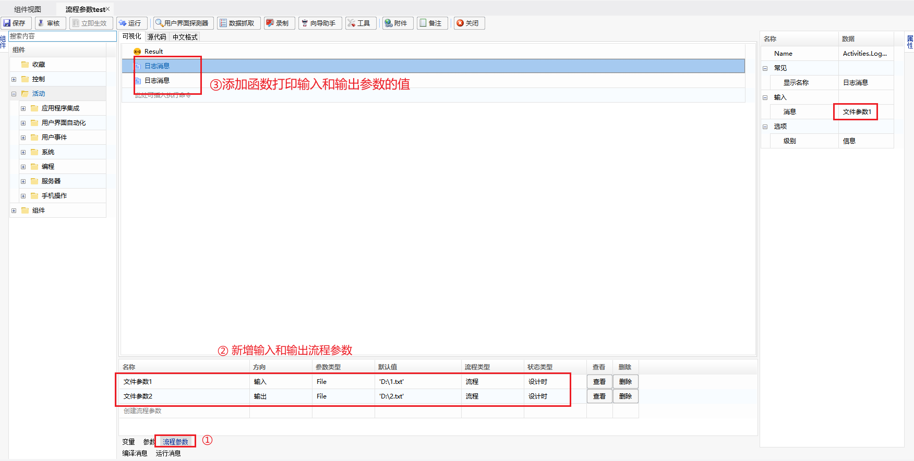
  
     After editing and debugging, save and review the component.
  
     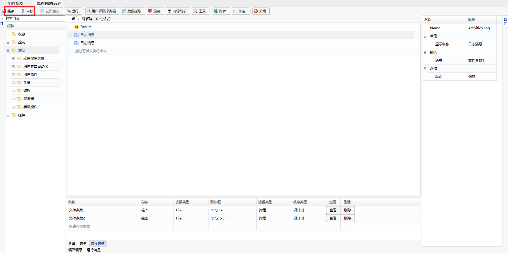
  
  2. Create a new process and call the "Process Parameter Test" component
  
     Open the 【Process Design】 interface, create a process named "Process Parameter Test", and call the "Process Parameter Test" component.
  
     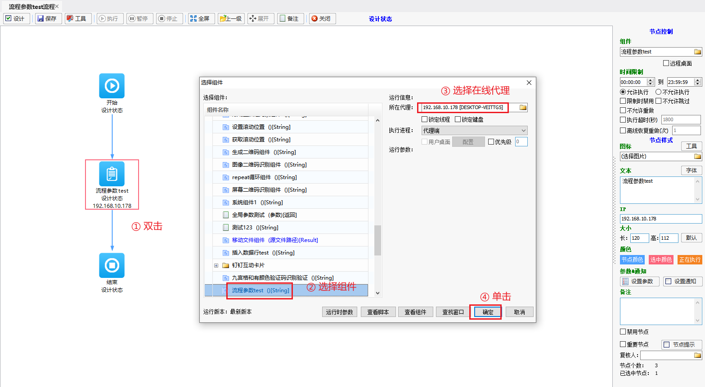
  
     Set process parameters with the same name and type as those in the "Process Parameter Test" component in the process parameters panel, and check the "Manually Execute Process Pop-up Parameter Setting" option.
  
     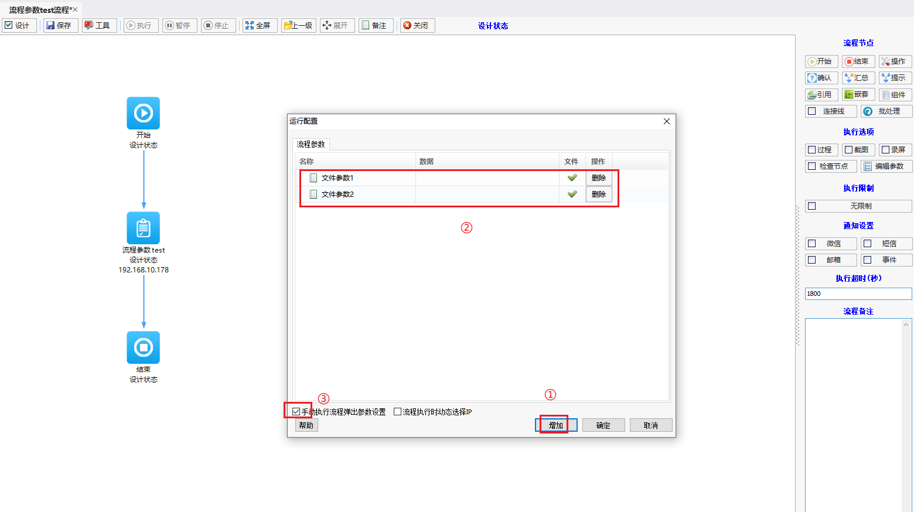
  
  3. Save and execute the process
  
     When the process executes, the "Run Configuration" window will pop up. At this point, upload the two files "D:\3.txt" and "D:\4.txt".
  
     > **[Tips]**
     >
     > &emsp;Since both "File Parameter 1" and "File Parameter 2" are "File" type parameters, files need to be uploaded. Below are the contents of the uploaded files "D:\3.txt" and "D:\4.txt".
     >
     > 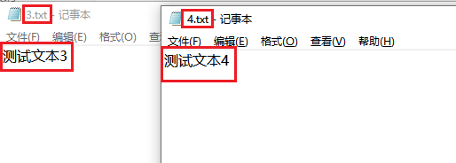
  
     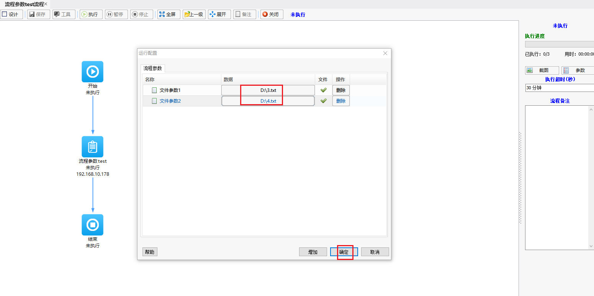
  
  4. View the process logs
  
     ① The first line of the log prints the value of "File Parameter 1", which comes from the file path ("D:\3.txt") uploaded in the 【Process Design】 interface for "File Parameter 1", indicating that the file path ("D:\3.txt") uploaded in the 【Process Design】 interface for "File Parameter 1" was passed to "File Parameter 1" in the component.
  
     ② The second line of the log prints the value of "File Parameter 2", which comes from the file path ("D:\2.txt") set in the component for "File Parameter 2", indicating that the file path ("D:\2.txt") set in the component for "File Parameter 2" was passed to "File Parameter 2" in the 【Process Design】 interface.
  
     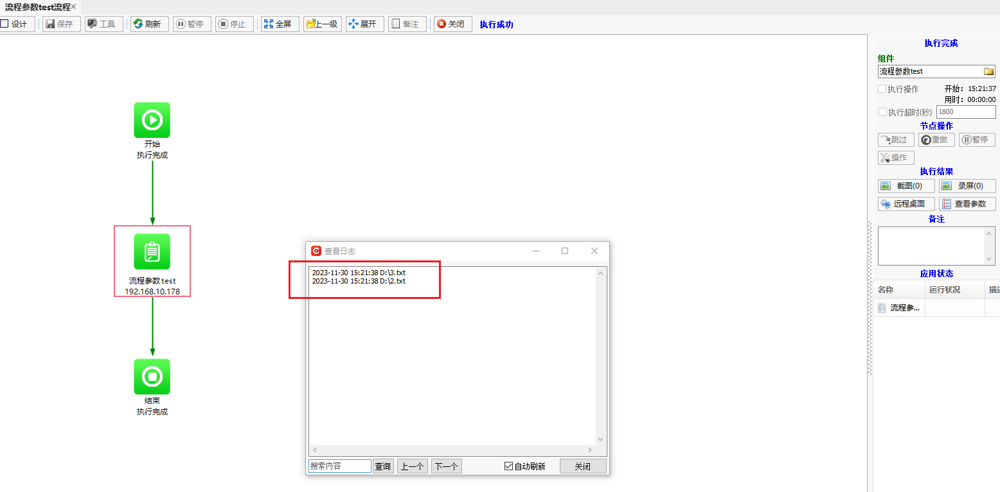
  
  5. View the parameters
  
     ① The files uploaded during the process execution, "D:\3.txt" and "D:\4.txt", can be downloaded in "Parameters" - "Files" after execution;
  
     ② The file uploaded in the 【Process Design】 interface for "File Parameter 1" ("D:\3.txt") overwrites the file content set in "File Parameter 1" of the component ("D:\1.txt"), making it available for the component to use, i.e., the file content uploaded in the 【Process Design】 interface for "File Parameter 1" was passed to the file in "File Parameter 1" of the component;
  
     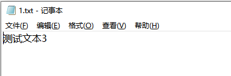
  
     ③ The file set in "File Parameter 2" of the component ("D:\2.txt") has been passed to the process and can be downloaded and used in "Parameters" - "Files" after execution, i.e., the file set in "File Parameter 2" of the component was passed to the process for use;
  
     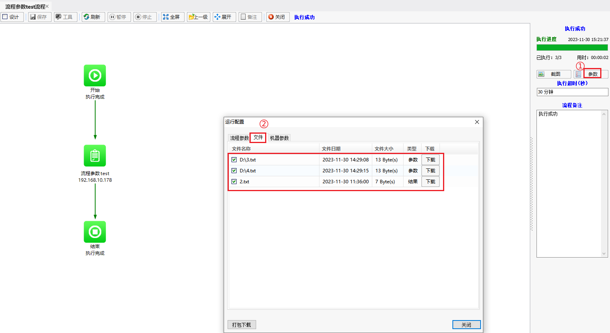
  
  6. In summary, for "File" type process parameters: **Input process parameters** in the component can get the content of the uploaded file from the same name parameter of the process and use the obtained file in the component; **Output process parameters** in the component can upload the set file to the same name parameter of the process and use the set file in the process for download.
  
     > **[Explanation]**
     >
     > - Operations during run-time are similar, except that in design-time you can view it in the interface, while in run-time you cannot.
     > - Operations under node type are similar. If the process parameter in the component is of the "Process" type, there is no need to select the node and create a parameter with the same name in the process. If the process parameter in the component is of the "Node" type, you need to select the node that calls the component in the process and then create a process node parameter with the same name.

  