##### Creating Global Parameters

Global parameters can be created either through the 【Global Parameters】 interface or by using relevant functions in the component. The details are as follows:

（I）Create in the 【Global Parameters】 Interface:

1. Enter the 【Global Parameters】 Interface:

   Click “Script Management” in the left tree bar, then select and click “Global Parameters” to enter the global parameters interface;

   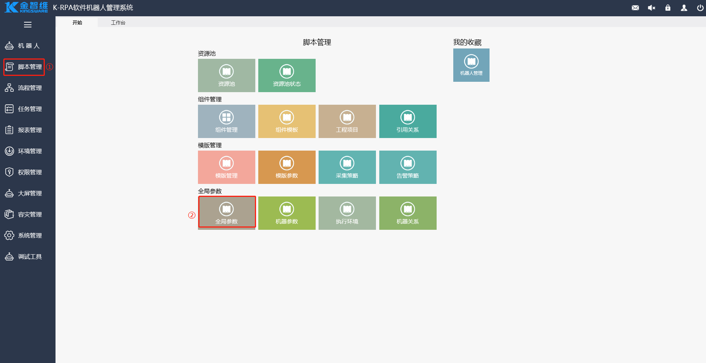

2. Create Global Parameters:

   In the 【Global Parameters】 interface, click “Add” - “Add Parameter”.

   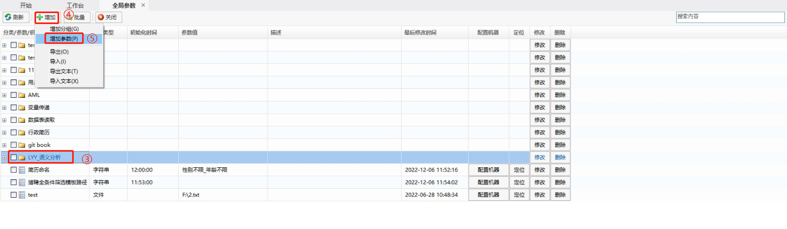

   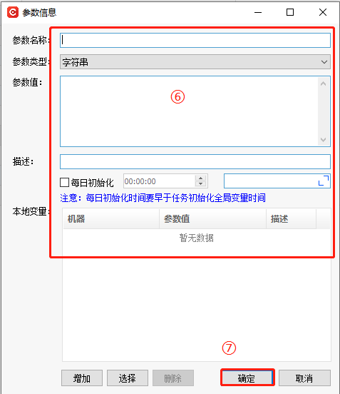

（II）Create Using Relevant Functions:

1. Create Global Parameters Using the 【Set Global Parameter】 Function:

   In the component editing interface, add the 【Set Global Parameter】 function;

   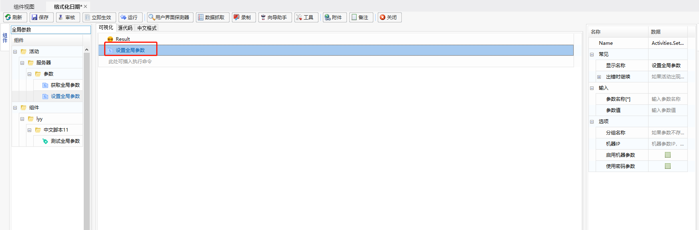

2. Edit the 【Set Global Parameter】 Function:

   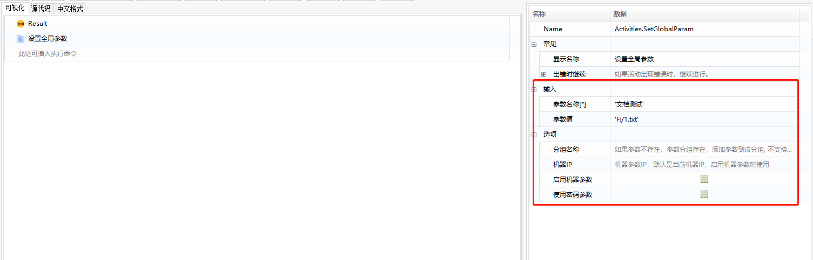

3. Execute the Function to Complete the Global Parameter Setting.

   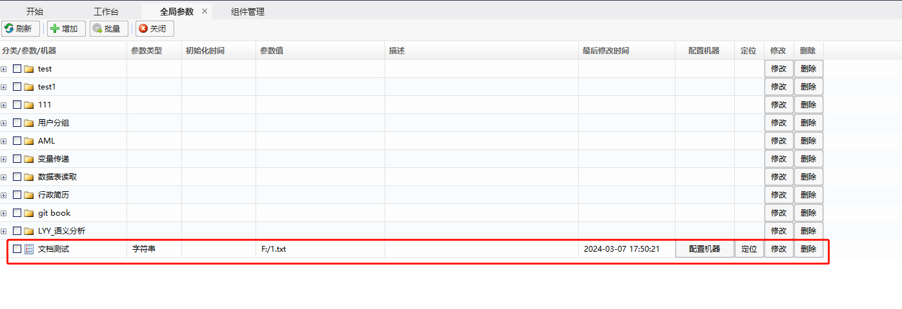

##### Using Global Parameters

Users can interact between parameters, components, and processes by calling the 【Get Global Parameter】 function in components or using global parameters in processes.

（I）Get the Value of a Global Parameter Using a Function:

1. Create a Global Parameter Using the 【Get Global Parameter】 Function:

   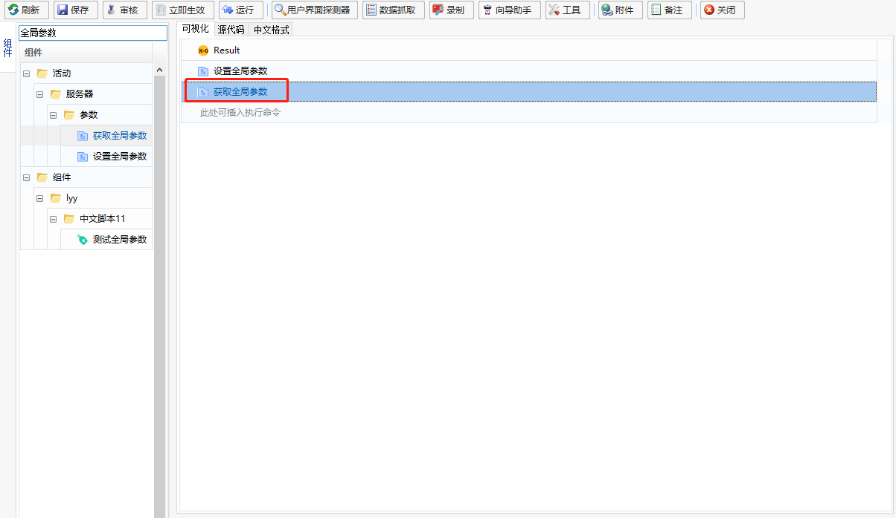

2. Edit the 【Get Global Parameter】 Function:

   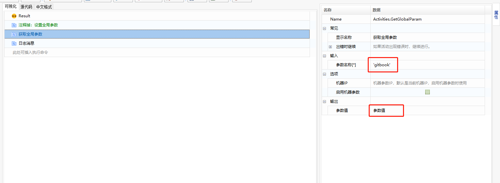

3. Execute the Function to Get the Value of the Specified Global Parameter.

   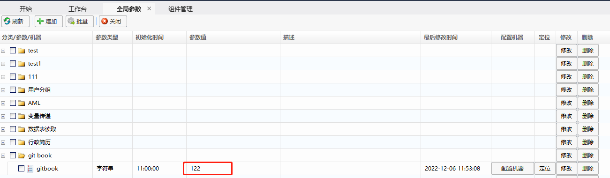

   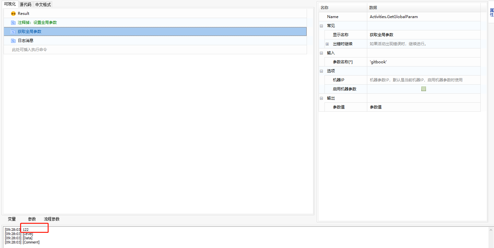

（II）Call Global Parameters in a Process:

   Example: Write the value of a specified global parameter into an Excel cell.

1. In the component, call the 【Excel Application Scope】 and 【Write Cell】 functions;

   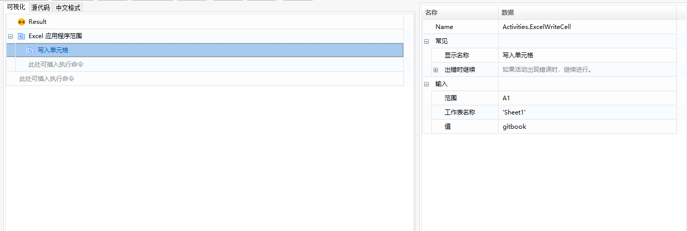

2. Pass the Excel file path into the “Workbook Path” of the 【Excel Application Scope】 function;

   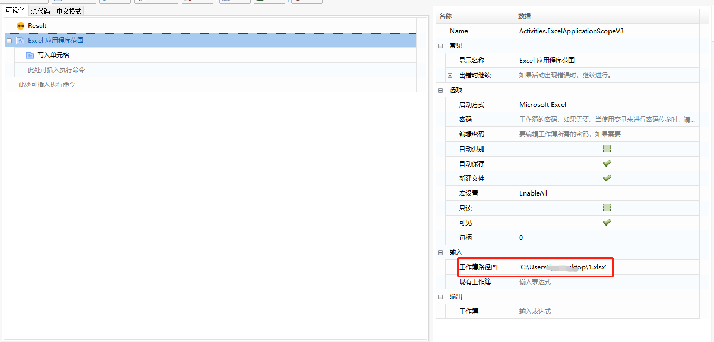

3. Create an input parameter named “gitbook” and pass this variable into the “Value” property of the 【Write Cell】 function. Edit the “Range” and “Sheet Name” properties;

   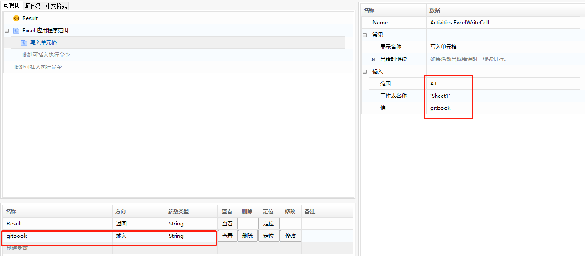

4. In the process design, call this component and select the required global parameter during parameter selection;

   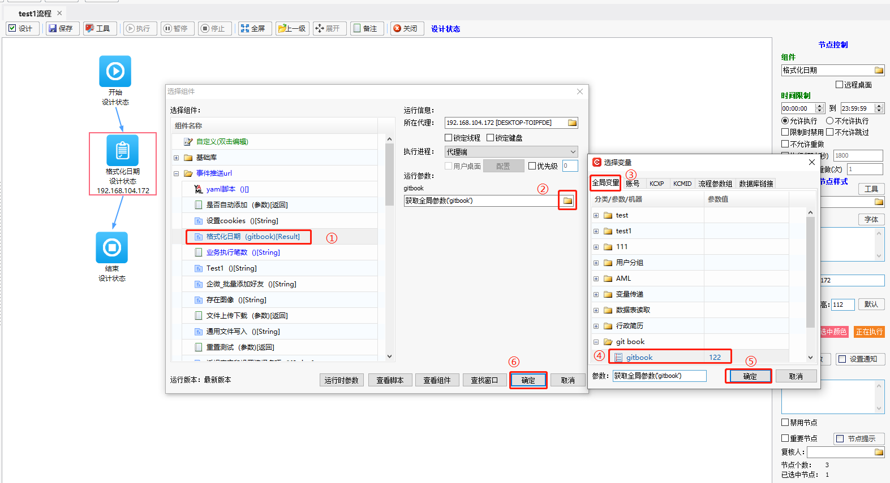

5. Execute the process and view the result: The selected global parameter's value will be successfully written to the specified cell in the Excel file.

   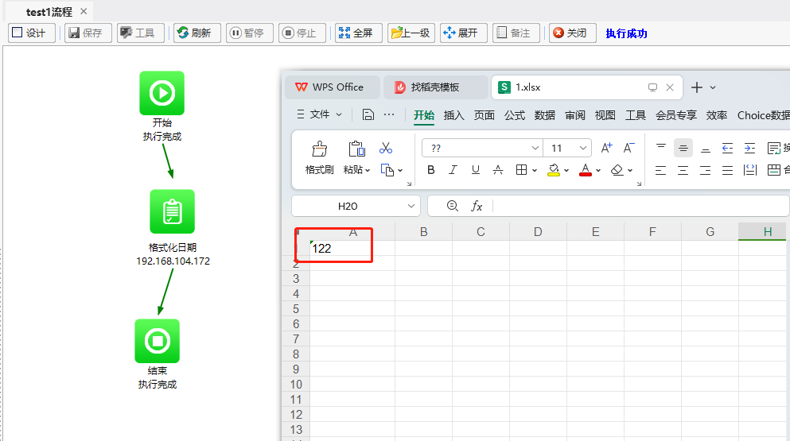

### Global Parameters

The **Global Parameters** interface provides a unified entry for configuring parameters, allowing users to maintain and manage global parameters. Components can invoke these parameters using related functions, and processes can select global parameters during parameter configuration.

For instance, if there are 10 machines with the KCXP program installed in the same path, a global parameter for the KCXP program path can be set. When configuring the process to select the program path, simply reference this parameter.

#### Global Parameters Creation

Global parameters can be created in the **Global Parameters** interface or through related functions in components. Here are the detailed steps:

**(I) In the Global Parameters interface:**

1. **Access the Global Parameters interface:**

   Click "Script Management" in the left tree bar and select "Global Parameters" to enter the Global Parameters interface.

   

2. **Create a global parameter:**

   In the Global Parameters interface, click "Add" - "Add Parameter."

   

   

**(II) Through related functions:**

1. **Using the Set Global Parameter function to create a global parameter:**

   In the component editing interface, add the **Set Global Parameter** function.

   

2. **Edit the Set Global Parameter function:**

   

3. **Execute the function to complete the global parameter setting:**

   

#### Using Global Parameters

Users can retrieve global parameters by invoking the **Get Global Parameter** function in components or selecting global parameters during process parameter configuration for interactions between parameters, components, and processes.

**(I) Using functions to get the value of a global parameter:**

1. **Using the Get Global Parameter function to create a global parameter:**

   

2. **Edit the Get Global Parameter function:**

   

3. **Execute the function to retrieve the value of the specified global parameter:**

   

   

**(II) Invoking global parameters in a process:**

Example: Writing the value of a specified global parameter into an Excel cell.

1. **In the component, use the **Excel Application Scope** and **Write Cell** functions:**

   

2. **In the Excel Application Scope function, input the Excel file path for the "Workbook Path" attribute:**

   

3. **Create an input parameter named "gitbook" and pass this variable to the "Value" attribute of the Write Cell function. Specify the "Range" and "Sheet Name":**

   

4. **In the process design, invoke this component and select the global parameter to be passed in:**

   

5. **Execute the process and check the result: the value of the selected global parameter is successfully written into the specified cell in the Excel file.**

   

