### 用户界面探测器

“用户界面探测器”界面，展示的是当前系统中打开的所有程序的元素信息。

#### 功能说明

当用户无法直接指明元素时，可手动展开“用户界面探测器”界面获取的所有程序元素信息，当在界面中查看到目标元素时，即可将该元素的表达式直接复制到脚本向导函数“选取器”属性的表达式栏。

> **[warning] 注意**
>
> &emsp;若用户通过该探测器获取到元素信息后无法验证成功，则可适当对该元素信息进行删减操作，直到验证成功为止（一般仅会在获取到的元素表达式信息的中间行进行删减操作）。

界面如下所示：

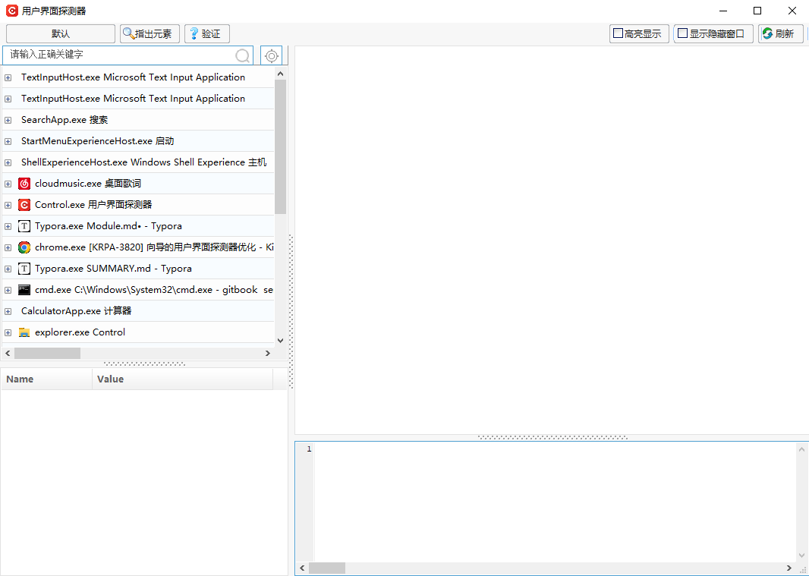

- 界面左上角的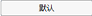按钮，可筛选用户界面框架，界面展示的元素是根据所选择的界面框架进行展示。
- 指出元素：可通过【指出元素】操作，指明元素。
- 验证：当选中元素后，可通过单击【验证】按钮，查看是否验证通过，若验证通过，则表明元素存在；若验证不通过，则表明元素不存在。
- 高亮显示：当指明元素时，可通过“高亮显示”，用红框框住所指明的元素。
- 显示隐藏窗口：当勾选“显示隐藏窗口”，则对于系统中隐藏的窗口都将会在该界面进行显示。
- 刷新：刷新当前界面，当切换了用户界面框架时，需要对界面进行刷新。

当在界面中选中所需要的元素，则在界面左下角及右侧的对应区域会显示出元素详情信息；

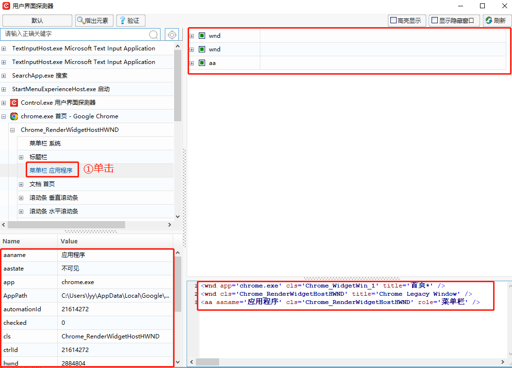

界面右下角所显示的元素表达式，是根据右上角区域所勾选的字段来生成的，如：当取消勾选界面中的“role”字段，则在表达式中将会无“role”字段生成。

未取消勾选“role”字段，表达式如下所示：

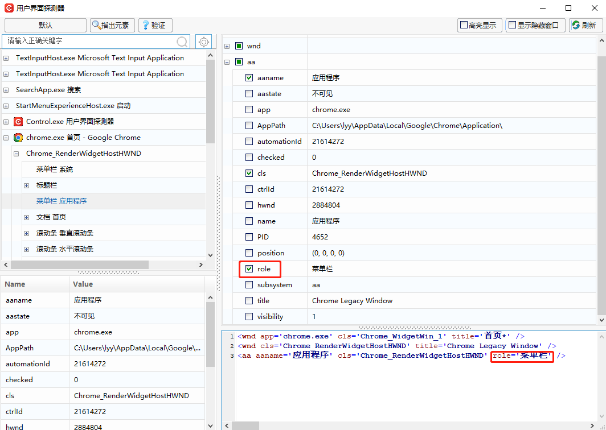

取消勾选“role”字段，表达式如下所示：

用户验证通过目标元素信息后，可将所生成的元素表达式复制到函数的“选取器”-“表达式编辑器”中，如下图所示

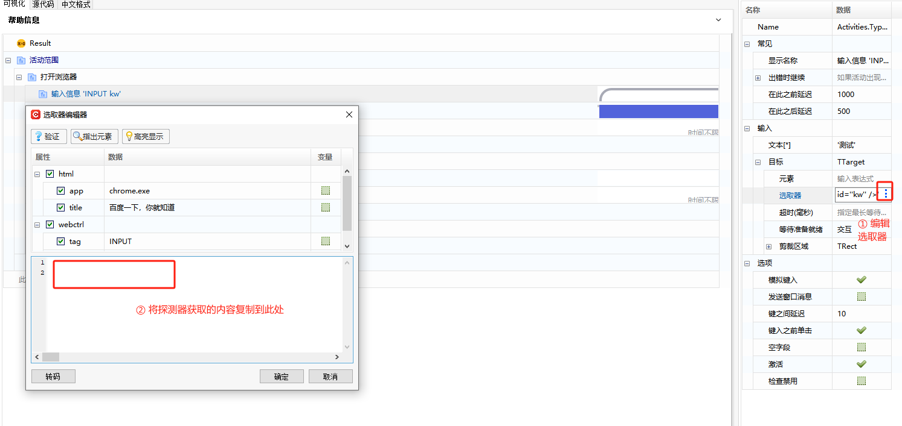

#### 场景示例

示例：通过谷歌浏览器打开百度界面，在百度界面进行操作。

1. 在组件编辑界面，添加【打开浏览器】函数，输入需要打开的网页地址（此处打开百度）；

   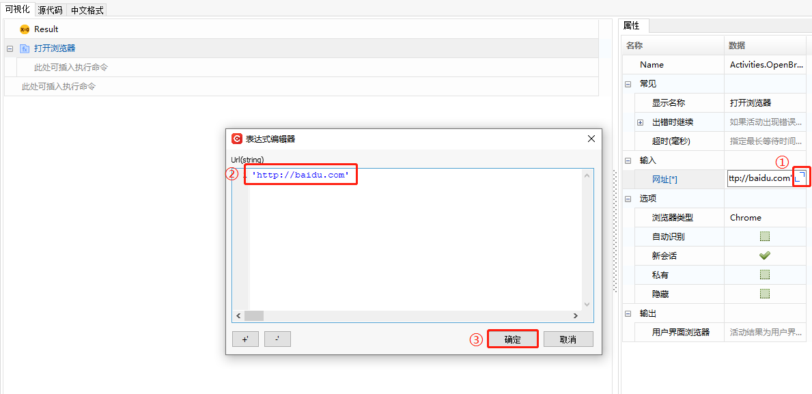

   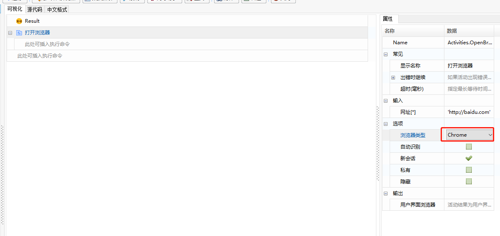

2. 添加【单击】函数，在组件编辑界面，单击【用户界面探测器】；

   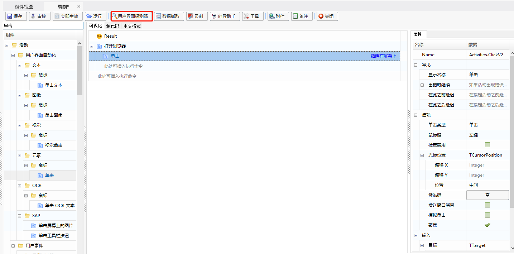

3. 在“用户界面探测器”界面，单击【指出元素】，鼠标指明需要指定的元素，则在界面的下方会生成元素的表达式；

   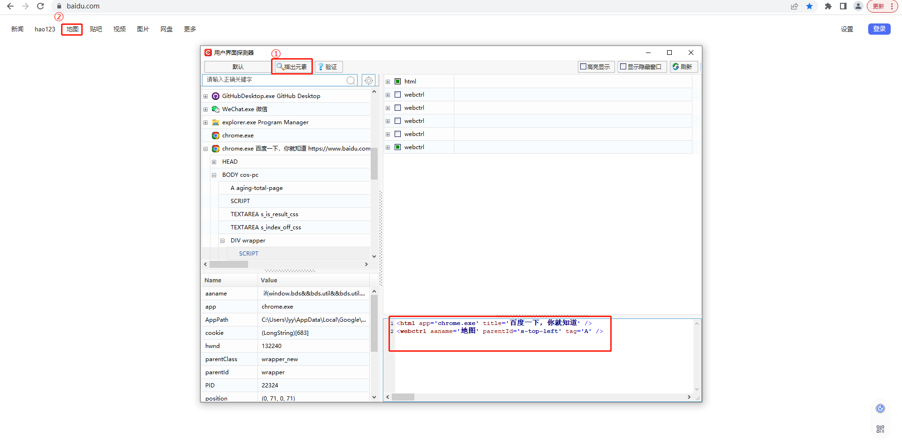

4. 将界面下方的表达式，复制到【单击】函数的选取器属性的表达式编辑处；

   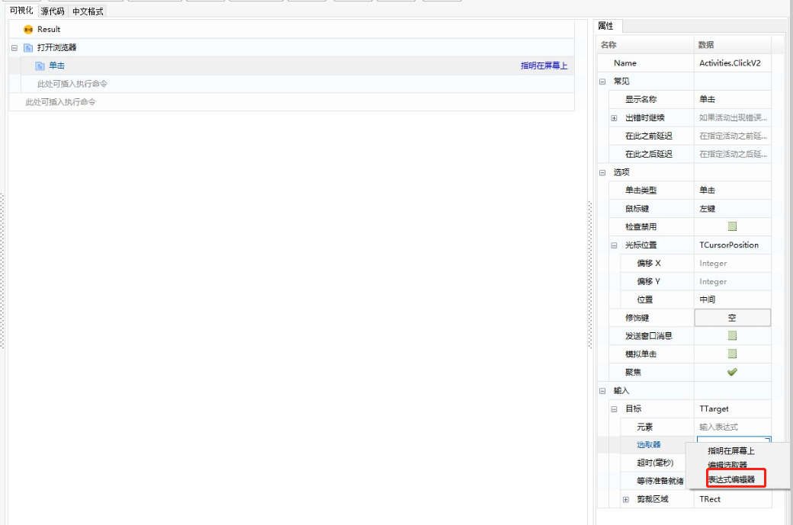

   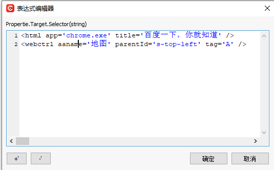

5. 可通过【验证】以及【高亮显示】，判断所选择的元素是否正确；

   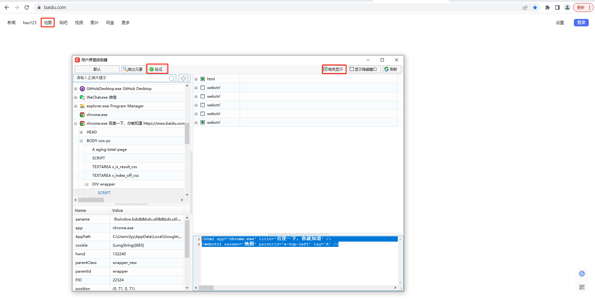

6. 待设置完成后，可关闭“用户界面探测器”，回到脚本编辑界面，进行脚本执行等其他操作。
