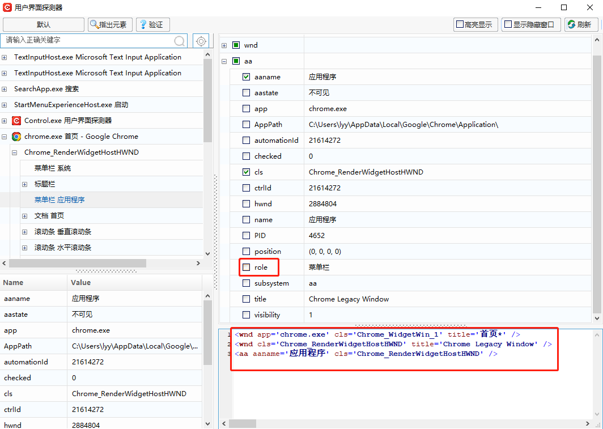

### UI Explorer

The "UI Explorer" interface displays information about all open program elements in the current system.

#### Function Description

When users cannot directly specify elements, they can manually expand the "User Interface Detector" interface to get all program element information. When the target element is found in the interface, the element expression can be copied directly to the "Selector" property of the script guide function.

> **[Note]**
>
> &emsp;If users cannot successfully verify the element information obtained through the detector, they can appropriately trim the element information until verification is successful (usually, only middle lines of the obtained element expression information need to be trimmed).

The interface is shown as follows:

- The button in the top left corner  can filter the user interface framework. The elements displayed in the interface are based on the selected interface framework.
- Specify Element: Elements can be specified through the 【Specify Element】 operation.
- Verify: After selecting an element, click the 【Verify】 button to check whether the verification is successful. If it passes, it indicates that the element exists; if it fails, it indicates that the element does not exist.
- Highlight: When specifying an element, it can be highlighted with a red frame.
- Show Hidden Windows: If "Show Hidden Windows" is checked, hidden windows in the system will be displayed in this interface.
- Refresh: Refresh the current interface. If the user interface framework is switched, the interface needs to be refreshed.

When the required element is selected in the interface, the detailed element information will be displayed in the corresponding area at the bottom left and right sides of the interface;

The element expression displayed in the lower right corner of the interface is generated based on the fields checked in the upper right area. For example, if the "role" field in the interface is unchecked, the "role" field will not be generated in the expression.

When the "role" field is not unchecked, the expression is as follows:

When the "role" field is unchecked, the expression is as follows:

After the target element information is successfully verified, the generated element expression can be copied to the "Expression Editor" of the "Selector" in the function, as shown below

#### Scenario Example

Example: Open the Baidu page through Google Chrome and operate on the Baidu page.

1. In the component editing interface, add the 【Open Browser】 function and enter the webpage address to be opened (here, open Baidu);

   

   

2. Add the 【Click】 function, and in the component editing interface, click 【UI Explorer】;

   

3. In the "UI Explorer" interface, click 【Indicate Element】 and use the mouse to point to the element to be specified. The element expression will be generated at the bottom of the interface;

   

4. Copy the expression at the bottom of the interface to the expression editor of the "Selector" property of the 【Click】 function;

   

   

5. Use 【Verify】 and 【Highlight】 to determine whether the selected element is correct;

   

6. After setting is completed, the "User Interface Detector" can be closed, returning to the script editing interface to execute the script and perform other operations.

