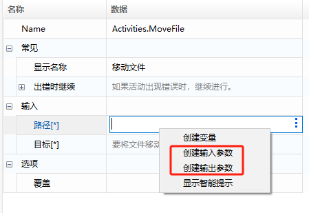
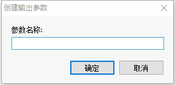
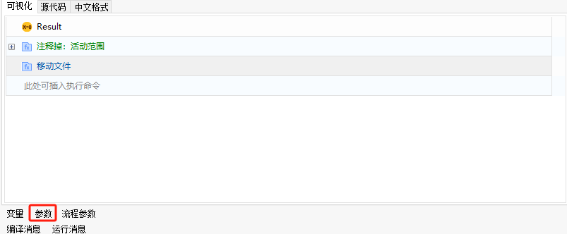
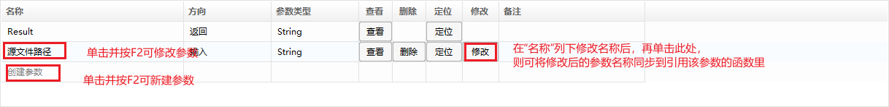
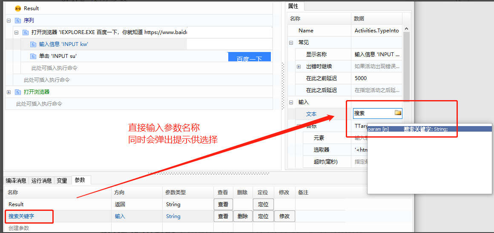
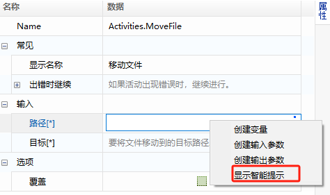
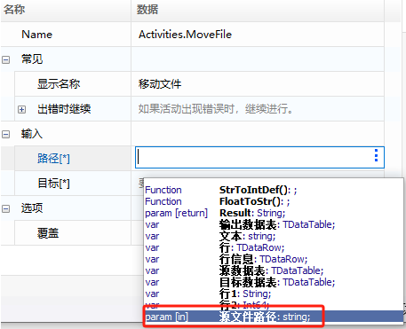
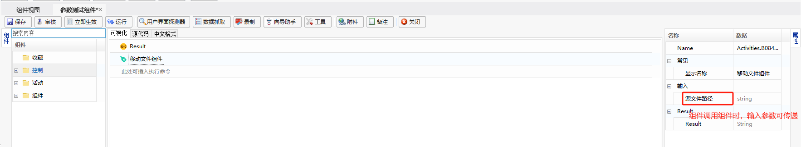
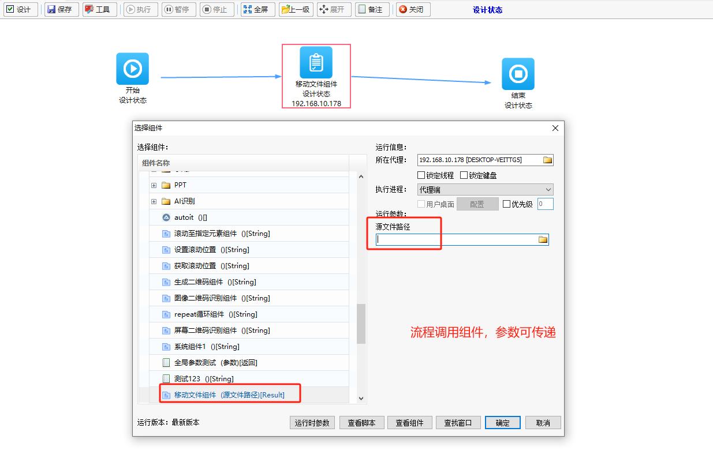

## Component Development

### Component Parameters

Similar to function design in programming, components support dynamic data parameter passing, which helps improve the reusability of components. For example, in an online banking login component, the username and password can be passed as parameters from outside, allowing different accounts to log in to the online banking system.

Parameters can be divided into input and output based on the direction of transmission.

#### Creating Parameters

1. Create from the context menu.

   In the property panel of the script function, right-click the edit box, and select "Create Input Parameter" / "Create Output Parameter" from the context menu. Then enter the parameter name in the pop-up box. The parameter type will be automatically defined according to the type required in the property box.

   

   

   

2. Create in the parameter panel.

   If the parameter panel is not displayed at the bottom of the component editing interface, click "Parameters" as shown below to expand the parameter panel:

   

   In the expanded parameter panel, press F2 to enter the editing state and create a new parameter. Use the 【Locate】 button to locate the function that calls the parameter.

   
   
   > **[info] Tip**
   >
   > - After selecting the parameter name and pressing F2 to change the name, click the "Modify" button to synchronize the modified parameter name to the functions referencing the parameter. (This feature is supported in versions after 2023.12.27).
   > - The supported types of parameters can be selected by clicking the "Parameter Type" column and pressing F2 for a dropdown selection. When the parameter established here is referenced by the component, ensure that the variable type matches the property type.

#### Using Parameters

Parameters can be used by directly entering the parameter name or by selecting it through the "Show Smart Tips" method:

1. Directly enter the keyword name (without quotes).

   

2. Right-click the edit box and select "Show Intelli Prompt".

   

   

#### Passing Parameters

Parameters can be passed in two ways: parameter passing when a component calls another component, and parameter passing when a process calls a component.

1. Parameter passing when a component calls another component.

   

2. Parameter passing when a process calls a component.

   
