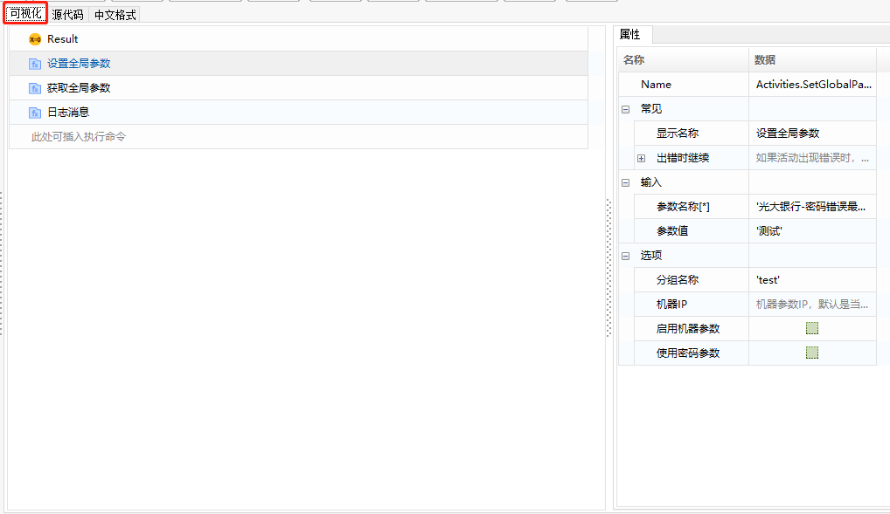
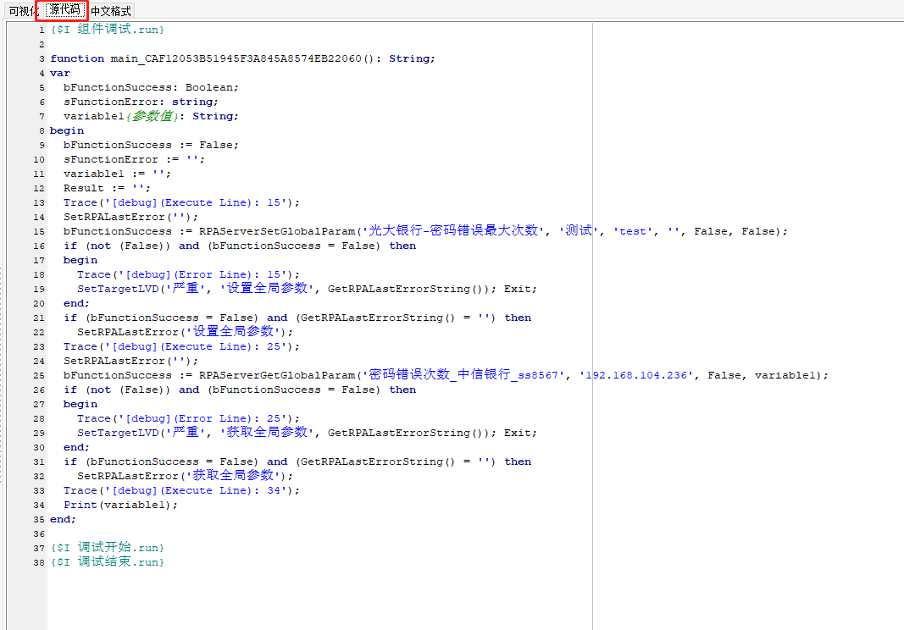
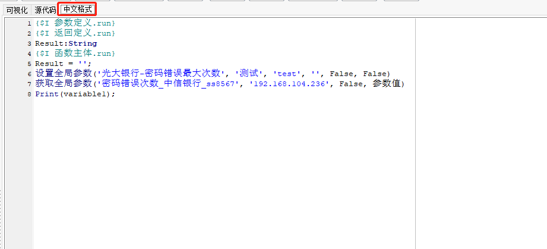

## 组件展示

在【组件管理】- 脚本向导编辑页面，用户可通过可视化、源代码和中文格式三个子页面查看当前脚本向导代码信息，其中可视化界面为脚本向导的主要开发界面。

### 可视化

在【组件管理】页面增加“脚本向导”类型的组件，进入脚本向导编辑页面时，默认展示的是“可视化”子页面，在该页面可进行函数增加编辑等操作。

“可视化”页面，如下图所示：

### 源代码

“源代码”页面，可查看到脚本向导组件的源代码形式，可在脚本编辑页面，单击“源代码”进行切换。

> **[warning] 注意**
>
> &emsp;“源代码”页面下的代码不支持复用到其他语言中，如将该页面代码复制到英文脚本编辑界面是无法正常执行的。

“源代码”页面如下图所示：

### 中文格式

“中文格式”页面，是将脚本向导组件中所增加的函数，以中文脚本的格式进行展示。

> **[warning] 注意**
>
> &emsp;“中文格式”页面下的代码不支持直接复用到中文脚本中，仅可通过该页面查看到该脚本向导组件对应运用的中文函数情况。

“中文格式”页面，如下图所示：

