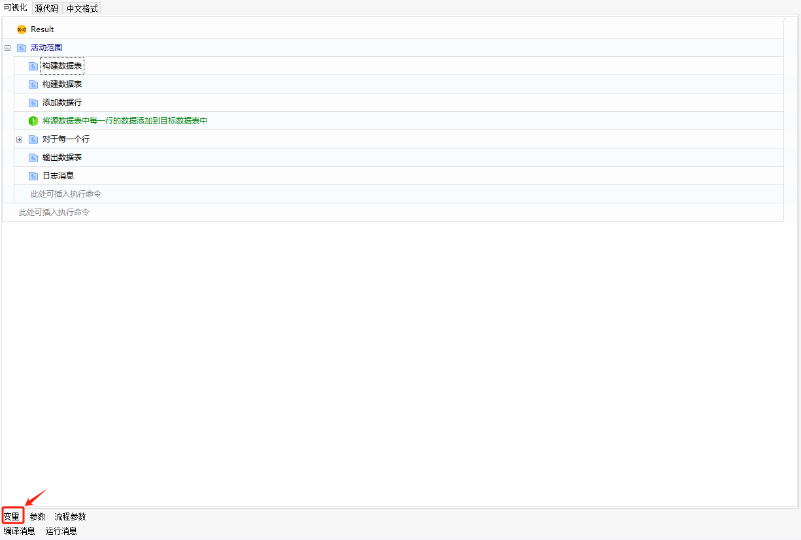
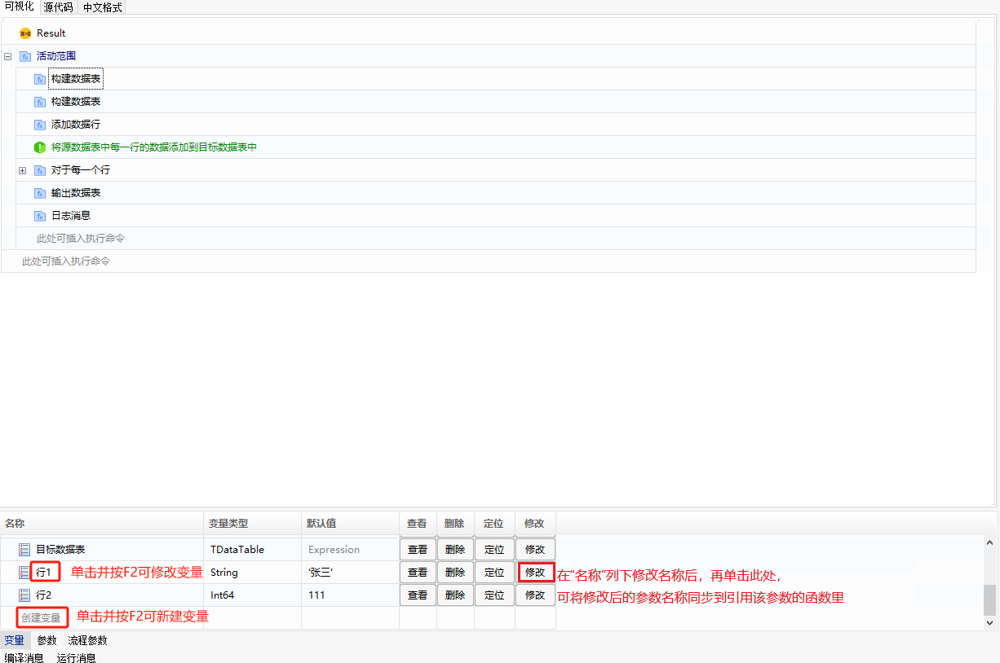
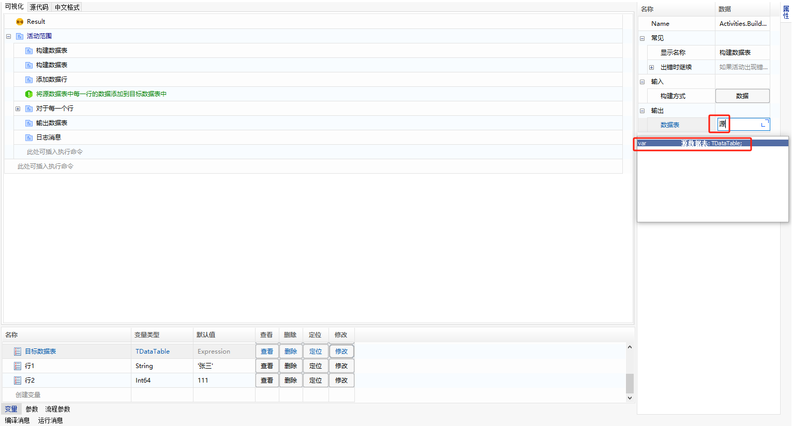
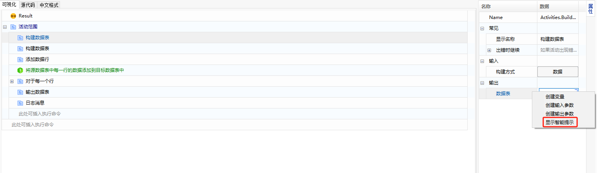
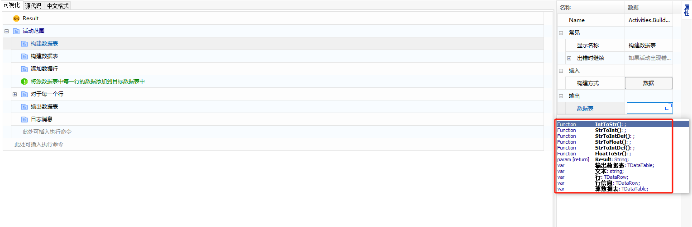

## Component Variables

Variables are the carriers of data transmission between script statements within a component. In this system, variables are distinguished by data types, and scripts can reference variable values and assign values to variables.

### Creating Variables

1. Create from the context menu.

   In the script function's property panel, right-click after clicking the editing box, and select "Create Variable" from the context menu. Enter the variable name in the pop-up box. The variable type will be automatically defined based on the type required in the property box.

   

2. Create in the variable panel.

   If the variable panel is not displayed at the bottom of the component editing interface, click the "Variable" button as shown below to expand the variable panel:

   

   In the expanded variable panel, click and press F2 to enter the edit mode, where you can create or modify variables. The 【Locate】 button can also be used to locate the function that references the variable.

   > **[Note]**
   >
   > - After modifying the variable name by pressing F2, clicking the "Modify" button afterward will synchronize the modified variable name with the functions that reference this variable.
   > - The types supported for variables can be selected by clicking the "Variable Type" column and pressing F2 for a drop-down menu. When creating variables here, ensure that the variable type matches the property type when referenced by the component.

   

### Using Variables

Variables can be used by directly entering the variable name or by using the "Show Intelli Prompt" option.

1. Directly enter the variable name (without quotes).

   

2. Right-click after clicking the editing box and use the "Show Intelli Prompt" option for selection.

   

   
