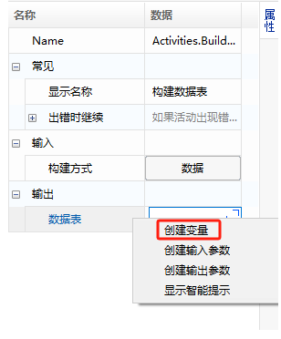

### 组件变量

变量是组件内部的脚本语句之间传递数据的载体，本系统中变量是区分数据类型的，脚本可以引用变量的值，以及给变量赋值。

#### 创建变量

1. 从上下文菜单中选择创建。

   在脚本函数的属性面板中，单击编辑框后右键，可从上下文菜单中选择“创建变量”，然后在弹出框中输入变量名称。变量类型会根据属性框中所需要的类型自动定义。

   

2. 变量面板中创建。

   若组件编辑界面下方未显示变量面板，则可单击下图的“变量”，展开变量面板：

   

   在展开的变量面板中，单击并按 F2 可进入编辑状态，可新建或者修改变量，其中通过【定位】按钮，也可定位到所引用该变量的函数。

   > **[info] 提示**
   >
   > - 选中变量名称按 F2 修改名称后，再单击其后方的“修改”按钮，可将修改后的变量名称同步到引用该变量的函数里。
   > - 变量支持的类型可通过单击“变量类型”列后按 F2 进行下拉选择，此处建立的变量被组件引用时，需保证变量类型与属性类型一致。
   
   

#### 使用变量

变量的使用，可直接输入变量名称，或通过“显示智能提示”方式进行选择。

1. 直接输入关键字名称（无需带引号）

   

2. 单击编辑框后右键，通过“显示智能提示”方式进行选择。

   

   
   
 ## Component Variables

Variables are the carriers of data transmission between script statements within a component. In this system, variables are distinguished by data types, and scripts can reference variable values and assign values to variables.

### Creating Variables

1. Create from the context menu.

   In the script function's property panel, right-click after clicking the editing box, and select "Create Variable" from the context menu. Enter the variable name in the pop-up box. The variable type will be automatically defined based on the type required in the property box.

   

2. Create in the variable panel.

   If the variable panel is not displayed at the bottom of the component editing interface, click the "Variables" button as shown below to expand the variable panel:

   

   In the expanded variable panel, click and press F2 to enter the edit mode, where you can create or modify variables. The 【Locate】 button can also be used to locate the function that references the variable.

   > **[info] Note**
   >
   > - After modifying the variable name by pressing F2, clicking the "Modify" button afterward will synchronize the modified variable name with the functions that reference this variable.
   > - The types supported for variables can be selected by clicking the "Variable Type" column and pressing F2 for a drop-down menu. When creating variables here, ensure that the variable type matches the property type when referenced by the component.

   

### Using Variables

Variables can be used by directly entering the variable name or by using the "Show Smart Hint" option.

1. Directly enter the keyword name (without quotes).

   

2. Right-click after clicking the editing box and use the "Show Smart Hint" option for selection.

   

   
