### 数据抓取

数据抓取实际为【提取结构化数据】函数的协作工具，主要是从具有规则的表格、表单或者列表中提取数据，如table 、 ul 、ol 以及其他具有规则的 div、span 等数据。

#### 功能说明

当用户需要对具有规则的表单、表格或者列表进行操作时，可通过数据抓取工具进行数据的获取，数据抓取的方式有下面两种：

- 通过添加“提取结构化数据”函数，在该函数属性面板的“提取元数据”字段中提供XML字符串，以此指定提取的信息；
- 通过使用组件编辑面板中的【数据抓取】按钮，直接指明抓取的信息，从而自动生成相关函数以及函数所相关的属性。

#### 场景示例

当前示例以抓取浏览器中表单的数据为例，具体使用请参考以下两个示例：

[场景示例一](#场景示例一)

[场景示例二](#场景示例二)

##### 场景示例一

通过【数据抓取】按钮进行数据抓取。

1. 在浏览器中打开所需抓取数据的网页表格，如图所示：

   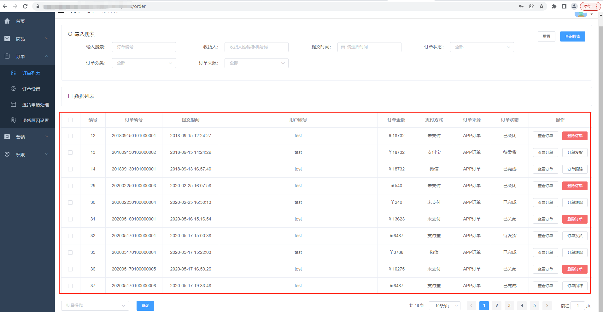

2. 在组件编辑面板中，单击【数据抓取】按钮，此时会弹出一个“提取向导”的窗口，然后按照窗口提示的步骤进行操作。

   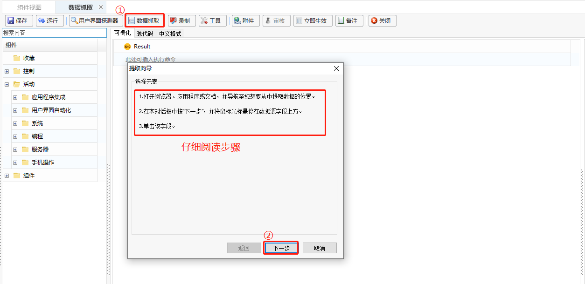

3. 在“提取向导”窗口中，单击下一步后，将鼠标光标悬停在数据源字段上方（红框选中我们所需选择的字段即可），单击该字段。此时将会有个提示“您已选择了一个表格单元，是否从整个表格中提取数据”，单击【是】。

   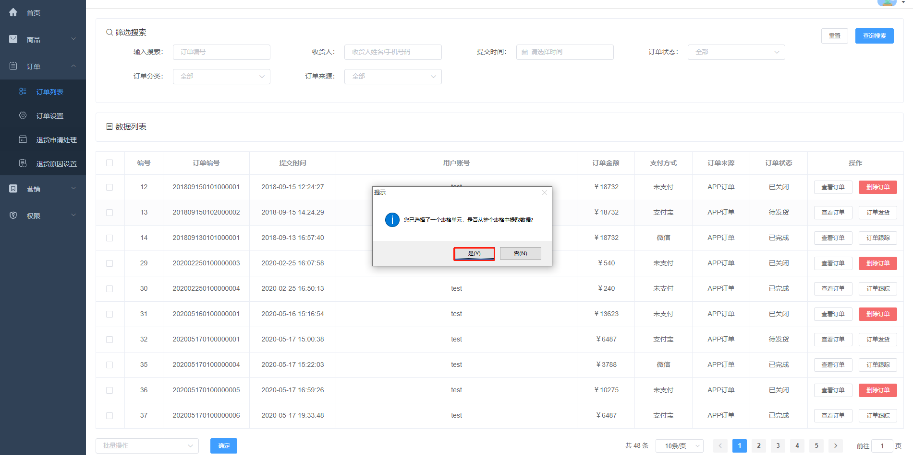

4. 完成步骤3后，页面将切换至控制台，此时在“提取向导”窗口中会加载到所提取到的表格的数据，可在该处设置数据的最大显示条数（默认最大结果条数为100；0表示不限制，此时会提取表格中的所有数据）。

   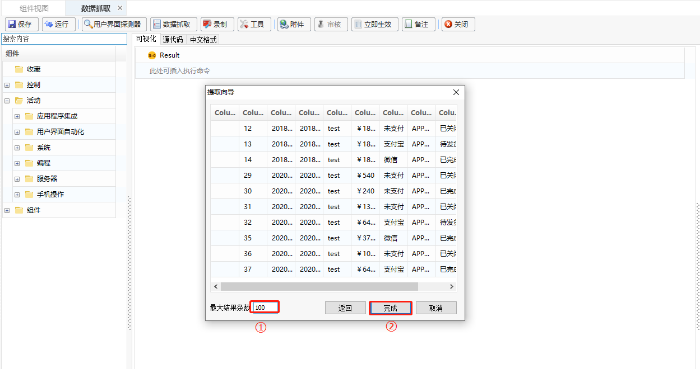

5. 单击【完成】按钮，会有相应的提示操作。

   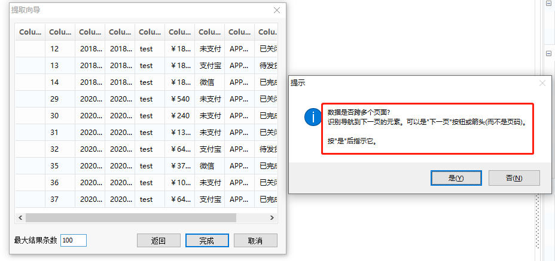

   - 单击【是】，则表明将要抓取跨多个页面的数据，此时可根据提示框中的步骤进行操作。
   - 单击【否】，则表明只抓取当前页面的数据。

6. 操作完成上述步骤后，将会在组件编辑面板中，生成一个“提取结构化数据”的函数。

   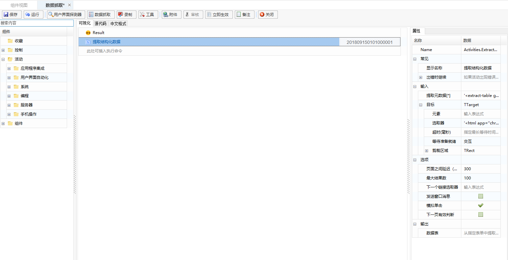

7. 在所生成的“提取结构化数据”函数中，创建数据表的输出变量，将输出结果赋给变量Table。

   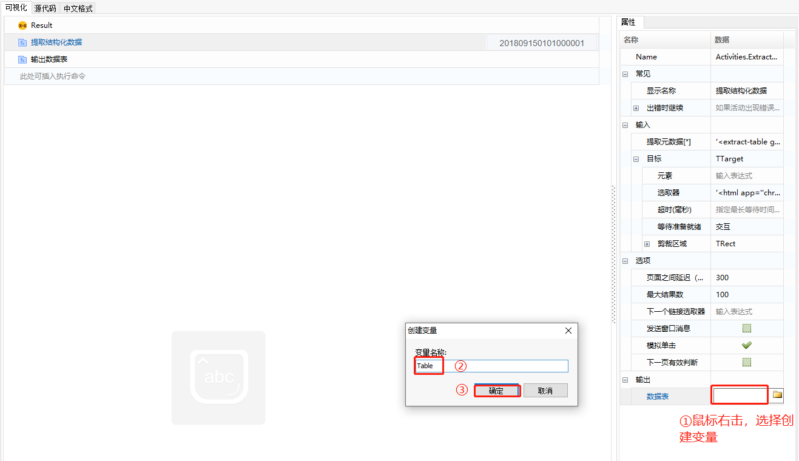

8. 此时我们可添加相应的其他辅助函数，将我们所抓取到的数据直接输出或写入文件中。

   - 结果直接输出的操作方式：

     1. 添加“输出数据表”函数，数据表属性选择Table变量，并创建文本的输出变量text。

        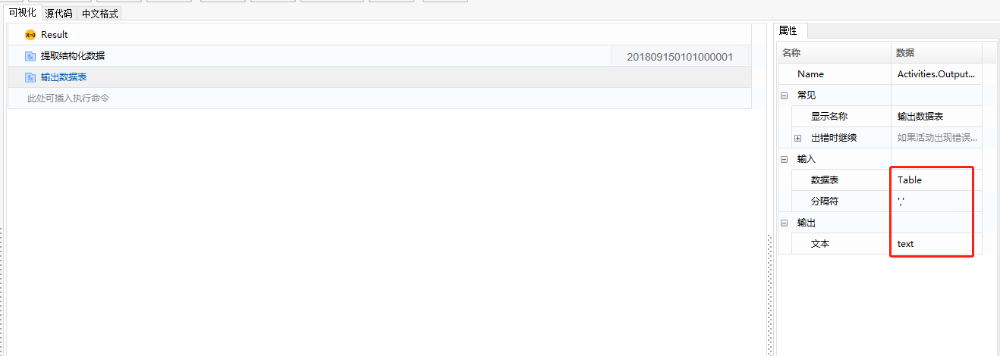

     2. 添加“日志消息”函数，设置如下：

        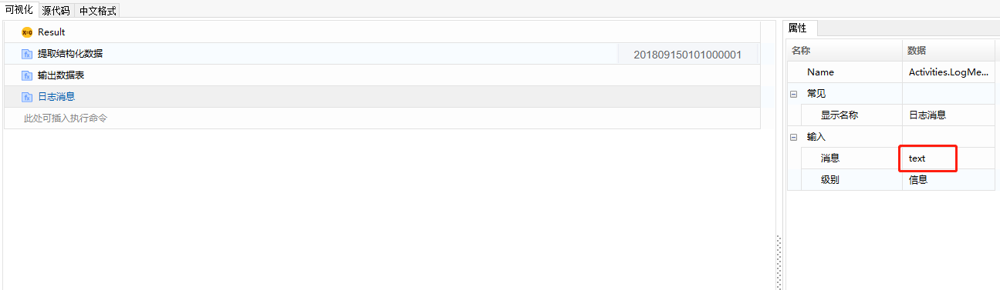

     3. 执行结果如下所示：

        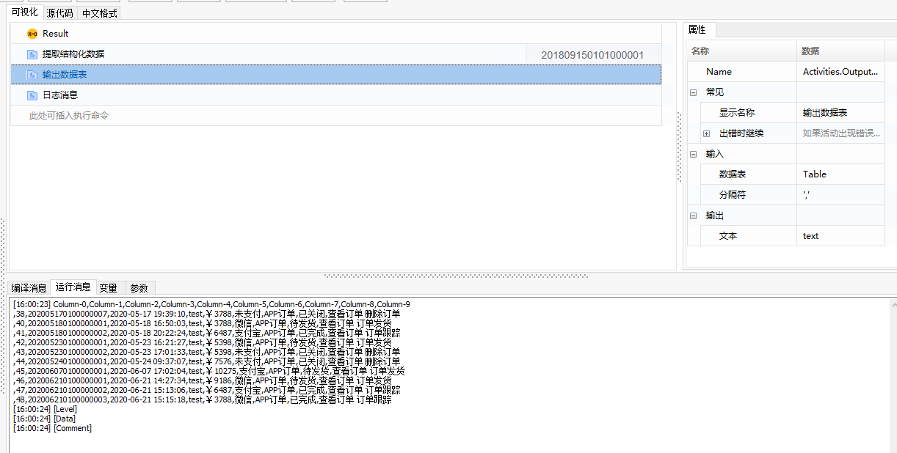

   - 结果写入文件的操作方式：

     1. 添加“Excel应用程序范围”函数，填入需要存放的工作簿的路径，如下图所示：

        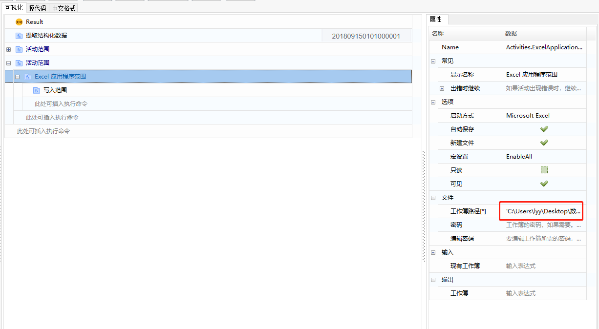

     2. 添加“写入范围”函数，设置效果如下图所示：

        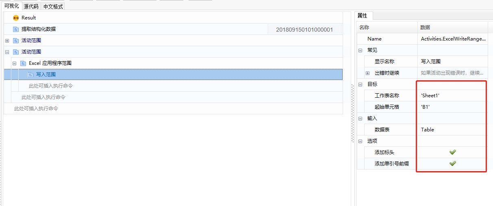

     3. 执行结果如下：

        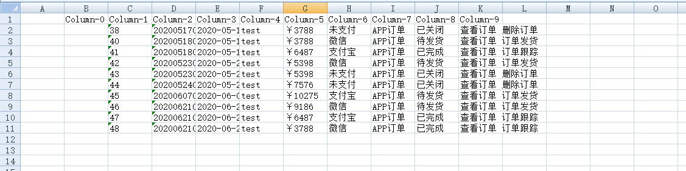

##### 场景示例二

通过“提取结构化数据”函数进行数据抓取。

1. 在组件编辑面板中，添加“提取结构化数据”函数，通过指明元素指明需要抓取的表格数据字段，指明完成后，选取器属性栏会自动生成相关内容，此时创建输出变量Table即可。

   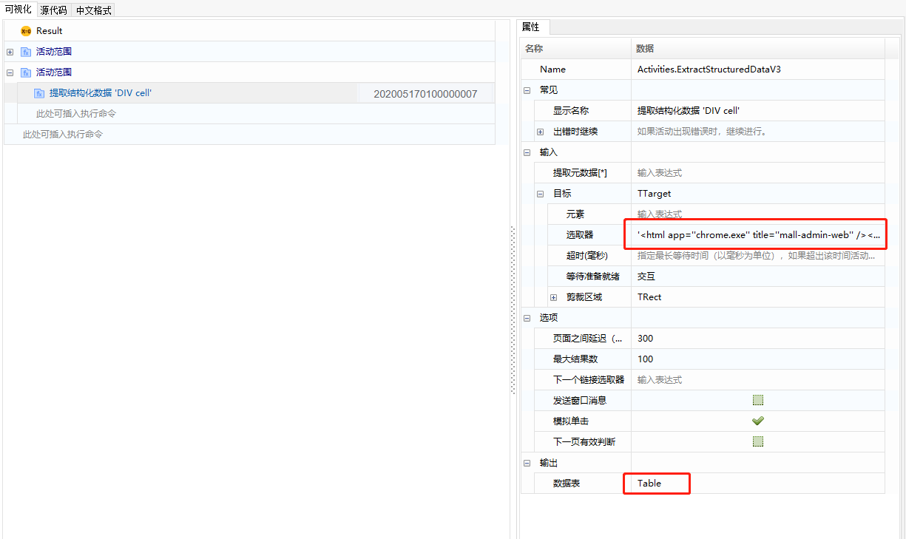

2. 接下来的操作，与场景示例一一样，具体可从[场景示例一](#步骤7)的步骤7开始进行参考。

