### 开发第一组件

**示例：通过谷歌浏览器打开百度网页，在百度网页进行操作。**

1. 在组件编辑界面左边的“搜索内容”框中，输入“打开浏览器”，双击“打开浏览器”可将该函数添加到中间的编辑面板中；

   

2. 添加【打开浏览器】函数，在函数的网址栏输入百度的网址，浏览器类型选择“Chrome”；

   

3. 在搜索框中，输入“输入信息”，双击“输入信息”可将该函数添加到中间的编辑面板中；

   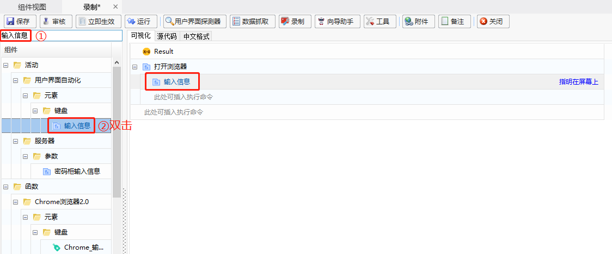

4. 在【输入信息】函数的“文本”属性栏中，填入想要输入的内容，且通过“指明在屏幕上”指明内容输入的位置（此处指明的位置为百度界面的所有框）；

   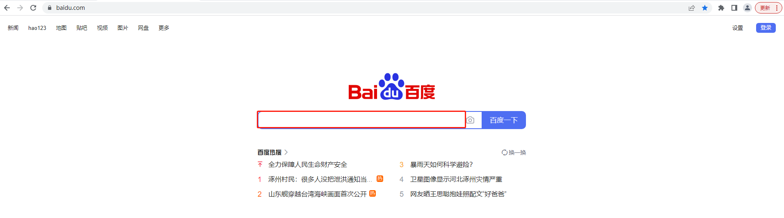

   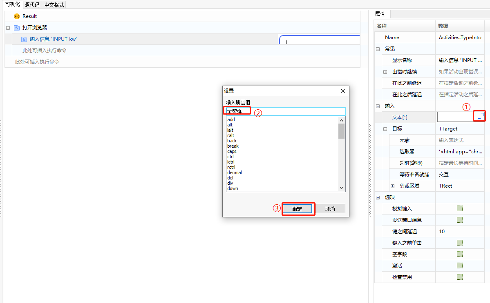

5. 在搜索框中输入“单击”，双击添加【单击】函数，且通过“指明在屏幕上”指明【百度一下】按钮；

   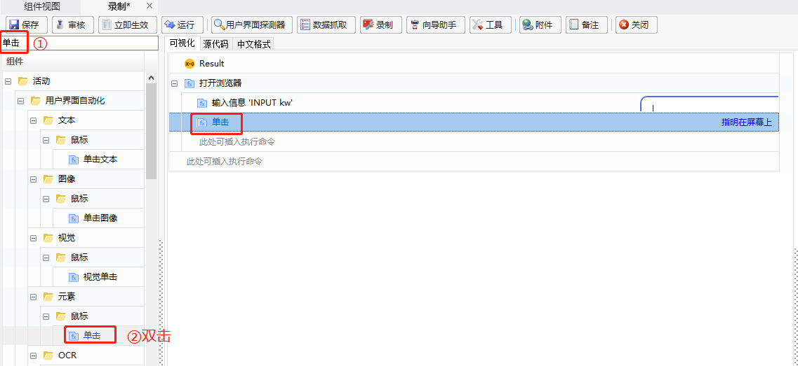

   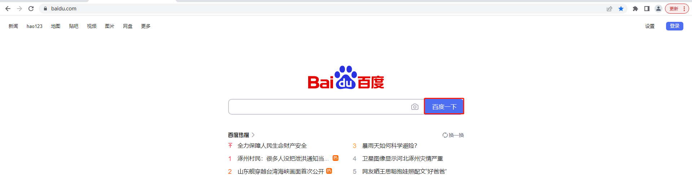

   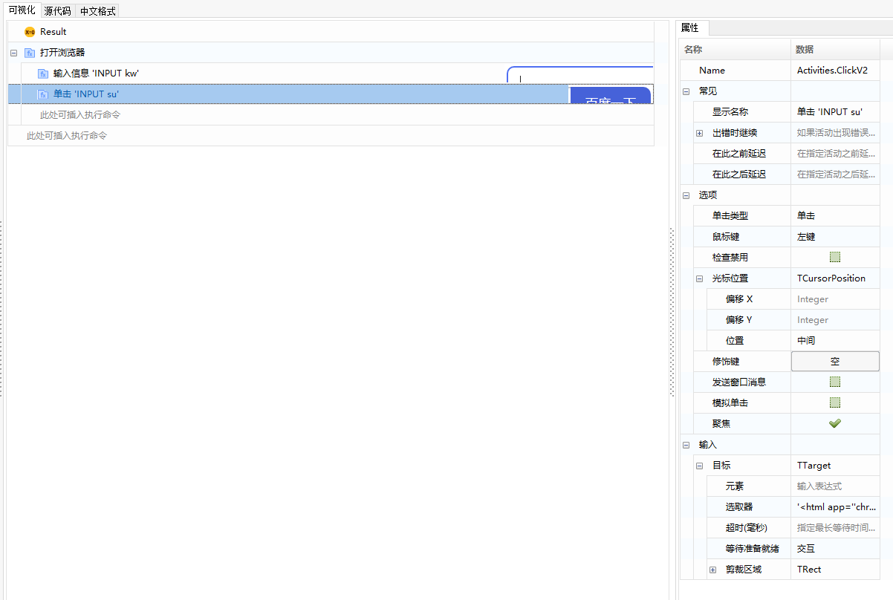

6. 在搜索栏搜索“获取属性”，添加【获取属性】函数，通过“指明在屏幕上”指明需要获取的元素，并在“属性”栏选择该元素的属性（该属性类型的选择，可通过在网页中按 F12 查看）；

   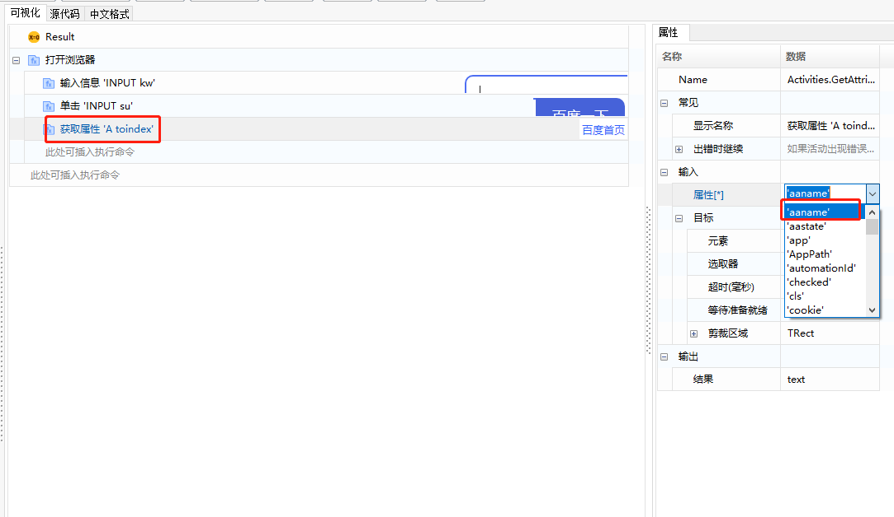

7. 在【获取属性】函数中创建输出变量 “text” ；

   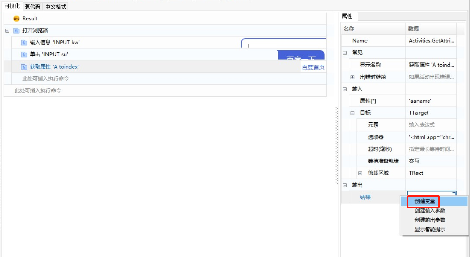

   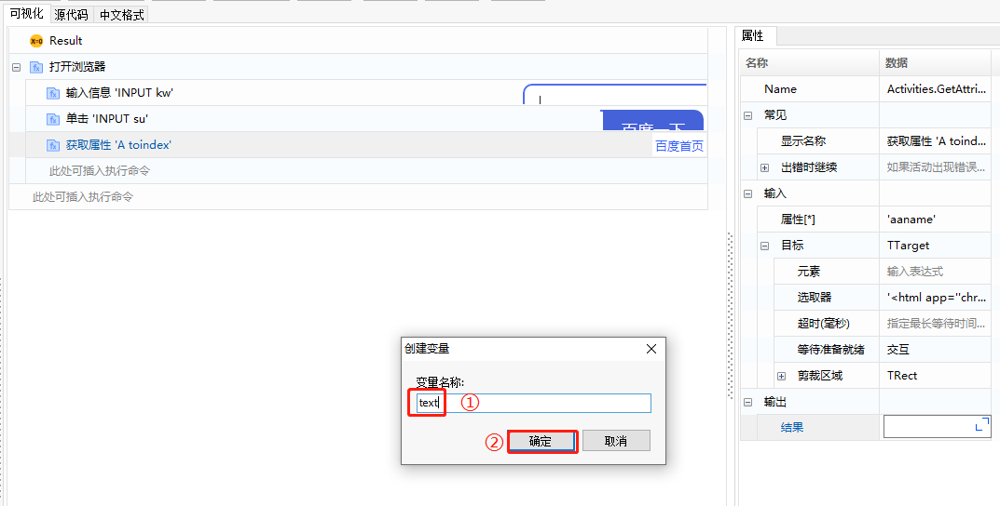

8. 添加【日志消息】函数，将【获取属性】函数的输出变量 “text” 作为【日志消息】的输入变量；

   

   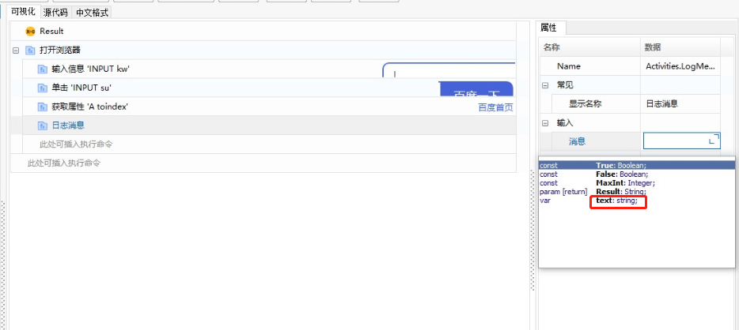

   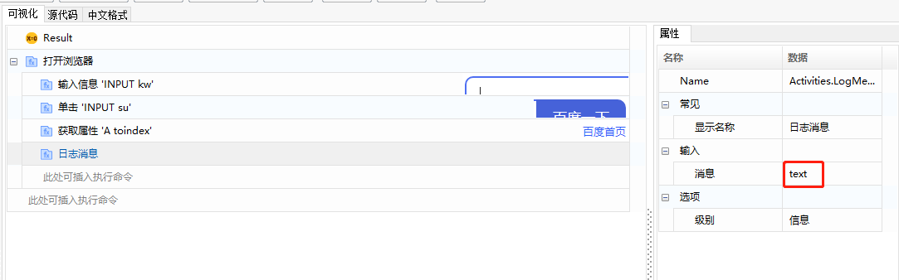

9. 脚本编辑完成后，执行脚本即可。

### Developing the First Component

**Example: Open the Baidu webpage using Google Chrome and perform operations on the Baidu webpage.**

1. In the component editing interface, enter "Open Browser" in the "Search Content" box on the left side, and double-click "Open Browser" to add this function to the middle editing panel.

   

2. Add the 【Open Browser】 function, enter the Baidu URL in the function's address bar, and select "Chrome" as the browser type.

   

3. In the search box, enter "Input Information", and double-click "Input Information" to add this function to the middle editing panel.

   

4. In the 【Input Information】 function's "Text" property panel, enter the content you want to input, and use "Specify on Screen" to indicate the location where the content should be entered (in this case, specify all input fields on the Baidu page).

   

   

5. In the search box, enter "Click", double-click to add the 【Click】 function, and use "Specify on Screen" to indicate the 【Baidu Search】 button.

   

   

   

6. In the search bar, search for "Get Attribute", add the 【Get Attribute】 function, use "Specify on Screen" to indicate the element from which to get the attribute, and select the attribute in the "Attribute" panel (the attribute type can be viewed by pressing F12 on the webpage).

   

7. Create an output variable "text" in the 【Get Attribute】 function.

   

   

8. Add the 【Log Message】 function, and use the output variable "text" from the 【Get Attribute】 function as the input variable for the 【Log Message】.

   

   

   

9. After completing the script editing, execute the script.

   

   

   

   
