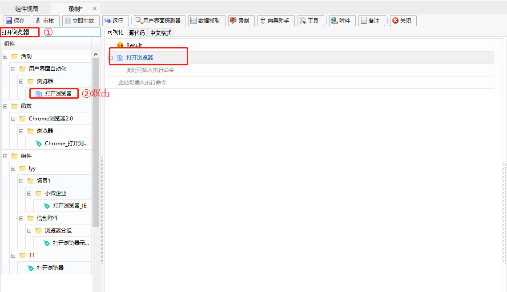
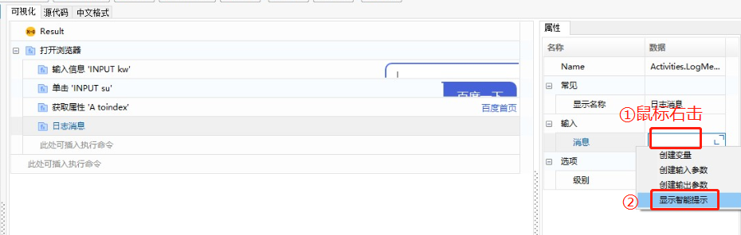

### Developing the First Component

**Example: Open the Baidu webpage using Google Chrome and perform operations on the Baidu webpage.**

1. In the component editing interface, Search "Open Browser" and double-click to add this function to the editing panel.

   

2. Add the "Open Browser" function, enter the Baidu URL in the function's address bar, and select "Chrome" as the browser type.

   

3. Search "Type Into" and double-click to add this function to the editing panel.

   

4. In the 【Type Into】 function's "Text" property panel, enter the content you want to input, and use "Indicate on Screen" to indicate the location where the content should be entered (in this case, specify all input fields on the Baidu page).

   

   

5. Search "Click" and double-click to add the 【Click】 function, and use "Indicate on Screen" to indicate the 【Search ("百度一下")】 button.

   

   

   

6. Search for "Get Attribute", add the 【Get Attribute】 function, use "Indicate on Screen" to indicate the element from which to get the attribute, and select the attribute in the "Attribute" panel (the attribute type can be viewed by pressing F12 on the webpage).

   

7. Create an output variable "text" in the 【Get Attribute】 function.

   

   

8. Add the 【Log Message】 function, and use the output variable "text" from the 【Get Attribute】 function as the input variable for the 【Log Message】.

   

   

   

9. After completing the script editing, execute the script.

   

   

   

   
