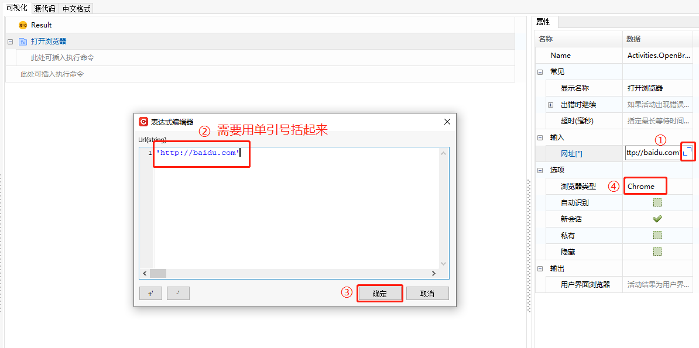

### 开发第一组件

**示例：通过谷歌浏览器打开百度网页，在百度网页进行操作。**

1. 在组件编辑界面左边的“搜索内容”框中，输入“打开浏览器”，双击“打开浏览器”可将该函数添加到中间的编辑面板中；

   

2. 添加【打开浏览器】函数，在函数的网址栏输入百度的网址，浏览器类型选择“Chrome”；

   

3. 在搜索框中，输入“输入信息”，双击“输入信息”可将该函数添加到中间的编辑面板中；

   

4. 在【输入信息】函数的“文本”属性栏中，填入想要输入的内容，且通过“指明在屏幕上”指明内容输入的位置（此处指明的位置为百度界面的所有框）；

   

   

5. 在搜索框中输入“单击”，双击添加【单击】函数，且通过“指明在屏幕上”指明【百度一下】按钮；

   

   

   

6. 在搜索栏搜索“获取属性”，添加【获取属性】函数，通过“指明在屏幕上”指明需要获取的元素，并在“属性”栏选择该元素的属性（该属性类型的选择，可通过在网页中按 F12 查看）；

   

7. 在【获取属性】函数中创建输出变量 “text” ；

   

   

8. 添加【日志消息】函数，将【获取属性】函数的输出变量 “text” 作为【日志消息】的输入变量；

   

   

   

9. 脚本编辑完成后，执行脚本即可。

   

   

   

   
