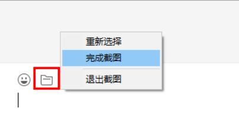

#### 场景示例

脚本向导的录制操作中，可分为RPA、前台以及智能推荐三种录制方式。不同的录制方式，最终所生成的脚本组件示例不同，现在分别对这三种录制方式进行介绍，其中不同示例所采取的录制方式如下：

示例一：[CS应用操作自动化](#cs应用操作自动化)，采取RPA录制方式；

示例二：[BS网页操作自动化](#bs网页操作自动化)，采取智能推荐录制方式；

示例三：[基于图像识别的UI自动化](#基于图像识别的ui自动化)。

##### CS应用操作自动化

此处以记事本操作为例进行介绍。

示例：打开记事本，写入内容后保存退出。

1. 打开记事本，单击【录制】按钮，弹出录制选项界面；

   

2. 在弹出的录制选项界面，单击【应用程序】，在下拉选项中选择”启动应用程序“，选中并单击步骤1中所打开的记事本的空白处，此时可自动获取到当前的程序路径，实现打开记事本的动作；

   

   

3. 在录制选项界面中，单击【录制】-RPA，单击记事本编辑框，在弹出的窗口中，输入需要写入的内容（如：“金智维RPA”）单击【确定】；

   

   

4. 单击记事本的关闭按钮，选择保存路径，录制完成后，按ESC键退出；

   

   

5. 录制完成后，可通过单击【查看】按钮，查看录制步骤，在此处可对已录制的步骤进行删除操作，也可将录制步骤进行导出；

   

   导出的步骤将存放在“.docx”文件中，步骤将分为业务需求背景描述以及业务操作流程两个部分，其中业务操作流程的每一步都将附上操作的截图，效果如下：

   

6. 录制完成后，单击【保存并退出】，则将回到脚本编辑界面；

   

7. 若此时在向导的编辑界面，想查看中文函数，则可通过单击【工具】-【显示函数】；

   

   

8. 若在向导编辑界面，对于“指明在屏幕上”的函数，可选择在函数右侧显示所指明的元素截图，也可选择将该截图进行隐藏，此时可通过【工具】-【显示截图】功能进行操控；

   

   勾选“显示截图”：

   

   取消勾选“显示截图”：

   

9. 待设置完成后，单击【运行】-【运行】脚本即可。

##### BS网页操作自动化

此处以谷歌浏览器为例进行介绍。

示例：打开谷歌浏览器，输入指定内容进行搜索。

1. 打开谷歌浏览器，进入需要操作的网页（如：百度网页），单击【录制】按钮；

   

2. 在录制选项界面，单击【应用程序】-【打开浏览器】，选中并单击步骤1中所打开的百度浏览器，此时可自动获取到当前网页的网址，实现打开浏览器的动作；

   

   

3. 在录制选项界面中，单击【录制】-智能推荐，单击百度输入框，此时会出现智能选择框，在智能选择框中可搜索需要操作的动作；

   

   

3. 在弹出的智能搜索框中，单击【输入信息】，此时会弹出一个输入信息弹框，在此处输入需要搜索的内容，单击【确定】按钮即可；

   

   

3. 待输入搜素内容之后，可单击【百度一下】按钮进行搜索。此时需要选中【百度一下】按钮，在智能搜索框中，选择【单击】操作；

   

3. 选中需要操作的元素单击，在智能搜索框的搜索栏中，输入需要搜索的操作。如下图，单击搜索出来的“获取位置”，即可实现获取位置的操作；

   

3. 录制完毕后，按ESC键可退出操作，单击【保存并退出】，即可回答脚本编辑界面，此时执行脚本即可。

   

##### 基于图像识别的UI自动化

示例：给微信好友发送文件。

1. 单击【录制】按钮，弹出录制选项界面；

   

2. 打开微信界面，单击【图像】-【鼠标】-【单击】，鼠标左键框出搜索图像范围，之后选择完成截图，在弹出的提示框中单击【确定】；

   

   

   

3. 在录制选项界面，单击【键入】-【输入信息】，在搜索框中输入微信好友名称；

   

4. 单击【图像】-【鼠标】-【单击】，鼠标左键框出搜索到的好友头像范围，之后选择完成截图，在弹出的提示框中单击【确定】；

5. 在聊天界面，单击【图像】-【鼠标】-【单击】，鼠标左键框出文件图标范围，之后选择完成截图，在弹出的提示框中单击【确定】；

   

6. 单击文件图标，在弹出的界面，单击【键入】-【输入信息】，设置文件的录制和名称，单击【单击】按钮，单击【打开】；

   

7. 在聊天界面，单击【图像】-【鼠标】-【单击】，鼠标左键框出发送文件图标范围，之后选择完成截图，在弹出的提示框中单击【确定】；

   

8. 录制完成后，按ESC键退出录制界面，单击【保存并退出】按钮，即可退出录制界面；

   

9. 录制完成后，可执行组件。

#### Scenario Examples

In the script wizard recording operations, there are three recording methods: RPA, Frontend, and Intelligent Recommendation. Each recording method generates different script component examples. Below is an introduction to these three recording methods. The recording methods used for different examples are as follows:

Example 1: [CS Application Automation](#cs-application-automation), using RPA recording method;

Example 2: [BS Web Page Automation](#bs-web-page-automation), using Intelligent Recommendation recording method;

Example 3: [Image Recognition-Based UI Automation](#image-recognition-based-ui-automation).

##### CS Application Automation

This example demonstrates the operation of Notepad.

Example: Open Notepad, write content, then save and exit.

1. Open Notepad, click the 【Record】 button to bring up the recording options interface;

   

2. In the pop-up recording options interface, click 【Application】, select "Launch Application" from the dropdown options, click on the blank area of Notepad opened in step 1, and the current program path will be automatically obtained to perform the action of opening Notepad;

   

   

3. In the recording options interface, click 【Record】-RPA, click on the Notepad text box, in the pop-up window, enter the content to be written (e.g., "Jinzhihui RPA") and click 【OK】;

   

   

4. Click the close button on Notepad, choose a save path, and after recording is complete, press the ESC key to exit;

   

   

5. After recording is complete, click the 【View】 button to view the recorded steps. You can delete recorded steps or export them here;

   

   Exported steps will be stored in a ".docx" file, divided into business requirement background description and business operation process sections. Each step in the business operation process will include an operation screenshot, as shown below:

   

6. After recording is complete, click 【Save and Exit】 to return to the script editing interface;

   

7. If you want to view Chinese functions in the wizard's editing interface, click 【Tools】-【Show Functions】;

   

   

8. In the wizard editing interface, for functions marked as "Specify on Screen", you can choose to display or hide the screenshots of the specified elements. This can be controlled using 【Tools】-【Show Screenshots】;

   

   Check "Show Screenshots":

   

   Uncheck "Show Screenshots":

   

9. Once the settings are complete, click 【Run】-【Run】 the script.

##### BS Web Page Automation

This example demonstrates using Google Chrome.

Example: Open Google Chrome, enter specified content for search.

1. Open Google Chrome, navigate to the webpage to be operated on (e.g., Baidu webpage), and click the 【Record】 button;

   

2. In the recording options interface, click 【Application】-【Open Browser】, select and click on the Baidu browser opened in step 1, and the current webpage URL will be automatically obtained to perform the action of opening the browser;

   

   

3. In the recording options interface, click 【Record】- Intelligent Recommendation, click on the Baidu input box, and an intelligent selection box will appear. You can search for the required operation actions in the intelligent selection box;

   

   

4. In the pop-up intelligent search box, click 【Input Information】, a dialog box will appear where you can enter the search content. Click the 【OK】 button to confirm;

   

   

5. After entering the search content, click the 【Baidu Search】 button to perform the search. Select the 【Baidu Search】 button in the intelligent search box, and choose the 【Click】 operation;

   

6. Select the element to operate on, click, and enter the search operation in the intelligent search box. For example, click "Get Location" to perform the operation of obtaining location;

   

7. After recording is complete, press the ESC key to exit the operation. Click 【Save and Exit】 to return to the script editing interface, and then execute the script.

   

##### Image Recognition-Based UI Automation

Example: Send a file to a WeChat friend.

1. Click the 【Record】 button to bring up the recording options interface;

   

2. Open the WeChat interface, click 【Image】-【Mouse】-【Click】, select the range for searching the image with the left mouse button, then choose and complete the screenshot, and click 【OK】 in the pop-up prompt;

   

   

   

3. In the recording options interface, click 【Type】-【Input Information】, enter the WeChat friend's name in the search box;

   

4. Click 【Image】-【Mouse】-【Click】, select the range of the friend's avatar with the left mouse button, then choose and complete the screenshot, and click 【OK】 in the pop-up prompt;

5. In the chat interface, click 【Image】-【Mouse】-【Click】, select the range of the file icon with the left mouse button, then choose and complete the screenshot, and click 【OK】 in the pop-up prompt;

   

6. Click the file icon, in the pop-up interface, click 【Type】-【Input Information】, set the file recording and name, then click the 【Click】 button, and click 【Open】;

   

7. In the chat interface, click 【Image】-【Mouse】-【Click】, select the range of the send file icon with the left mouse button, then choose and complete the screenshot, and click 【OK】 in the pop-up prompt;

   

8. After recording is complete, press the ESC key to exit the recording interface, and click 【Save and Exit】 to exit the recording interface;

   

9. After recording is complete, you can execute the component.

