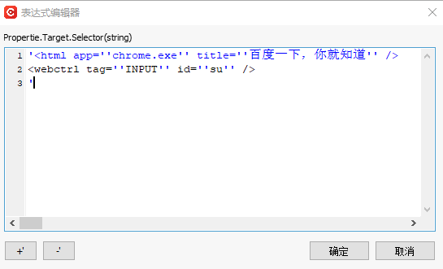

### 选取器

当某些软件程序的布局和属性节点具有易变的值时，机器人为了适应这些无法预测的变化，需要进行手动修改选取器，如某些Web的应用程序。

#### 功能说明

对于可指明元素的函数，都将会拥有“选取器”属性。当指明元素时，“选取器”属性的值会自动生成，但用户也可根据实际情况修改“选取器”的内容。选取器的功能及使用，如下【单击】函数示例：

- 单击“选取器”属性栏右侧的图标；

  

- 会弹出一个下拉栏，可选择“指明在屏幕上”、“编辑选取器”、“表达式编辑器”；

  

  - 指明在屏幕上

    此处的“指明在屏幕上”功能，和函数右侧的“指明在屏幕上”功能一样，都是单击后选中需要指明的元素即可。

    

    > **[info] 提示**
    >
    > - 当进入了指明元素状态时，可通过按“Esc”取消选择。
    > - 当进入了指明元素状态时，可通过按“F2”延时选择。
    > - 当进入了指明元素状态时，可通过按“F3”选择区域。
    > - 当进入了指明元素状态时，可通过按“F4”切换用户界面框架。

    当指明元素后，在函数右侧“指明在屏幕上”的区域进行单击，则会出现一个下拉栏，可选择的操作有：指明在屏幕上、编辑选取器、表达式编辑器、查看截图、删除截图。

    

  - 编辑选取器：在“选取器编辑器”界面，可以查看到所指明元素的属性、数据、变量以及元素的表达式，除此之外，还可对所指明的元素进行验证以及高亮显示出元素在界面中的位置。

    现以指明“百度一下”按钮为例：

    - 未指明元素时，“选取器编辑器”界面如下所示：

      

    - 指明元素时，“选取器编辑器”界面如下所示，可自定义编辑该界面的内容；

      

      单击【验证】按钮，当变成时，表明验证成功，元素存在；当变成时，表明验证失败，元素不存在。

      

      单击【指出元素】，可重新进行元素选择。

      

      单击【高亮显示】，则会用红色方框框出所指明的元素。

      

      

    

  - 表达式编辑器：当指明元素后，在“表达式编辑器”页面，可查看到该元素的表达式，可在此处自定义进行修改。

    

#### 场景示例

示例：通过谷歌浏览器打开百度界面，在百度界面进行操作。

1. 在组件编辑界面，添加【打开浏览器】函数，输入需要打开的网页网址（此处打开百度）；

   

   

2. 添加【单击】函数，单击【指明在屏幕上】，在百度界面上，选择需要单击的元素（此处选择的是单击“新闻”）；

   

   选取器表达式如下：

   

3. 若此时需要切换单击的元素，可直接在步骤2中的选取器表达式中进行修改。如需要单击百度界面中的“地图”元素，则需将“aaname”修改为地图即可如下：

   具体修改的内容可根据网页元素而定，可通过在网页中按F12进行查看。

   

   

4. 设置完毕后，可执行组件，执行的结果为：通过谷歌浏览器打开百度界面，且进入“地图”界面。

### Selector

When certain software programs have layouts and property nodes with variable values, robots need to manually modify selectors to adapt to these unpredictable changes, such as in some web applications.

#### Function Description

For functions that can specify elements, there will be a "Selector" property. When specifying an element, the value of the "Selector" property is automatically generated, but users can also modify the content of the "Selector" according to the actual situation. The functions and usage of selectors are as follows, illustrated with an example of the 【Click】 function:

- Click the icon on the right side of the “Selector” property field;

  

- A dropdown menu will appear, allowing you to choose between “Specify on Screen”, “Edit Selector”, and “Expression Editor”;

  

  - Specify on Screen

    The “Specify on Screen” feature here is the same as the “Specify on Screen” feature on the right side of the function. Simply click and select the element you want to specify.

    

    > **[info] Tip**
    >
    > - To cancel the selection when in specifying element mode, press “Esc”.
    > - To delay the selection when in specifying element mode, press “F2”.
    > - To select a region when in specifying element mode, press “F3”.
    > - To switch user interface frameworks when in specifying element mode, press “F4”.

    After specifying the element, if you click in the “Specify on Screen” area on the right side of the function, a dropdown menu will appear with options including: Specify on Screen, Edit Selector, Expression Editor, View Screenshot, and Delete Screenshot.

    

  - Edit Selector: In the “Selector Editor” interface, you can view the properties, data, variables, and expressions of the specified element. Additionally, you can validate and highlight the element's location on the interface.

    Taking the “Baidu Search” button as an example:

    - When the element is not specified, the “Selector Editor” interface appears as follows:

      

    - When the element is specified, the “Selector Editor” interface appears as follows, and you can customize the content of this interface;

      

      Clicking the 【Validate】 button changes  to , indicating that validation is successful and the element exists. If it changes to , it indicates validation failure and the element does not exist.

      

      Clicking 【Specify Element】 allows you to reselect the element.

      

      Clicking 【Highlight】 will outline the specified element with a red box.

      

      

  - Expression Editor: After specifying an element, in the “Expression Editor” page, you can view the expression of the element and customize it here.

    

#### Scenario Example

Example: Open the Baidu interface using Google Chrome and perform operations on the Baidu interface.

1. In the component editing interface, add the 【Open Browser】 function and enter the URL of the webpage to open (in this case, open Baidu);

   

   

2. Add the 【Click】 function, click 【Specify on Screen】, and select the element to click on the Baidu interface (in this case, click on “News”);

   

   The selector expression is as follows:

   

3. If you need to switch the element to click, you can directly modify the selector expression from step 2. For example, to click on the “Map” element on the Baidu interface, change “aaname” to “Map” as shown below:

   The specific modifications can be determined based on the webpage elements, which can be viewed by pressing F12 on the webpage.

   

   

4. After completing the setup, execute the component. The result will be: Open the Baidu interface using Google Chrome and navigate to the “Map” interface.

