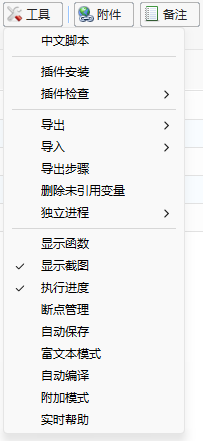
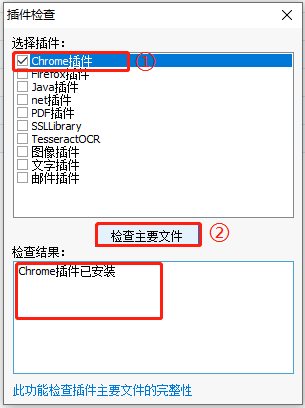
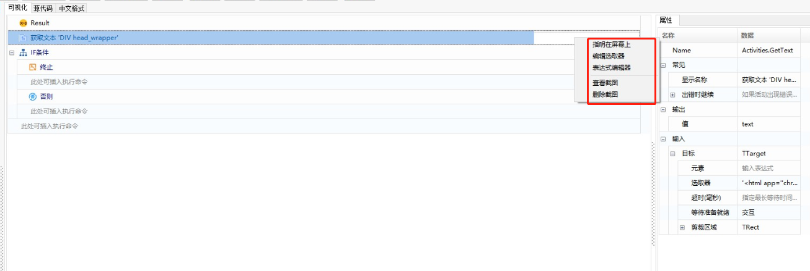
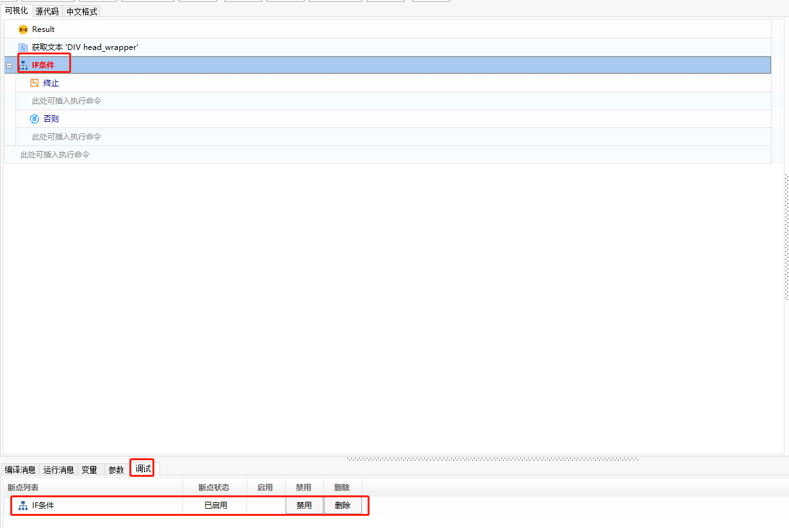
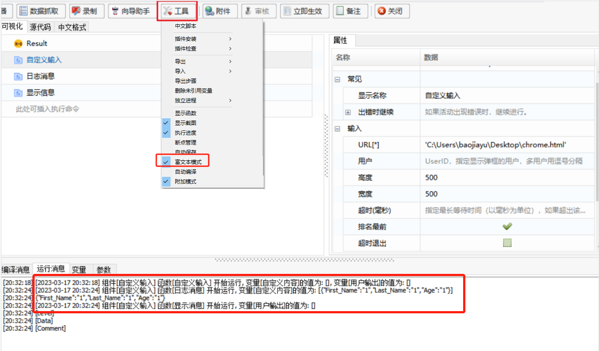
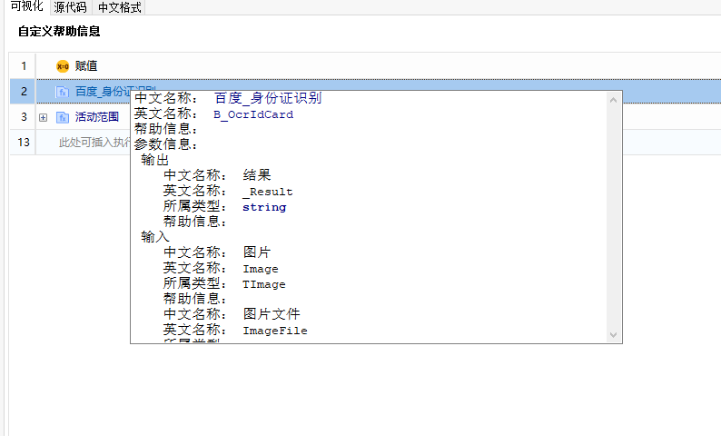

### 工具栏

在组件编辑面板中，工具栏的出现为用户进行脚本向导组件编写提供了更多的协作功能，如插件的自动安装、脚本的断点调试等，【工具】按钮功能菜单如下图所示：

- 中文脚本：将脚本向导组件切换成中文脚本类型组件，切换成功后需要重新打开。

  > **[warning]  注意**
  >
  > &emsp;切换时不会将当前代码自动转换成中文脚本代码。

- 插件安装：有些函数的使用需要依赖相应的插件，在此处可以自动安装指定插件。插件列表如下所示：

  

  | 名称         | 用途                                                         | 插件安装                                                     |
  | ------------ | ------------------------------------------------------------ | ------------------------------------------------------------ |
  | 图像插件     | 在使用OpenCV函数时需要用到该插件，用户进行图片的查找。       | [安装教程](http://doc.kingsware.cn:8096/public/Uploads/Doc/D04D0AF3E2674A8692DE2D31E543A0DF/%E6%94%AF%E6%8C%81%E5%B7%A5%E5%85%B7%E5%AE%89%E8%A3%85%E8%AF%B4%E6%98%8E/Image.html) |
  | 文字插件     | 在使用“获取窗口内容”函数时需要用到该插件，使用前需要先 激活窗口。应用场景：非标准窗口获取不到内容时，需要安 装该插件来获取内容。 | [安装教程](http://doc.kingsware.cn:8096/public/Uploads/Doc/D04D0AF3E2674A8692DE2D31E543A0DF/%E6%94%AF%E6%8C%81%E5%B7%A5%E5%85%B7%E5%AE%89%E8%A3%85%E8%AF%B4%E6%98%8E/Word.html) |
  | Java插件     | 该插件主要用于Java类客户端程序元素的抓取，成功安装插件 后，在脚本向导编辑界面使用向导函数时，可以用“指明屏幕上 ”抓取Java类客户端程序元素。 | [安装教程](http://doc.kingsware.cn:8096/public/Uploads/Doc/D04D0AF3E2674A8692DE2D31E543A0DF/%E6%94%AF%E6%8C%81%E5%B7%A5%E5%85%B7%E5%AE%89%E8%A3%85%E8%AF%B4%E6%98%8E/Java1.html) |
  | pdf插件      | 该插件主要用于pdf相关函数的使用。                            | [安装教程](http://doc.kingsware.cn:8096/public/Uploads/Doc/D04D0AF3E2674A8692DE2D31E543A0DF/%E6%94%AF%E6%8C%81%E5%B7%A5%E5%85%B7%E5%AE%89%E8%A3%85%E8%AF%B4%E6%98%8E/Pdf.html) |
  | Firefox插件  | Firefox插件的安装，即安装火狐浏览器插件、配置扩展程 序，这样才能使用自动化系统的函数去操作火狐浏览器， 且脚本向导录制时可抓取到火狐浏览器的单个元素。 | [安装教程](http://doc.kingsware.cn:8096/public/Uploads/Doc/D04D0AF3E2674A8692DE2D31E543A0DF/%E6%94%AF%E6%8C%81%E5%B7%A5%E5%85%B7%E5%AE%89%E8%A3%85%E8%AF%B4%E6%98%8E/FirefoxNew.html) |
  | chrome插件   | V2版本插件，即安装谷歌浏览器插件，配置扩展程序， 这样才能使用自动化系统的函数去操作谷歌浏览器（目 前仅支持开发版本的谷歌浏览器），且脚本向导录制时 可以抓取到谷歌浏览器的单个元素。 | [安装教程](http://doc.kingsware.cn:8096/public/Uploads/Doc/D04D0AF3E2674A8692DE2D31E543A0DF/%E6%94%AF%E6%8C%81%E5%B7%A5%E5%85%B7%E5%AE%89%E8%A3%85%E8%AF%B4%E6%98%8E/Chrome.html) |
  | chromeV3插件 | 升级版的谷歌插件，一般在谷歌版本为120之后才需使 用该插件，建议使用chrome插件。安装谷歌浏览器插件， 配置扩展程序，这样才能使用自动化系统的函数去操作谷 歌浏览器，且脚本向导录制可以抓取到谷歌浏览器的元素。 | [安装教程](http://doc.kingsware.cn:8096/public/Uploads/Doc/D04D0AF3E2674A8692DE2D31E543A0DF/%E6%94%AF%E6%8C%81%E5%B7%A5%E5%85%B7%E5%AE%89%E8%A3%85%E8%AF%B4%E6%98%8E/ChromeV3.html) |
  | Edge插件     | Edge插件的安装，即安装Edge浏览器插件、配置扩展程序， 这样才能使用自动化系统的函数去操作谷歌浏览器，且 脚本向导录制时可以抓取到Edge浏览器的单个元素。 | [安装教程](http://doc.kingsware.cn:8096/public/Uploads/Doc/D04D0AF3E2674A8692DE2D31E543A0DF/%E6%94%AF%E6%8C%81%E5%B7%A5%E5%85%B7%E5%AE%89%E8%A3%85%E8%AF%B4%E6%98%8E/Edge.html) |
  | 360插件      | 360插件的安装，即安装360浏览器插件、配置扩 展程序，这样才能使用自动化系统的函数去操作 360浏览器，且脚本向导录制时可抓取到360浏 览器的单个元素。 | [安装教程](http://doc.kingsware.cn:8096/public/Uploads/Doc/D04D0AF3E2674A8692DE2D31E543A0DF/%E6%94%AF%E6%8C%81%E5%B7%A5%E5%85%B7%E5%AE%89%E8%A3%85%E8%AF%B4%E6%98%8E/360.html) |
  | SSLLibrary   | SSLLibrary插件安装，主要用于进行AI识别函数 及http/https相关函数的使用。当使用AI函数时， 访问的类型参数选择的是代理端时，需要运用到 此插件；若是访问类型选的是服务器端时，需要 把这两个Dll文件拷贝到服务器目录下。 | [安装教程](http://doc.kingsware.cn:8096/public/Uploads/Doc/D04D0AF3E2674A8692DE2D31E543A0DF/%E6%94%AF%E6%8C%81%E5%B7%A5%E5%85%B7%E5%AE%89%E8%A3%85%E8%AF%B4%E6%98%8E/SSLLibrary.html) |
  | TesseractOCR | TesseractOCR插件主要用于需要进行OCR识别的 相关函数，如：文字识别图片和文字识别文件函 数，对发票、证件等票据的识别，都是需要运用到此 插件。 | [安装教程](http://doc.kingsware.cn:8096/public/Uploads/Doc/D04D0AF3E2674A8692DE2D31E543A0DF/%E6%94%AF%E6%8C%81%E5%B7%A5%E5%85%B7%E5%AE%89%E8%A3%85%E8%AF%B4%E6%98%8E/TesseractOCR.html) |
  | 邮件插件     | 邮件插件主要应用于脚本向导函数“获取IMAP邮 件消息”，当参数“连接方式”选择Chilkat时，需要 安装邮件插件。 | [安装教程](http://doc.kingsware.cn:8096/public/Uploads/Doc/D04D0AF3E2674A8692DE2D31E543A0DF/%E6%94%AF%E6%8C%81%E5%B7%A5%E5%85%B7%E5%AE%89%E8%A3%85%E8%AF%B4%E6%98%8E/Email.html) |
  | .net插件     | 当使用“CSharp”分组下的函数时，需要安装此插件 才能抓取到“.net”类型的窗口元素。 | [安装教程](http://doc.kingsware.cn:8096/public/Uploads/Doc/D04D0AF3E2674A8692DE2D31E543A0DF/%E6%94%AF%E6%8C%81%E5%B7%A5%E5%85%B7%E5%AE%89%E8%A3%85%E8%AF%B4%E6%98%8E/Net.html) |
  | Excel插件    | 安装Excel插件，可对脚本向导对应的Excel函数进 行操作。    | [安装教程](http://doc.kingsware.cn:8096/public/Uploads/Doc/D04D0AF3E2674A8692DE2D31E543A0DF/%E6%94%AF%E6%8C%81%E5%B7%A5%E5%85%B7%E5%AE%89%E8%A3%85%E8%AF%B4%E6%98%8E/Excel.html) |

- 插件检查：插件检查包含谷歌占用检查、火狐占用检查以及插件文件检查三种。可检查谷歌或火狐插件是否有占用异常、检查指定的插件是否已安装。

  插件文件检查：

  

- 导出：导出当前组件，可按照个人所需的格式导出该组件，支持导出的格式有：“.kws”后缀的文件、十六进制、Json格式以及可视化组件（“.vis”后缀文件）。

- 导入：该【导入】按钮中所导入的组件格式，与【导出】按钮中所导出的组件一一对应。

- 导出步骤：导出当前组件的操作步骤，并且将该组件执行中每一步的执行结果都截图保存，导出的文件为“.docx”格式。

- 删除未引用变量：删除当前组件中多余的、未引用的变量。

- 显示函数：在组件编辑面板左侧树栏中，显示中文函数。即若想在脚本向导组件中调用中文函数，则可勾选上“显示函数”，在左边树栏中选择需要调用的中文函数。

- 显示截图：该功能仅针对有“指明在屏幕上”功能的函数，当通过“指明在屏幕上”指明指定的元素或者界面的某些信息时，将会显示所指明的区域的截图，否则将不显示。

  勾选“显示截图”：

  

  不勾选“显示截图”：将无法显示上图的操作。

- 执行进度：勾选“执行进度”，则将会详细输出当前组件每一步执行进度的信息。

- 断点管理：勾选了“断点管理”，在组件编辑面板的下方增加了个“调试”栏，后续在某个函数中设置了断点，都将会在该“调试”栏中显示，且可对所设置的断点进行启用、禁用以及删除的操作。

  

- 自动保存：启动自动保存功能后，若在组件编辑过程中出现突发情况导致控制台被关闭，再次登录进控制台打开该组件时，会弹出提示框是否导入本地新组件，单击确定后，可恢复原本所编辑的组件。

- 富文本模式：勾选“富文本模式”后，在执行组件时，将会输出当前组件的富文本模式内容，如：执行时间、组件名称、组件中函数的变量名称、变量值等内容。当前仅支持字符串、整型、布尔类型的输出。

  

- 自动编译：勾选“自动编译”，设置开始编译的时间（必须大于或等于30S），到所设置的时间后，将会自动编译当前组件。

- 附加模式：此功能主要应用于【附加窗口】/【附加浏览器】函数，以便在窗口/浏览器元素发生改变时，用户可快速更新【附加窗口】/【附加浏览器】下所有函数的“选取器”内容。勾选“附加模式”后，用户只需修改【附加窗口】/【附加浏览器】函数的“选取器”内容，即可同步更新其下所有函数的“选取器”内容；不勾选则不会自动更新其下函数的“选取器”内容。

- 实时帮助：该功能支持实时查看函数/组件帮助信息，默认不勾选，勾选后，向导脚本中添加向导函数/中文函数/向导自定义组件/向导自定义组件后，单击其所在行，即可实时查看帮助信息。

  > **[warning] 注意**
  >
  > &emsp;”控制“分组下函数不支持实时帮助功能。
  
  
  
  ### Toolbar

In the component editing panel, the toolbar provides additional collaboration functions for script wizard component creation, such as automatic plugin installation and script breakpoint debugging. The functionalities of the 【Tools】 button menu are as follows:

- **Chinese Script**: Switch the script wizard component to a Chinese script type component. After switching, you need to reopen it.

  > **[warning] Note**
  >
  > &emsp;Switching will not automatically convert the current code to Chinese script code.

- **Plugin Installation**: Some functions require corresponding plugins. Here, you can automatically install specified plugins. The list of plugins is as follows:

  | Name         | Purpose                                                   | Plugin Installation                                        |
  | ------------ | -------------------------------------------------------- | ---------------------------------------------------------- |
  | Image Plugin | Needed for functions using OpenCV, for image searching.  | [Installation Guide](http://doc.kingsware.cn:8096/public/Uploads/Doc/D04D0AF3E2674A8692DE2D31E543A0DF/%E6%94%AF%E6%8C%81%E5%B7%A5%E5%85%B7%E5%AE%89%E8%A3%85%E8%AF%B4%E6%98%8E/Image.html) |
  | Text Plugin  | Needed for the “Get Window Content” function; requires activation of the window. Useful for non-standard windows where content cannot be retrieved without this plugin. | [Installation Guide](http://doc.kingsware.cn:8096/public/Uploads/Doc/D04D0AF3E2674A8692DE2D31E543A0DF/%E6%94%AF%E6%8C%81%E5%B7%A5%E5%85%B7%E5%AE%89%E8%A3%85%E8%AF%B4%E6%98%8E/Word.html) |
  | Java Plugin  | Mainly used for capturing Java client program elements. After successful installation, you can use the “Specify on Screen” function in the script wizard editor to capture Java client program elements. | [Installation Guide](http://doc.kingsware.cn:8096/public/Uploads/Doc/D04D0AF3E2674A8692DE2D31E543A0DF/%E6%94%AF%E6%8C%81%E5%B7%A5%E5%85%B7%E5%AE%89%E8%A3%85%E8%AF%B4%E6%98%8E/Java1.html) |
  | PDF Plugin   | Used for functions related to PDF operations.            | [Installation Guide](http://doc.kingsware.cn:8096/public/Uploads/Doc/D04D0AF3E2674A8692DE2D31E543A0DF/%E6%94%AF%E6%8C%81%E5%B7%A5%E5%85%B7%E5%AE%89%E8%A3%85%E8%AF%B4%E6%98%8E/Pdf.html) |
  | Firefox Plugin | Installation of Firefox browser plugin, configuring extensions to use automation system functions for Firefox, and capturing single elements during script wizard recording. | [Installation Guide](http://doc.kingsware.cn:8096/public/Uploads/Doc/D04D0AF3E2674A8692DE2D31E543A0DF/%E6%94%AF%E6%8C%81%E5%B7%A5%E5%85%B7%E5%AE%89%E8%A3%85%E8%AF%B4%E6%98%8E/FirefoxNew.html) |
  | Chrome Plugin | V2 version plugin, for installing Google Chrome plugin and configuring extensions to use automation system functions for Google Chrome (currently only supports the development version of Google Chrome), and capturing single elements during script wizard recording. | [Installation Guide](http://doc.kingsware.cn:8096/public/Uploads/Doc/D04D0AF3E2674A8692DE2D31E543A0DF/%E6%94%AF%E6%8C%81%E5%B7%A5%E5%85%B7%E5%AE%89%E8%A3%85%E8%AF%B4%E6%98%8E/Chrome.html) |
  | ChromeV3 Plugin | Upgraded Google plugin, generally used after Google version 120. It is recommended to use the Chrome plugin. Install Google Chrome plugin and configure extensions to use automation system functions and capture elements during script wizard recording. | [Installation Guide](http://doc.kingsware.cn:8096/public/Uploads/Doc/D04D0AF3E2674A8692DE2D31E543A0DF/%E6%94%AF%E6%8C%81%E5%B7%A5%E5%85%B7%E5%AE%89%E8%A3%85%E8%AF%B4%E6%98%8E/ChromeV3.html) |
  | Edge Plugin  | Installation of Edge browser plugin, configuring extensions to use automation system functions for Edge, and capturing single elements during script wizard recording. | [Installation Guide](http://doc.kingsware.cn:8096/public/Uploads/Doc/D04D0AF3E2674A8692DE2D31E543A0DF/%E6%94%AF%E6%8C%81%E5%B7%A5%E5%85%B7%E5%AE%89%E8%A3%85%E8%AF%B4%E6%98%8E/Edge.html) |
  | 360 Plugin    | Installation of 360 browser plugin, configuring extensions to use automation system functions for 360 browser, and capturing single elements during script wizard recording. | [Installation Guide](http://doc.kingsware.cn:8096/public/Uploads/Doc/D04D0AF3E2674A8692DE2D31E543A0DF/%E6%94%AF%E6%8C%81%E5%B7%A5%E5%85%B7%E5%AE%89%E8%A3%85%E8%AF%B4%E6%98%8E/360.html) |
  | SSLLibrary    | SSLLibrary plugin installation, mainly for AI recognition functions and http/https related functions. When using AI functions with proxy endpoints, this plugin is required; if using server endpoints, copy the two DLL files to the server directory. | [Installation Guide](http://doc.kingsware.cn:8096/public/Uploads/Doc/D04D0AF3E2674A8692DE2D31E543A0DF/%E6%94%AF%E6%8C%81%E5%B7%A5%E5%85%B7%E5%AE%89%E8%A3%85%E8%AF%B4%E6%98%8E/SSLLibrary.html) |
  | TesseractOCR  | TesseractOCR plugin used for OCR recognition functions, such as text recognition in images and files, and recognizing invoices, documents, etc. | [Installation Guide](http://doc.kingsware.cn:8096/public/Uploads/Doc/D04D0AF3E2674A8692DE2D31E543A0DF/%E6%94%AF%E6%8C%81%E5%B7%A5%E5%85%B7%E5%AE%89%E8%A3%85%E8%AF%B4%E6%98%8E/TesseractOCR.html) |
  | Email Plugin  | Email plugin for the “Get IMAP Email Messages” function, required when the parameter “Connection Type” is selected as Chilkat. | [Installation Guide](http://doc.kingsware.cn:8096/public/Uploads/Doc/D04D0AF3E2674A8692DE2D31E543A0DF/%E6%94%AF%E6%8C%81%E5%B7%A5%E5%85%B7%E5%AE%89%E8%A3%85%E8%AF%B4%E6%98%8E/Email.html) |
  | .NET Plugin   | Required for functions under the “CSharp” group to capture “.net” type window elements. | [Installation Guide](http://doc.kingsware.cn:8096/public/Uploads/Doc/D04D0AF3E2674A8692DE2D31E543A0DF/%E6%94%AF%E6%8C%81%E5%B7%A5%E5%85%B7%E5%AE%89%E8%A3%85%E8%AF%B4%E6%98%8E/Net.html) |
  | Excel Plugin  | Install the Excel plugin to operate on Excel functions in the script wizard. | [Installation Guide](http://doc.kingsware.cn:8096/public/Uploads/Doc/D04D0AF3E2674A8692DE2D31E543A0DF/%E6%94%AF%E6%8C%81%E5%B7%A5%E5%85%B7%E5%AE%89%E8%A3%85%E8%AF%B4%E6%98%8E/Excel.html) |

- **Plugin Check**: Includes checks for Google and Firefox plugin usage, as well as plugin file checks. You can check if Google or Firefox plugins have abnormal usage or if specific plugins are installed.

  Plugin File Check:

  

- **Export**: Export the current component in various formats: “.kws” file, hexadecimal, JSON format, or visual component (“.vis” file).

- **Import**: The formats for importing components here match those for exporting components.

- **Export Steps**: Export the steps of the current component and save screenshots of the execution results of each step. The exported file is in “.docx” format.

- **Delete Unused Variables**: Remove unnecessary and unreferenced variables from the current component.

- **Show Functions**: Display Chinese functions in the left tree view of the component editing panel. If you want to call Chinese functions in the script wizard component, check “Show Functions” to select the desired Chinese functions from the left tree view.

- **Show Screenshot**: This feature is for functions with “Specify on Screen” functionality. When specifying an element or information on the screen, it will display a screenshot of the specified area. If unchecked, no screenshot will be shown.

  Check “Show Screenshot”:

  

  Uncheck “Show Screenshot”: The above screenshot will not be displayed.

- **Execution Progress**: Check “Execution Progress” to output detailed information about each step of the component’s execution progress.

- **Breakpoint Management**: When “Breakpoint Management” is checked, a “Debug” bar will be added at the bottom of the component editing panel. Breakpoints set in any function will be displayed in this “Debug” bar, where you can enable, disable, or delete them.

  

- **Auto Save**: Enable auto-save so that if an unexpected situation occurs that closes the console, upon logging back in and reopening the component, a prompt will appear to import the local new component. Clicking “Yes” will restore the component to its last edited state.

- **Rich Text Mode**: When “Rich Text Mode” is checked, the component’s execution output will include rich text content such as execution time, component name, and variable names and values within the component. Currently, it supports string, integer, and boolean outputs.

  

- **Auto Compile**: Check “Auto Compile” and set the start time for compilation (must be greater than or equal to 30 seconds). The current component will be automatically compiled after the set time.

- **Attach Mode**: This feature is used for the 【Attach Window】/【Attach Browser】 function to quickly update the “Selector” content of all functions under the window/browser element when changes occur. When “Attach Mode” is checked, modifying the “Selector” content in the 【Attach Window】/【Attach Browser】 function will synchronize updates to all functions under it. If unchecked, it will not automatically update the “Selector” content.

- **Real-Time Help**: This feature allows real-time viewing of function/component help information. By default, it is not checked. When checked, you can view help information in real time by clicking on a function/custom component line in the wizard script.

  > **[warning] Note**
  >
  > &emsp;The “Control” group functions do not support the real-time help feature.

  

​		
