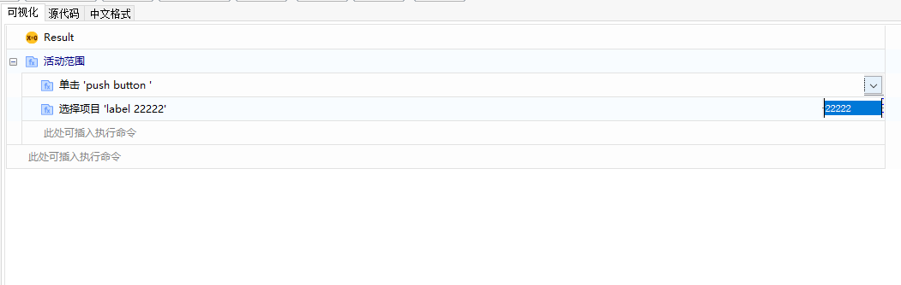

# 组件设计

## 组件工具

### 录制

录制器是脚本向导工具的重要组成部分，其可以帮助人们在设置自动化业务流程时节省大量时间，此功能可以在屏幕上捕获用户的动作并将其转换为活动范围。

支持的浏览器类型有 IE、Edge、Chrome、Firefox、360 以及金智维自研的KRPA浏览器。值得注意的是，除 IE 和金智维浏览器不需要安装插件外，其他浏览器都需要安装对应插件才可以正常录制。浏览器对应插件的安装方法，可以查看[《支持工具部署手册》](http://doc.kingsware.cn:8096/public/Uploads/Doc/D04D0AF3E2674A8692DE2D31E543A0DF/index.html?id=F0944F2961EC4D2C8652AE6D41645BE8&hex=7b2275736572223a2276697369746f72222c22656473223a226331656638323763303034653861393338373534313836623539346139663863222c226465734b6579223a224630304632384146222c22646f634964223a224630393434463239363145433444324338363532414536443431363435424538222c22697341646d696e223a66616c73657d)。

#### 功能说明

单击【录制】按钮，可显示录制器面板，该面板可分为：连续录制、单步录制和结束录制三部分。

##### ① 结束录制模块

结束当前录制，并把录制结果自动生成脚本。

##### ② 连续录制模块

连续性地录制用户在界面上地操作，自动生成活动范围。其中，录制可分为RPA、前台以及智能推荐三种录制方式。

- RPA：RPA后台录制操作。

- 前台：前台操作，会记录鼠标移动、单击等各种操作，

- 智能推荐：可智能选择或搜索需要的操作动作。

  

##### ③ 单步录制模块

指录制用户在界面的单步操作，其中用户的单步操作包括：鼠标操作、键盘操作、复制文本操作、界面元素操作、结合文字识别界面操作以及结合图像识别操作。

[应用程序操作](#应用程序操作)

[鼠标操作](#鼠标操作)

[键盘录制](#键盘录制)

[复制文本操作](#复制文本操作)

[界面元素操作](#界面元素操作)

[结合文字识别操作](#结合文字识别操作)

[结合图像识别操作](#结合图像识别操作)

[手机操作](#手机操作)

- ###### 应用程序操作：

  

  **示例：如打开且关闭“Chrome.exe”应用程序，打开百度界面，关闭百度界面选项卡。**

  1. 手动打开谷歌浏览器，单击【录制】按钮，弹出的录制选项界面；

     

  2. 在弹出的录制选项界面，单击【应用程序】，下拉栏中选择【启用应用程序】，在所打开的谷歌浏览器的空白处单击，即可自动获取当前程序的路径，单击【确定】，实现打开谷歌浏览器的动作；

     

     

  3. 在弹出的录制界面，单击【应用程序】-【关闭应用程序】，选中并单击谷歌浏览器的关闭按钮，此时即可完成实现关闭谷歌浏览器的动作；

     

  4. 打开百度界面，单击【应用程序】-【打开浏览器】，在百度界面任意地方单击，会弹出一个URL弹框，此时会自动生成百度界面的网址，单击【确认】即可实现打开百度界面操作；

     

     

  5. 单击【应用程序】-【关闭选项卡】，选中并单击百度界面的关闭按钮，即可实现关闭百度界面操作；

     

  6. 单击【保存并退出】按钮，即可在组件编辑界面生成相关的操作组件；

     

     

- ###### 鼠标操作：

  

  **示例：选择展示指定的系统信息。**

  1. 在录制界面，单击【单击】-【单击】，指明需要单击的元素；

     

  2. 通过单击下拉箭头，在展开的下拉选项框中，通过单击【选择项目】，指明需要选择的元素；

     

     > **[info] 提示**
   >
     >  &emsp;在通过【选择项目】选择指定选项时，可先按F2延迟选择，再手动单击下拉箭头展开下拉选项，最后在出现红色框框时再进行元素的指明。

  5. 单击【保存并退出】按钮，会在组件编辑界面生成相应的操作组件；
  
     

- ###### 键盘录制：

  

  **示例：在记事本输入内容，并通过发送热键方式选中全部内容。**

  1. 打开一个记事本，在录制界面，单击【键入】-【输入信息】，在记事本空白处单击，此时会弹出一个弹框，在弹出的编辑框中写入需要输入的内容，单击【确定】即可完成输入操作；

     

     

     

  2. 在录制界面，单击【键入】-【发送热键】，此时会出现一个红框，选中记事本单击，会弹出“热键”弹框，在该弹框中，可自定搭配热键操作。如全选的快捷方式为“Ctrl+A”，则需勾选“Ctrl”，然后在输入框中输入a（大小写不区分）；

     

     

     

  3. 单击【确定】后，将会选中记事本中所有内容；

     

  4. 录制完成后，单击【保存并退出】，在组件编辑界面将会生成对应的组件。

     

- ###### 复制文本操作

  

  - 【复制文本】：即为【获取文本】函数的功能。
  - 【屏幕抓取】：当抓取方法选择“原生”时，则是使用【获取全文本】函数进行抓取；当抓取方法选择“OCR”时，则是使用【获取OCR文本】函数进行抓取。

  **示例：抓取记事本的内容**。

  1. 打开待抓取内容的记事本，在录制界面，单击【复制】-【复制文本】，指明要抓取的内容；

     

  2. 在录制界面，单击【复制】-【屏幕抓取】，在记事本中指明需要抓取的内容，此时会弹出一个“屏幕抓取器”弹框，在该弹框中可选择“原生”或“OCR”的抓取方法，选择完成后，单击【确定】，即可实现屏幕录制操作；

     

     

- ###### 界面元素操作

  界面元素的操作，对应的是元素分组下的函数。

  

  

- ###### 结合文字识别操作

  文字识别操作，对应的是文本分组下的函数。

  

  

- ###### 结合图像识别操作

  图像识别操作，对应的是图像分组下的函数。

  

- ###### 手机操作

  手机操作，对应的时手机操作分组下的函数。
  
  

