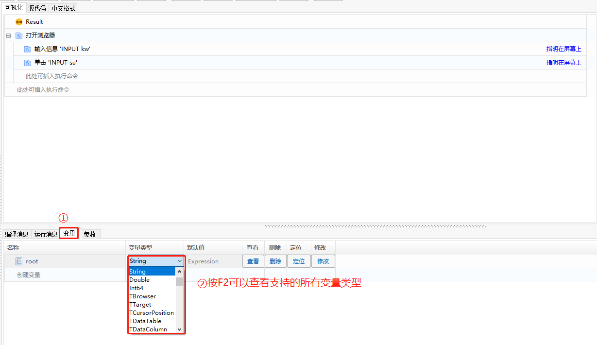
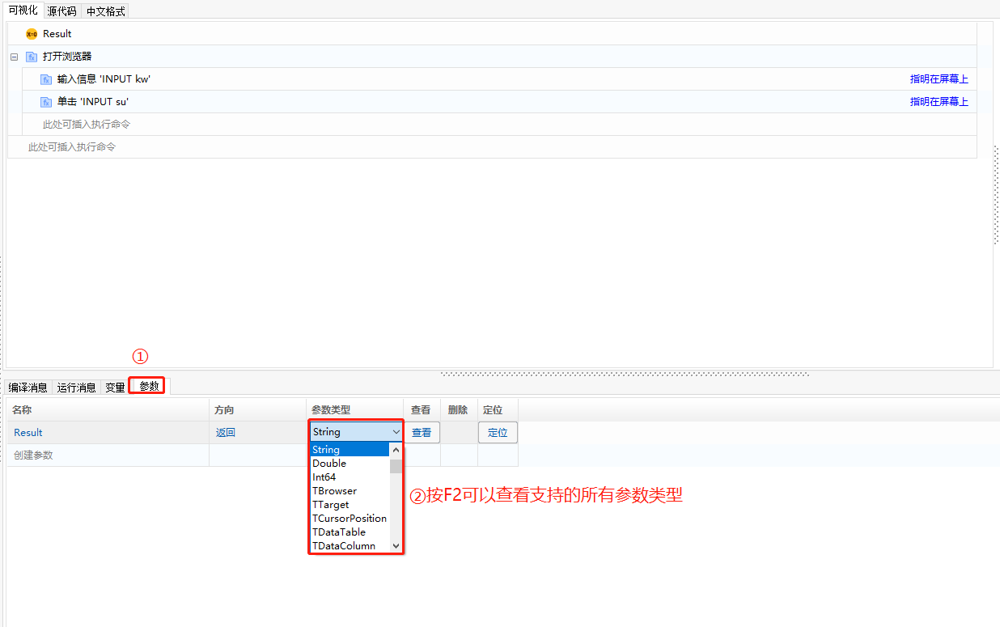
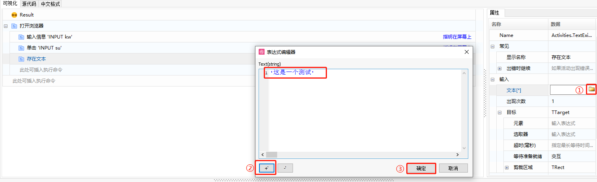
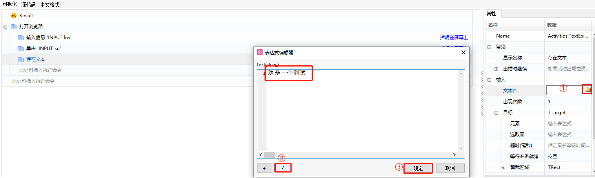
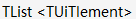

## 数据类型

数据类型是所有计算机语言都必须涉及的内容，它用于确定变量在内存中的存放方式和占用内存的大小。常用的基本数据类型如下：

| 数据类型 | 含义                                                         | 示例              | 说明                                    |
| -------- | ------------------------------------------------------------ | ----------------- | --------------------------------------- |
| String   | 字符串类型，可以定义一 个字符串序列                       | ‘computer’,’text’ | 字符前后要添加单引号                    |
| Boolean  | 布尔值，只有2个值                                            | True/False        | 一般用于做判断或决策                    |
| Integer  | 整型,，用于存储程序中的 整数类型数值                     | 100，2020         | 一般用于执行方程或者 进行比较       |
| Double   | 双精度浮点类型，用于存 储程序中的小数类型数值， 表示范围： -1.79E+308~-1.79E+308 | 10.5,13.56        | 一般通过变量来实现输 入和输出       |
| Float    | 单精度浮点类型，可以定 义一个浮点数，表示范围： -3.40E+38~3.40E+38 | 1.0,3.14          | 一般通过变量来实现输 入和输出       |
| Array    | 数组类型，用于存储同一 类型的多个值，可以创建 整数类型数组、字符串类 型数组、布尔值类型数组 等具有固定的大小 | [‘0.1’,’0.2’…]    | 一般通过变量来实现输 入和输出       |
| List     | 列表类型，也是一种Object 类型，用于存储同一类型的 多个值，可以被延长或缩短 | [‘1’,’2’,’3’…]    | 一般通过变量来实现列 表的输入和输出 |

- 系统支持的变量类型，可通过“变量”-“变量类型”进行查看，同时在变量页签可以对变量进行增删改操作。

  

- 系统支持的参数类型，可通过“参数”-“参数类型”进行查看，同时在参数页签可以对参数进行增删改操作。

  

### 部分需注意的数据类型说明

- 字符串

  字符串类型的内容，需要用单引号括起来，否则会报错。

  可在表达式编辑器中，单击下方的 “+” 号或者 “-” 号，对字符串整体添加或去除单引号。

  

  

- 列表

  列表是最常用的类型之一，列表输出可通过如下方式进行。

  1. 全部列表项，可通过“遍历循环”进行输出。
  2. 指定列表项，可通过“获取字符串列表项”对指定顺序的字符进行输出。

  > **[warning] 注意**
  > 
  >  &emsp;其余数据类型中，TList 均表示列表。如数据类型，即表示是一个列表，列表项类型为 TUiElement 。

