## 异常处理

### 异常传递

异常传递，相当于try finally end。

当【尝试执行】下的函数出现异常，则会直接跳转到【传递执行】下的函数执行，待【传递执行】下的函数执行完成后，退出整个组件的执行。

示例如下：

1. 在组件编辑面板中，添加【异常传递】函数；

   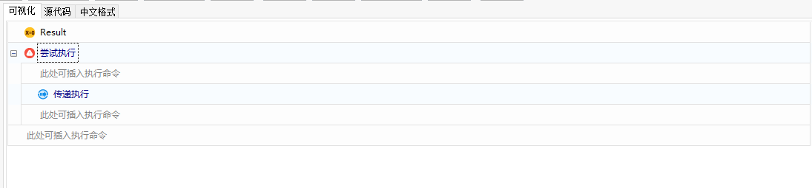

2. 在【尝试执行】函数下添加【日志消息】函数，属性设置如下图所示：

   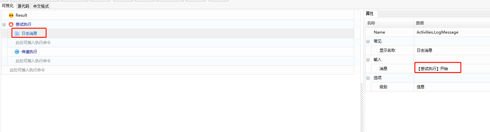

3. 在【日志消息】函数下添加【Excel应用程序范围】，传入指定的文件路径；

   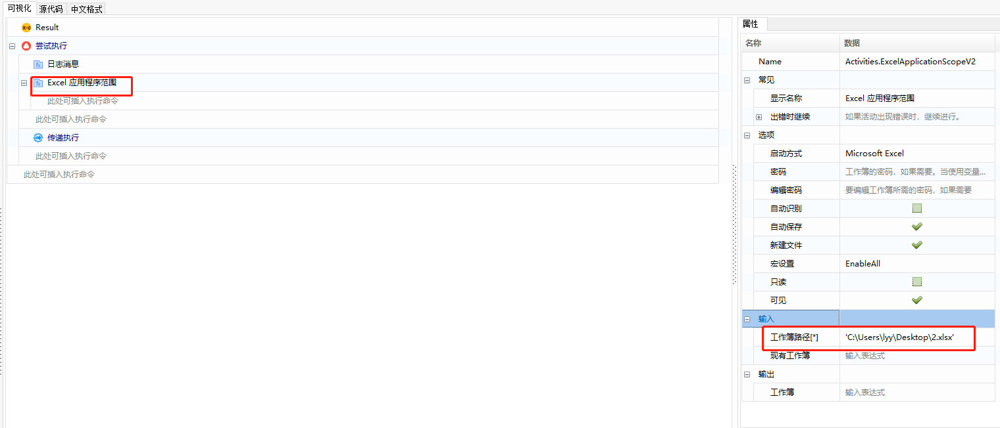

4. 在【Excel应用程序范围】函数下添加【写入单元格】函数，此处可设置出错点（如：工作表名称不存在）函数属性设置如下：

   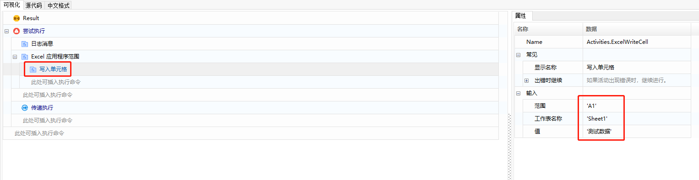

5. 在【写入单元格】函数下，添加【读取单元格】函数和【日志消息】函数，设置如下图所示：

   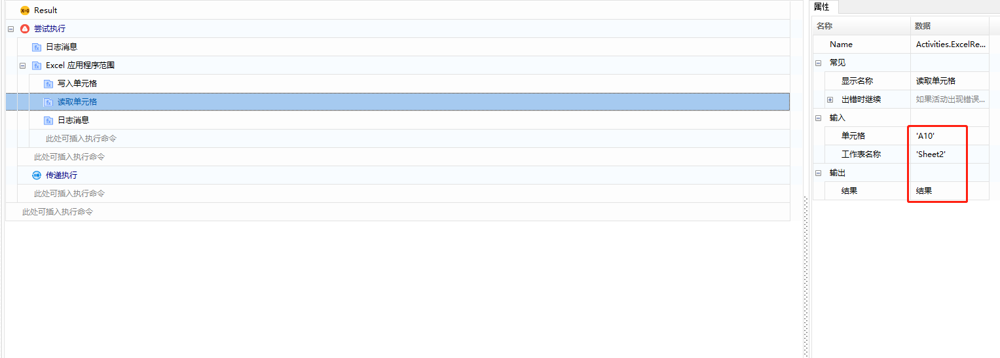

   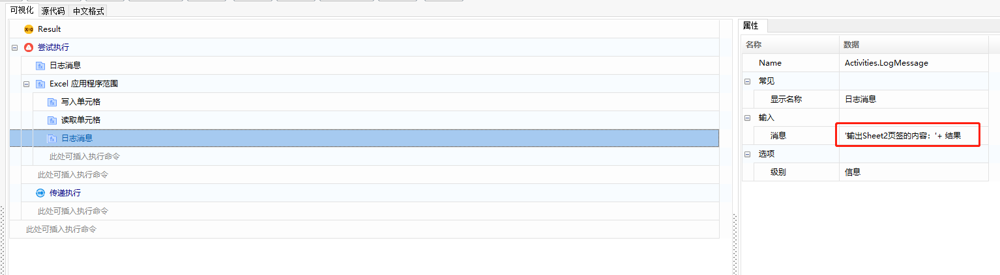

6. 在【传递执行】函数下，添加【日志消息】函数、【读取单元格】函数，如下图所示：

   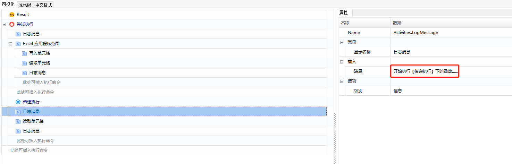

   

   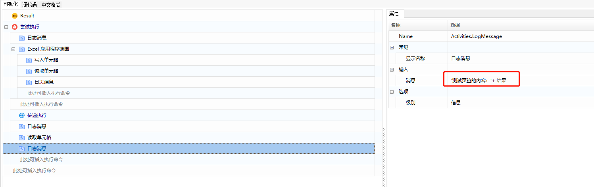

7. 在【尝试执行】的整个循环外，添加【日志消息】函数，配置入下图所示：

   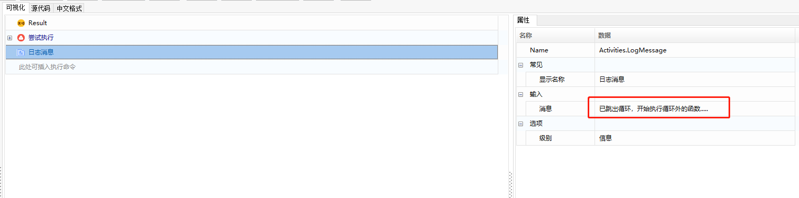

8. 组件设置完成后，执行组件。在【写入单元格】函数处出现异常，则跳转到【传递执行】下的函数执行，执行结果如图所示：

   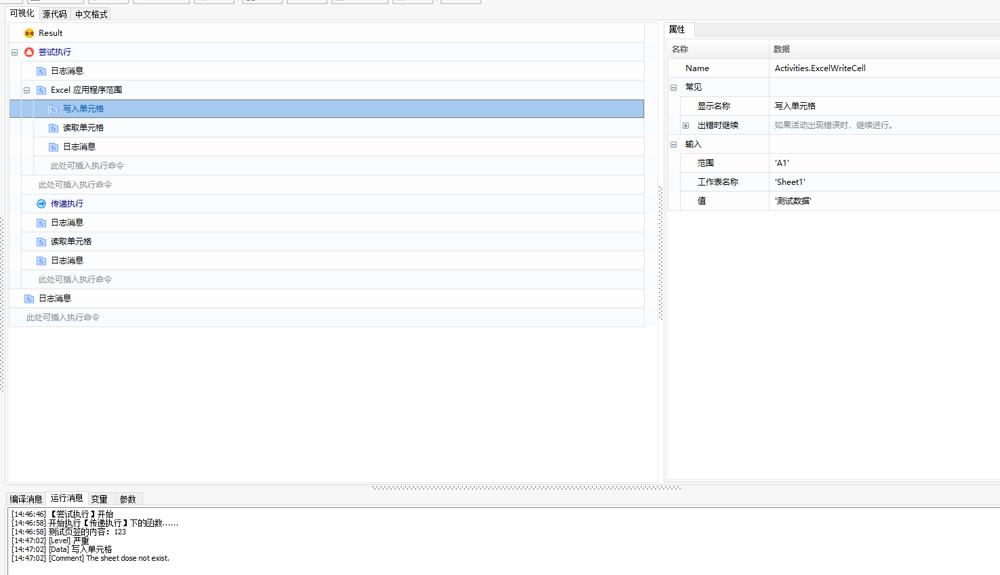

### 异常捕捉

【异常捕捉】函数，即对异常进行捕捉，相当于try except end。

当函数里的“出错时继续”下拉选择了“RaiseException”，那么组件执行到此函数时，若有异常错误就会执行到【捕捉错误】函数。

示例如下：

1. 在组件编辑界面，添加【异常捕捉】函数；

   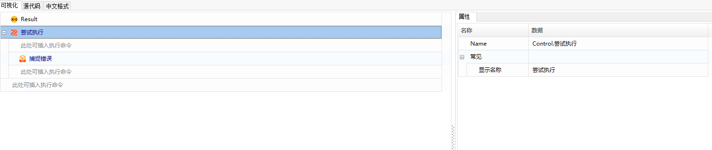

2. 在【尝试执行】函数下添加【获取下一个交易日】函数和【日志消息】函数，【获取下一个交易日】函数的“出错时继续”的属性栏选择“RaiseException”，（可在此处设置出错点：如日历名称填写一个不存在的日历名称）设置如下图所示：

   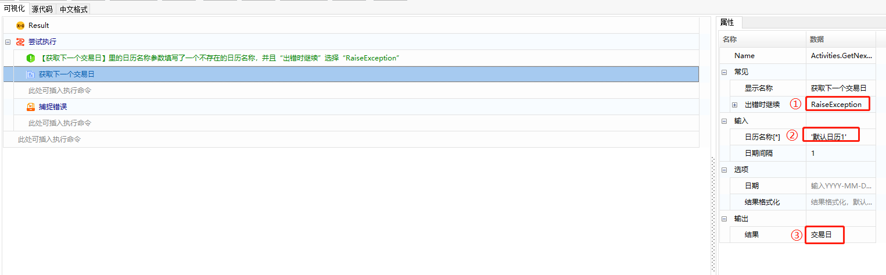

   ① ：“出错时继续”类型选择“RaiseException”；

   ② ：“日历名称”填写一个不存在的日历名称；

   ③ ： “结果”，创建一个输出变量名称为“交易日”，通过鼠标右击-选择“创建变量”的方式进行创建。

   将变量“交易日”的结果进行输出：

   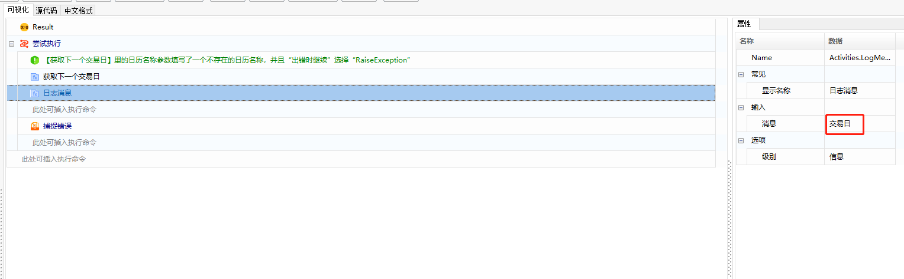

3. 添加【是否交易日】函数和【日志消息】函数，设置的结果如下所示：

   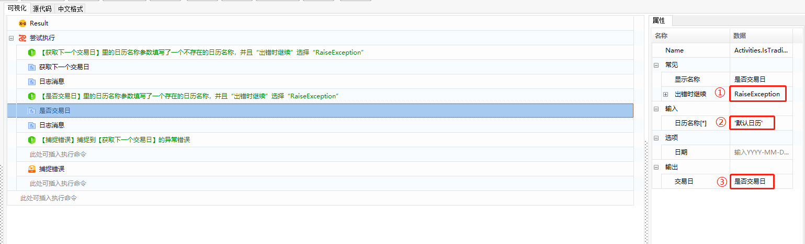

   ① ： “出错时继续”类型选择“RaiseException”；

   ② ： “日历名称”填写一个存在的日历名称；

   ③ ：  “结果”，创建一个输出变量名称为“是否交易日”，通过鼠标右击-选择“创建变量”的方式进行创建。

   将变量“是否交易日”的结果进行输出：

   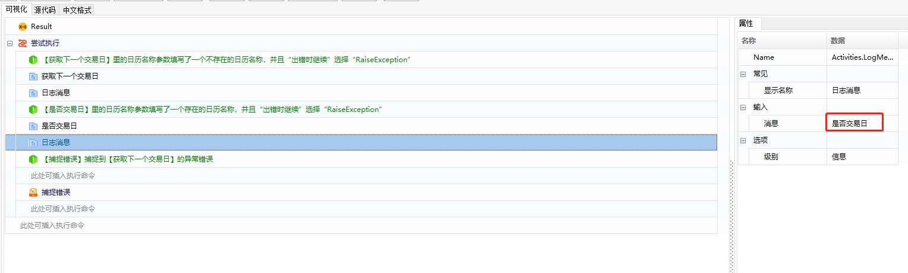

4. 在【捕捉错误】函数下添加【日志消息】函数，设置如下所示：

   

5. 待组件设置完成后，执行组件。【获取下一个交易日】函数有异常错误，因此会跳过【是否交易日】函数，直接执行到【捕捉错误】下的函数，执行结果如下图所示：

   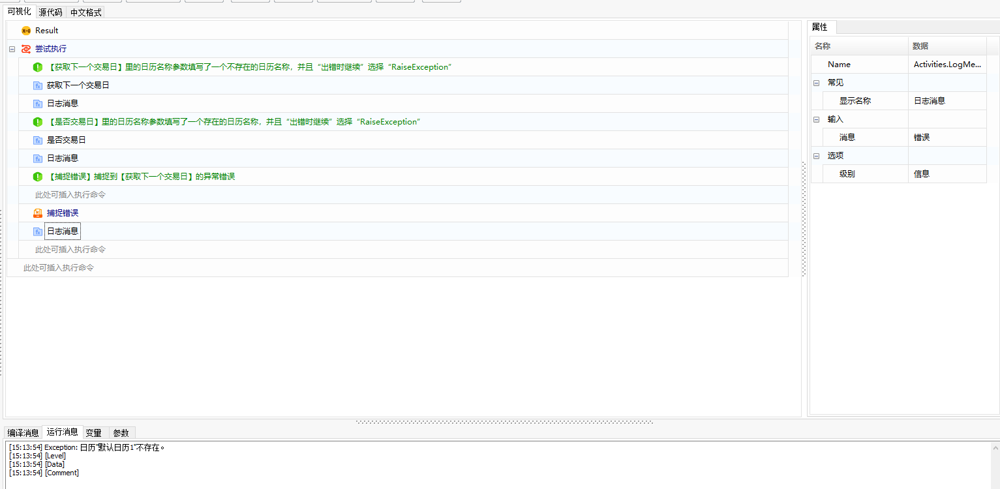

### 命令执行异常处理

在大部分函数的“常见”属性中，都有执行异常处理的选项，如“出错时继续”的两种情况如下：

- True：表示出错时继续往下执行。
- False：表示出错时停止脚本执行并退出，并提示错误信息。默认值为False。

错误信息包含以下几项内容：

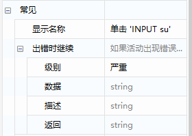

- 级别：正常、离线、未知、提示、警告、次要、主要、严重这8种情况供选择，一般情况下设置为“严重”。
- 数据：可选填，默认的值为系统返回的错误信息。
- 描述：可选填，可自定义增加描述信息。
- 返回：组件相互调用时的直接返回值。

### 条件判断结果异常处理

根据自定义的条件判断，若结果非预期，则主动触发执行中断。

示例：如获取文本内容，若获取到的内容为“ABC”时，终止执行并报告异常退出。

1. 在组件编辑面板中，添加"获取文本"函数，单击该函数的“指明在屏幕上”，指明需要获取的文本，待指明完成后，创建输出变量即可。设置效果如下：

   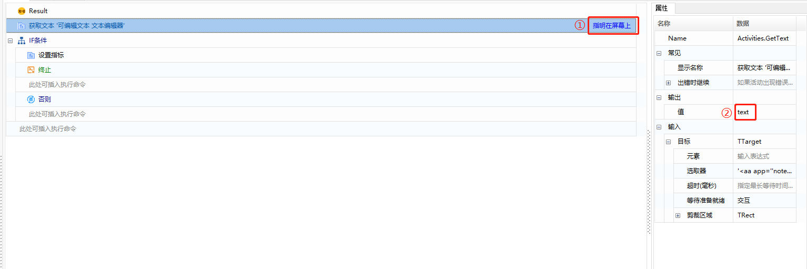

2. 添加“IF条件”函数，条件设置为“text = ABC”，当满足该条件时，则进行报错处理，设置效果如下：

   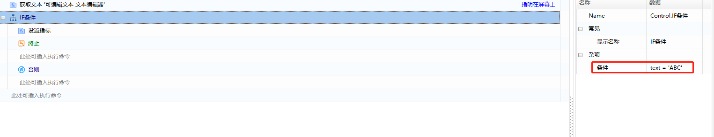

3. 添加“终止”函数，填写级别、数据、描述、返回等信息，设置效果如下图所示：

   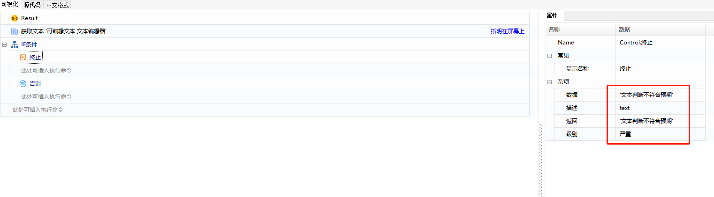

4. 执行组件，效果如下：

   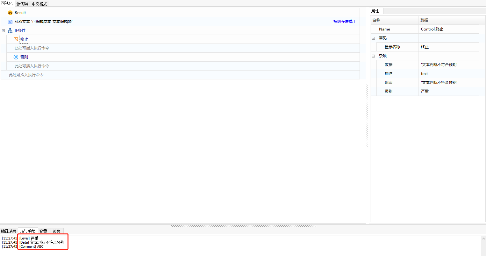
