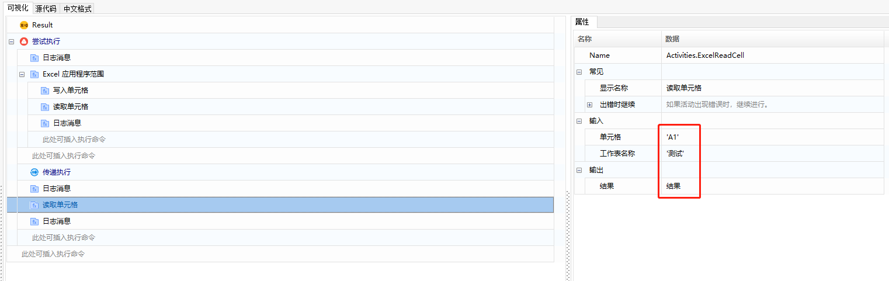

## Exception Handling

### Try Finally End 

When an exception occurs in the functions under the “Try” section, the execution will jump directly to the functions under the "Finally" section. After the functions in the "Finally" section are executed, the entire component execution will exit.

Example:

1. Add the “Try Finally" function in the component editor panel.

   

2. Add the “Log Message” function under the “Try” section, with the properties set as shown in the image below:

   

3. Add the “Excel Application Scope” function under the “Log Message” function, and specify the file path.

   

4. Add the “Write Cell” function under the “Excel Application Scope” function, where you can set the error point (e.g., worksheet name does not exist). The function properties are set as follows:

   

5. Add the “Read Cell” function and the “Log Message” function under the “Write Cell” function, with the settings as shown below:

   

   

6. Add the “Log Message” function and the “Read Cell” function under the "Finally" section, as shown below:

   

   

   

7. Add the “Log Message” function outside the entire “Try Finally” section, configured as shown below:

   

8. After completing the component setup, execute the component. If an exception occurs at the “Write Cell” function, it will jump to the functions under the "Finally" section, with the execution result shown below:

   

### Try Except End 

When the “ContinueOnError” section of a function is set to “RaiseException”, if there is an exception error when the component reaches this function, it will execute the “Try Except End” function.

Example:

1. Add the “Try Except End” function in the component editor panel.

   

2. Add the “GetNextTradingDay” function and the “Log Message” function under the “Try” section. Set the “ContinueOnError” property of the “GetNextTradingDay” function to “RaiseException” (you can set an error here, such as entering a non-existent calendar name). The settings are as follows:

   

   ①: Set “ContinueOnError” type to “RaiseException”;

   ②: Enter a non-existent calendar name for “Calendar Name”;

   ③: For “Result”, create an output variable named “Trading Day” by right-clicking and selecting “Create Variable”.

   Output the result of the variable “Trading Day”:

   

3. Add the “IsTradingDay” function and the “Log Message” function, with the settings as follows:

   

   ①: Set “ContinueOnError” property to “RaiseException”;

   ②: Enter an existing calendar name for “Calendar Name”;

   ③: For “Result”, create an output variable named “IsTradingDay” by right-clicking and selecting “Create Variable”.

   Output the result of the variable “IsTradingDay”:

   

4. Add the “Log Message” function under the “Except” section, with the settings as shown:

   

5. After completing the component setup, execute the component. The “Get Next Trading Day” function has an exception error, so the “IsTradingDay” function is skipped and execution proceeds directly to the functions under “Except”, with the result shown below:

   

### Command Execution Exception Handling 

Most functions have options for exception handling in the “Common” properties, such as the two cases for “ContinueOnError”:

- True: Indicates to continue execution even if an error occurs.
- False: Indicates to stop script execution and exit, and display an error message. The default value is False.

Error information includes the following:

- Level: Choose from Normal, Offline, Unknown, Information, Warning, Minor, Major, Critical. Generally set to “Critical”.
- Data: Optional, default value is the system's returned error message.
- Description: Optional, can be customized to add descriptive information.
- Return: Direct return value when components call each other.

### Conditional Exception Handling 

Based on custom conditions, if the result is not as expected, actively trigger an execution halt.

Example: If the retrieved text content is “ABC”, terminate the execution and report an abnormal exit.

1. In the component editor panel, add the “Get Text” function, click “Indicate on Screen” to specify the text to be retrieved, and create an output variable. The settings are as follows:

   

2. Add the “IF” function, set the condition to “text = ABC”, and handle the error when the condition is met. The settings are as follows:

   

3. Add the "Exit" function, fill in the level, data, description, and return information. The settings are as follows:

   

4. Execute the component. The result is shown below:

   

