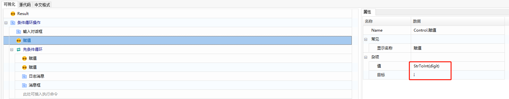
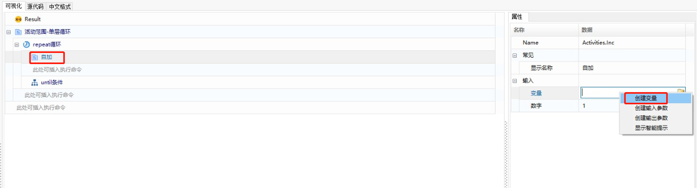

## Loop Statements

Loop statements are used to handle tasks that need to be repeated. Depending on the requirements, common loop syntax includes while loops, FOR Each loops, FOR loops, Continue, Break, Repeats, and Case&Case Value. Below is a detailed description and examples of these.

### While loop

A while loop executes the loop body as long as a specified condition is true, and it stops when the condition is no longer satisfied.

#### Example: Input a number between 0 and 10, check if it is greater than 0, and if it is, decrement it until the condition is no longer met (i.e., i = 0), then exit the loop.

1. Add the "Sequence" function, with settings as follows:

   

2. Add the "Input Dialog" function, with settings as follows:

   

3. Add the "Assign" function, with settings as follows:

   

4. Add the "While" function, with settings as follows:

   

5. In the "While" section, add two "Assign" functions, with settings as follows:

   

   Create a variable A, convert the decremented value of i to a string, and assign the converted result to variable A. 

   

6. Add the "Log Message" function, with settings as follows:

   

7. Add the "Message Box" function, with settings as follows:

   

8. Once the component is edited, Execute the component.

9. The execution results are as follows:

   

   

   

   

### For Each Loop

A "For Each" loop is used to iterate over an array or a collection object, repeating a block of statements for each element in the collection.

#### Example: Traverse and output the contents of a string list.

1. Add the "Sequence" function, with settings as follows:

   

2. Add the "Build String List" function, with settings as follows:

   

3. Add the "For Each" function, with settings as follows:

   

4. In the "For Each" section, add "Log Message" functions, with settings as follows:

   

   

### FOR Loop

The "FOR Loop" allows you to specify the number of iterations, and the loop exits when the maximum range is reached.

#### Example: Output numbers from 1 to 10.

1. Add the "Sequence" function, with settings as follows:

   

2. Add the "FOR Loop" function, with settings as follows:

   

3. Add the "Assign" function, with settings as follows:

   

4. Add the "Log Message" function, with settings as follows:

   

5. Once the component is edited, Execute the component.

   

6. The execution results are as follows:

   

### Continue

The "Continue" statement is used to skip the current iteration of a loop and proceed to the next iteration, meaning that the code following "Continue" in the current iteration will not be executed.

#### Example: Skip records with a value of "AA" in the list based on the previous For Each example.

1. Add an "IF" function below the "For Each" function, with the condition set as follows:

   

2. Add a "Continue" function below the "IF" function.

3. Once the component is edited, Execute the component.

4. The execution results are as follows:

   

### Break

The "Break" statement is used to exit a loop, meaning that no further statements in the current loop body will be executed, and the loop will be terminated immediately.

#### Example: Exit the loop when a record with a value of "BB" is found in the list based on the previous For Each example.

1. Set the condition for the "IF" function as follows:

   

2. Add a "Break" function below the "IF" function.

   

3. After editing the component, Execute the component.

4. The execution results are as follows:

   

### Repeat Loop

The Repeat loop repeatedly executes a block of statements until a specified condition becomes true.

**Difference from While loop:** A While loop checks the condition before executing, while a Repeat loop executes first and then checks the condition.

#### **Example 1** (Single loop): Create a variable `x` and initialize it to 1, Inc `x`, and stop when “x>3”.

1. Add the "Repeat" function, setting the termination condition to "x>3".

   

2. Add an "Inc" function below the "Repeat" function, create variable `x` and set it to 1.

   

   

3. Add a "Log Message" function below the "Inc" function to output the Inced result.

   In the message editor, right-click and select "Show Smart Tips" to choose the variable to output.

   

4. Execute the component. The loop stops when “x>3”, as shown:

   

#### **Example 2** (Nested loop): Create an outer loop variable `i` initialized to 1, and an inner loop variable `j` initialized to 2. Increment `i` and `j`, stop the inner loop when “j>5” and the outer loop when “i>1”.

1. Add the "Repeat" function, setting the termination condition to "i>1".

   

2. Inside the "Repeat", add an "Inc" function, create variable `i` and set it to 1.

   

3. Add another "Repeat" function inside the outer loop, setting the termination condition to "j>5".

   

4. Inside the inner "Repeat", add an "Inc" function, create variable `j` and set it to 2.

   

5. Add a "Log Message" function below the inner "Inc" function to output the value of `j`.

   

6. Add a "Log Message" function below the inner "Repeat" to output the value of `i`.

   

7. Execute the component. The inner loop stops when “j>5”, and the outer loop stops when “i>1”.

   

### Case & Case Value

The Case statement is a branch within "Switch' statement used to match specific values. Case and Case Value work together, executing the statements under the first matching Case Value branch and then exiting the Case statement, skipping the remaining Case Value branches.

#### Example 1:

Multiple branches with boolean expression conditions. Case values 0 and 1 represent “False” and “True”.

Execution result: The nested statement with the second Case Value executes, outputting "a < b, result is True".

#### Example 2:

Looping with a Case and Case Value function under a While loop. Assign variable “test” a value of 1. Set the While loop’s condition to "test<=5", and Case Value conditions to 1, 2, 3, 4, 6, Incing the variable “test”.

Execution result: When a Case Value condition matches the Case condition, execute the statements under that Case Value, then exit the Case statement and re-execute the While loop until the condition is no longer met.

