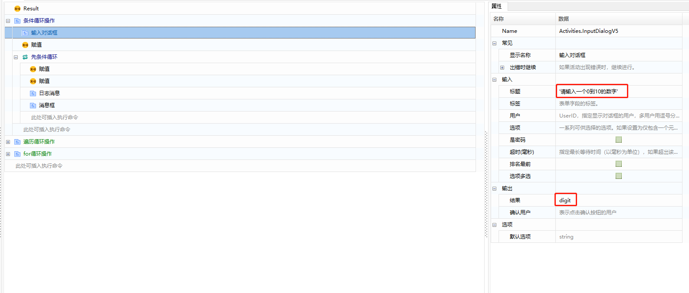
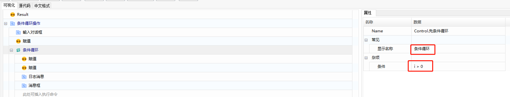
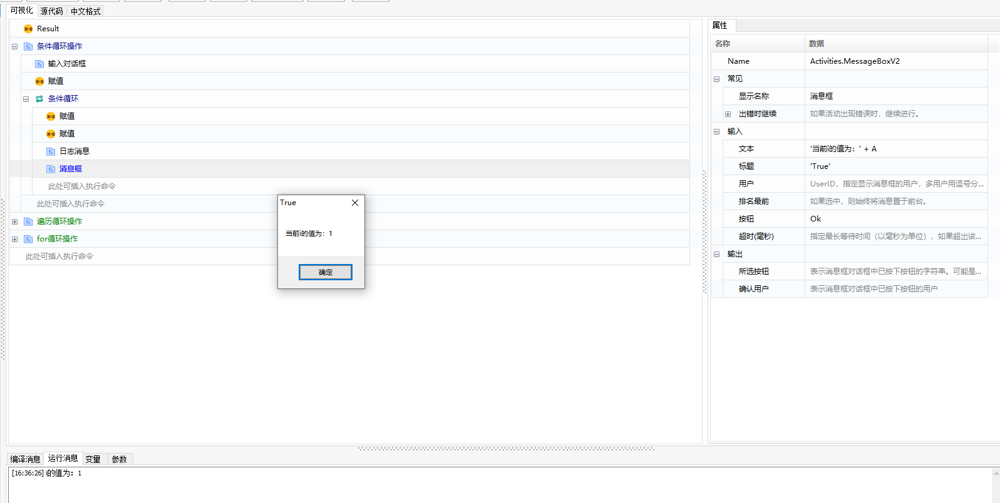

## 循环语句

 循环语句在不少实际问题中有许多具有规律性的重复操作，因此在程序中就需要重复执行某些语句。一组被重复执行的语句称之为循环体，能否继续重复，决定循环的终止条件。循环结构是在一定条件下反复执行某段程序的流程结构，被反复执行的程序被称为循环体。循环语句是由循环体及循环的终止条件两部分组成的。 下面为您介绍6种循环语法。

### 条件循环

当条件循环开始后，先判断条件是否满足，如果满足就执行循环体内的语句，执行完毕后再回来判断条件是否满足，如此无限重复，直到条件不满足时，执行先条件后面的语句。

#### 示例：输入一个0到10的数字，判断其是否大于0，若 i 大于0，则 i 进行自减操作，直到不满足条件（即 i = 0），跳出循环。

1. 添加“活动范围”函数，显示名称设置如下：

   

2. 添加“输入对话框”函数，属性设置如下所示：

   

3. 添加“赋值”函数，属性设置结果如下所示：

   

4. 添加“条件循环”函数，显示名称和属性值设置结果如下：

   

5. 在“条件循环”下，依次添加两个“赋值”函数，如下图所示：

   

   创建一个变量 A ，将自减后 i 的值转换为字符串类型，并将转换后的结果赋予变量 A 。变量 A 的创建方法，同条件循环中[变量a](\语法基础\IF.html#变量a)的创建方法一样。

   

6. 添加“日志消息”函数，函数设置结果如下：

   

7. 添加“消息框”函数，函数设置效果如下：

   

8. 待组件编辑完成后，单击【保存】，执行该组件。

9. 执行的结果如下所示：

   

   

   

   

### 遍历循环

使用遍历循环可以迭代数组或者一个集合对象，用于循环访问集合以获取所需信息，为数组或对象集合中的每一个元素重复一个嵌入语句组。

#### 示例：遍历输出一个字符串列表里面的内容。

1. 添加“活动范围”函数，显示名称设置如下：

   

2. 添加“构建字符串列表”函数，属性设置如下：

   

3. 添加“遍历循环”函数，属性设置效果如下：

   

4. 在“遍历循环”函数下，依次添加“日志消息”函数，如下所示：

   

   

### FOR循环

使用 “FOR 循环” 可指定本次循环的次数，当执行到设定的最大范围后，退出本次循环。

#### 示例：循环输出数字1到10。

1. 添加“活动范围”函数，函数设置效果如下：

   

2. 添加 “for 循环”函数，函数设置效果如下：

   

3. 添加“赋值”函数，函数设置效果如下：

   

4. 添加“日志消息”函数，函数设置效果如下：

   

5. 待组件编辑完成后，单击【保存】，执行组件。

   

6. 执行结果如下所示：

   

### Continue

Continue 是用于跳过本次循环，继续进行下一次循环，即本次循环中 Continue 后面的代码不执行,直接进行下一次循环。

#### 示例：基于上述遍历循环例子，跳过列表中值为“AA” 的记录。

1. 在“遍历循环”函数下方添加 “IF 条件”函数，“IF 条件” 函数的条件设置如图所示：

   

2. 在 “IF 条件”函数下方添加“继续”函数。

3. 待组件编辑完成后，单击【保存】执行组件。

4. 执行结果如图所示：

   

### Break

 Break 用于跳出循环，即不执行本循环体内的其他语句，直接跳出循环。

#### 示例：基于上述遍历循环例子，找到列表中值为 “BB” 的记录，则跳出循环。

1. 将 “IF 条件”函数的条件设置如下所示：

   

2. 在 “IF 条件”函数下方添加“中断”函数。

   

3. 编辑完组件后，单击“保存”，执行组件。

4. 组件执行的结果如下所示：

   

### repeat循环

重复执行循环，直到指定的条件为真时结束循环。

【repeat 循环】与【条件循环】的区别：【条件循环】先判断，后执行，而【repeat 循环】先执行后判断。

#### **示例一**（单层循环）：创建一个变量 x，且赋值为1，对 x 进行自加，直到 “x>3” 时结束循环。

1. 在组件编辑面板中，添加【repeat 循环】函数，设置终止循环条件 “x>3” 。

   

2. 在【repeat 循环】下方添加【自加】函数，在该函数中创建变量 x ，且为该变量赋值为1；

   

   

3. 在【自加】函数下方添加【日志消息】函数，且将自加的结果进行输出；

   在消息编辑框中，鼠标右击，选择“显示智能提示”，选择需要输出的变量。

   

4. 执行组件，当满足 “x>3”  时，终止循环，如下图所示：

   

#### **示例二**（嵌套循环）：创建外层循环变量 i ，赋值为1；内层循环变量 j ，赋值为2。 i 和 j 分别进行自加，直到 “j>5” 结束内层循环，“i>1” 结束外层循环。

1. 添加【repeat 循环】函数，设置终止循环条件 “i>1” ；

   

2. 在【repeat 循环】下添加【自加】函数，在该函数中创建变量 i ，且为该变量赋值为1；

   

3. 在【自加】函数下再添加一个【repeat 循环】函数，循环终止条件设置为 “j>5”；

   

4. 在内层的【repeat 循环】下添加【自加】函数，在该函数中创建变量 j ，且为该变量赋值为2；

   

5. 在内层的【自加】函数下，添加【日志消息】函数，将内层的变量 j 的值进行输出；

   

6. 在整个内层【repeat 循环】函数的下方添加【日志消息】函数，将外层的变量 i 的值进行输出；

   

7. 执行组件，当满足 “j>5” 时终止内层循环，当满足 “i>1” 时终止外层循环。

   

### Case&Case Value

Case 语句是 Switch 语句中的一个分支，用于匹配特定的值。
Case 与 Case Value 搭配使用，将会执行第一个与 Case 条件相匹配的 Case Value 分支下的语句，语句执行完成后直接跳出 Case ，不再执行 Case 下的其他 Case Value 分支。

#### 示例一：

嵌套多分支，Case 条件为布尔类型的表达式，Case Value 条件中，0 和 1 表示 “False” 和 “Ture” 。

执行结果：条件满足嵌套语句中的第二个 Case Value 语句，输出该语句下的信息：“a < b，结果为 True” 。

#### 示例二：

循环调用，在条件循环下添加【Case】和【Case Value】函数。为变量 “test” 赋值为1，【条件循环】函数的条件设置为 “test<=5” ,【Case Value】函数条件分别设置为1、2、3、4、6，对变量 “test” 进行自加处理。

执行结果：当 Case Value 条件与 Case 条件相匹配时，执行 Case Value 下的语句，执行完成后跳出 Case 语句，重新执行【条件循环】在重新进入 Case 语句，知道条件不满足【条件循环】时，脚本执行结束。

## Loop Statements

Loop statements are used to handle tasks that need to be repeated. Depending on the requirements, common loop syntax includes conditional loops, traversal loops, FOR loops, Continue, Break, repeat loops, and Case&Case Value. Below is a detailed description and examples of these.

### Conditional Loop

A conditional loop executes the loop body as long as a specified condition is true, and it stops when the condition is no longer satisfied.

#### Example: Input a number between 0 and 10, check if it is greater than 0, and if it is, decrement it until the condition is no longer met (i.e., i = 0), then exit the loop.

1. Add the "Activity Scope" function, with settings as follows:

   

2. Add the "Input Dialog" function, with settings as follows:

   

3. Add the "Assignment" function, with settings as follows:

   

4. Add the "Conditional Loop" function, with settings as follows:

   

5. Under the "Conditional Loop", add two "Assignment" functions, with settings as follows:

   

   Create a variable A, convert the decremented value of i to a string, and assign the converted result to variable A. The method to create variable A is the same as [variable a](\syntax basics\IF.html#variablea) in the conditional loop.

   

6. Add the "Log Message" function, with settings as follows:

   

7. Add the "Message Box" function, with settings as follows:

   

8. Once the component is edited, click [Save] to execute the component.

9. The execution results are as follows:

   

   

   

   

### Traversal Loop

A traversal loop is used to iterate over an array or a collection object, repeating a block of statements for each element in the collection.

#### Example: Traverse and output the contents of a string list.

1. Add the "Activity Scope" function, with settings as follows:

   

2. Add the "Build String List" function, with settings as follows:

   

3. Add the "Traversal Loop" function, with settings as follows:

   

4. Under the "Traversal Loop" function, add "Log Message" functions, with settings as follows:

   

   

### FOR Loop

The "FOR Loop" allows you to specify the number of iterations, and the loop exits when the maximum range is reached.

#### Example: Output numbers from 1 to 10.

1. Add the "Activity Scope" function, with settings as follows:

   

2. Add the "FOR Loop" function, with settings as follows:

   

3. Add the "Assignment" function, with settings as follows:

   

4. Add the "Log Message" function, with settings as follows:

   

5. Once the component is edited, click [Save] to execute the component.

   

6. The execution results are as follows:

   

### Continue

The "Continue" statement is used to skip the current iteration of a loop and proceed to the next iteration, meaning that the code following "Continue" in the current iteration will not be executed.

#### Example: Skip records with a value of "AA" in the list based on the previous traversal loop example.

1. Add an "IF Condition" function below the "Traversal Loop" function, with the condition set as follows:

   

2. Add a "Continue" function below the "IF Condition" function.

3. Once the component is edited, click [Save] to execute the component.

4. The execution results are as follows:

   

### Break

The "Break" statement is used to exit a loop, meaning that no further statements in the current loop body will be executed, and the loop will be terminated immediately.

#### Example: Exit the loop when a record with a value of "BB" is found in the list based on the previous traversal loop example.

1. Set the condition for the "IF Condition" function as follows:

   

2. Add a "Break" function below the "IF Condition" function.

   

3. After editing the component, click [Save] to execute the component.

4. The execution results are as follows:

   

### Repeat Loop

The repeat loop repeatedly executes a block of statements until a specified condition becomes true.

**Difference from Conditional Loop:** A conditional loop checks the condition before executing, while a repeat loop executes first and then checks the condition.

#### **Example 1** (Single-layer loop): Create a variable `x` and initialize it to 1, increment `x`, and stop when “x>3”.

1. Add the "Repeat Loop" function, setting the termination condition to "x>3".

   

2. Add an "Increment" function below the "Repeat Loop" function, create variable `x` and set it to 1.

   

   

3. Add a "Log Message" function below the "Increment" function to output the incremented result.

   In the message editor, right-click and select "Show Smart Tips" to choose the variable to output.

   

4. Execute the component. The loop stops when “x>3”, as shown:

   

#### **Example 2** (Nested loop): Create an outer loop variable `i` initialized to 1, and an inner loop variable `j` initialized to 2. Increment `i` and `j`, stop the inner loop when “j>5” and the outer loop when “i>1”.

1. Add the "Repeat Loop" function, setting the termination condition to "i>1".

   

2. Inside the "Repeat Loop", add an "Increment" function, create variable `i` and set it to 1.

   

3. Add another "Repeat Loop" function inside the outer loop, setting the termination condition to "j>5".

   

4. Inside the inner "Repeat Loop", add an "Increment" function, create variable `j` and set it to 2.

   

5. Add a "Log Message" function below the inner "Increment" function to output the value of `j`.

   

6. Add a "Log Message" function below the inner "Repeat Loop" to output the value of `i`.

   

7. Execute the component. The inner loop stops when “j>5”, and the outer loop stops when “i>1”.

   

### Case&Case Value

The Case statement is a branch within a Switch statement used to match specific values. Case and Case Value work together, executing the statements under the first matching Case Value branch and then exiting the Case statement, skipping the remaining Case Value branches.

#### Example 1:

Multiple branches with boolean expression conditions. Case values 0 and 1 represent “False” and “True”.

Execution result: The nested statement with the second Case Value executes, outputting "a < b, result is True".

#### Example 2:

Looping with a Case and Case Value function under a Conditional Loop. Assign variable “test” a value of 1. Set the Conditional Loop’s condition to "test<=5", and Case Value conditions to 1, 2, 3, 4, 6, incrementing the variable “test”.

Execution result: When a Case Value condition matches the Case condition, execute the statements under that Case Value, then exit the Case statement and re-execute the Conditional Loop until the condition is no longer met.

